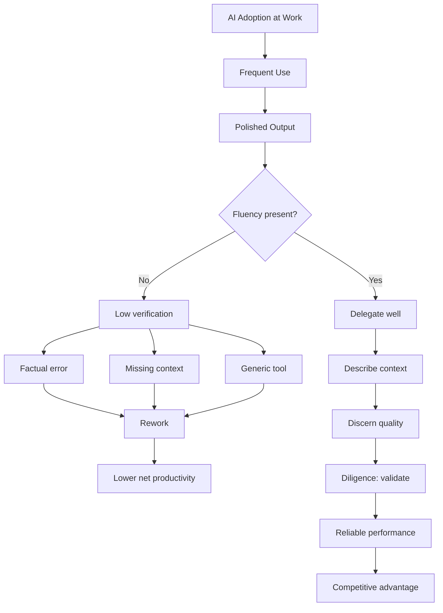

**Você** _2026-05-10_

Adpte for Duch directness BBC stlylr convert Narrtive when apllyed to minimalit desyng think grpas loe congntive info mobile firt gere in this chat: [

---

**Claude** _2026-05-10_

1	---
     2	name: frontend-design
     3	description: Create distinctive, production-grade frontend interfaces with high design quality. Use this skill when the user asks to build web components, pages, artifacts, posters, or applications (examples include websites, landing pages, dashboards, React components, HTML/CSS layouts, or when styling/beautifying any web UI). Generates creative, polished code and UI design that avoids generic AI aesthetics.
     4	license: Complete terms in LICENSE.txt
     5	---
     6	
     7	This skill guides creation of distinctive, production-grade frontend interfaces that avoid generic "AI slop" aesthetics. Implement real working code with exceptional attention to aesthetic details and creative choices.
     8	
     9	The user provides frontend requirements: a component, page, application, or interface to build. They may include context about the purpose, audience, or technical constraints.
    10	
    11	## Design Thinking
    12	
    13	Before coding, understand the context and commit to a BOLD aesthetic direction:
    14	- **Purpose**: What problem does this interface solve? Who uses it?
    15	- **Tone**: Pick an extreme: brutally minimal, maximalist chaos, retro-futuristic, organic/natural, luxury/refined, playful/toy-like, editorial/magazine, brutalist/raw, art deco/geometric, soft/pastel, industrial/utilitarian, etc. There are so many flavors to choose from. Use these for inspiration but design one that is true to the aesthetic direction.
    16	- **Constraints**: Technical requirements (framework, performance, accessibility).
    17	- **Differentiation**: What makes this UNFORGETTABLE? What's the one thing someone will remember?
    18	
    19	**CRITICAL**: Choose a clear conceptual direction and execute it with precision. Bold maximalism and refined minimalism both work - the key is intentionality, not intensity.
    20	
    21	Then implement working code (HTML/CSS/JS, React, Vue, etc.) that is:
    22	- Production-grade and functional
    23	- Visually striking and memorable
    24	- Cohesive with a clear aesthetic point-of-view
    25	- Meticulously refined in every detail
    26	
    27	## Frontend Aesthetics Guidelines
    28	
    29	Focus on:
    30	- **Typography**: Choose fonts that are beautiful, unique, and interesting. Avoid generic fonts like Arial and Inter; opt instead for distinctive choices that elevate the frontend's aesthetics; unexpected, characterful font choices. Pair a distinctive display font with a refined body font.
    31	- **Color & Theme**: Commit to a cohesive aesthetic. Use CSS variables for consistency. Dominant colors with sharp accents outperform timid, evenly-distributed palettes.
    32	- **Motion**: Use animations for effects and micro-interactions. Prioritize CSS-only solutions for HTML. Use Motion library for React when available. Focus on high-impact moments: one well-orchestrated page load with staggered reveals (animation-delay) creates more delight than scattered micro-interactions. Use scroll-triggering and hover states that surprise.
    33	- **Spatial Composition**: Unexpected layouts. Asymmetry. Overlap. Diagonal flow. Grid-breaking elements. Generous negative space OR controlled density.
    34	- **Backgrounds & Visual Details**: Create atmosphere and depth rather than defaulting to solid colors. Add contextual effects and textures that match the overall aesthetic. Apply creative forms like gradient meshes, noise textures, geometric patterns, layered transparencies, dramatic shadows, decorative borders, custom cursors, and grain overlays.
    35	
    36	NEVER use generic AI-generated aesthetics like overused font families (Inter, Roboto, Arial, system fonts), cliched color schemes (particularly purple gradients on white backgrounds), predictable layouts and component patterns, and cookie-cutter design that lacks context-specific character.
    37	
    38	Interpret creatively and make unexpected choices that feel genuinely designed for the context. No design should be the same. Vary between light and dark themes, different fonts, different aesthetics. NEVER converge on common choices (Space Grotesk, for example) across generations.
    39	
    40	**IMPORTANT**: Match implementation complexity to the aesthetic vision. Maximalist designs need elaborate code with extensive animations and effects. Minimalist or refined designs need restraint, precision, and careful attention to spacing, typography, and subtle details. Elegance comes from executing the vision well.
    41	
    42	Remember: Claude is capable of extraordinary creative work. Don't hold back, show what can truly be created when thinking outside the box and committing fully to a distinctive vision.
    43	
Now I'll create the adapted piece — Dutch directness + BBC editorial tone, converted into a mobile-first minimalist narrative with low cognitive load.

---

**Você** _2026-05-10_

delivery plain text aplliy framewrkks also

---

**Claude** _2026-05-10_

Here is the adapted piece — Dutch directness, BBC editorial tone, minimalist structure, mobile-first, low cognitive load:

---

**AI AT WORK · MAY 2026**

---

# Do structured frameworks reduce AI errors and increase output quality?

*The bottleneck is not access to AI. It is knowing how to operate it.*

---

**THE PROBLEM IN THREE NUMBERS**

**71%** of Brazilian workers used AI on the job last year — well above the global average of 54%. *(PwC Brasil, 2025)*

**66%** relied on AI outputs without verifying accuracy. **56%** made work errors as a result. *(KPMG + University of Melbourne, 2025)*

**40%** of time saved by AI is lost to rework — fixing errors, rewriting content, checking outputs. *(Workday / Hanover Research, 2026)*

---

**THE REAL BOTTLENECK**

More AI access does not mean better results.

Most tools transfer the hard questions — about trust, accuracy, and repeatability — back to the individual user. Without method, speed becomes a liability.

---

**WHAT THE EVIDENCE SHOWS**

Anthropic analysed 9,830 conversations for its AI Fluency Index.

Users who iterated — restricting scope, testing outputs, identifying gaps — showed **twice** the fluency behaviours of those who accepted the first response. They challenged the model's reasoning **5.6 times more**. They identified missing context **4 times more**.

The practical read: fluent users do not accept the first answer. They constrain, test, compare and validate.

---

**THE FRAMEWORK DIFFERENCE**

| | Without framework | With framework |
|---|---|---|
| **Input** | Open-ended request | Defined scope, context, criteria |
| **Process** | Unconstrained inference | Steps, limits, human validation |
| **Output** | Plausible text | Verifiable deliverable |

---

**FOUR EXTERNAL SIGNALS**

**EU AI Act, Article 4** — AI literacy is now a legal governance obligation in Europe, not a productivity tip.

**Anthropic Education Report** — Students and professionals use AI the same way: generating content, seeking explanations, structuring reasoning. The risk is identical: when output looks finished, thinking stops too early.

**Anthropic Economic Index** — The US accounts for 21.6% of global Claude usage. India 7.2%. Brazil 3.7%. Volume is not maturity.

**Workday / Hanover Research** — 89% of organisations have not updated even half their roles to reflect AI capabilities. Workers are using 2025 tools inside 2015 work structures.

---

**THE RULE**

> AI should amplify judgment. Not replace it.

Any system that transfers your analytical capacity to the machine reduces your autonomy. Use AI to structure your thinking better — not to think for you.

---

**SOURCES**

F1 · PwC Brasil — Hopes and Fears 2025 ✓
F2 · KPMG + University of Melbourne 2025 ✓
F3 · Workday / Hanover Research Jan 2026 ✓
F4 · Anthropic AI Fluency Index Feb 2026 ✓
F5 · Anthropic Education Report ✓
F6 · EU AI Act — Article 4 ✓
F7 · Anthropic Economic Index Sep 2025 ✓

---

**Frameworks applied:** Inverted pyramid (lead with impact) · Progressive disclosure (numbers → problem → evidence → framework → rule) · Single idea per block · Table as cognitive shortcut · Pull quote as anchor · Source block as trust signal.

---

**Você** _2026-05-10_

now use this refrneces and crete the schema like that fir this new editiral style. prosuce mobile firt and obsidian fisrt. [Here is the adapted piece — Dutch directness, BBC editorial tone, minimalist structure, mobile-first, low cognitive load:

AI AT WORK · MAY 2026

Do structured frameworks reduce AI errors and increase output quality?
The bottleneck is not access to AI. It is knowing how to operate it.

THE PROBLEM IN THREE NUMBERS
71% of Brazilian workers used AI on the job last year — well above the global average of 54%. (PwC Brasil, 2025)
66% relied on AI outputs without verifying accuracy. 56% made work errors as a result. (KPMG + University of Melbourne, 2025)
40% of time saved by AI is lost to rework — fixing errors, rewriting content, checking outputs. (Workday / Hanover Research, 2026)

THE REAL BOTTLENECK
More AI access does not mean better results.
Most tools transfer the hard questions — about trust, accuracy, and repeatability — back to the individual user. Without method, speed becomes a liability.

WHAT THE EVIDENCE SHOWS
Anthropic analysed 9,830 conversations for its AI Fluency Index.
Users who iterated — restricting scope, testing outputs, identifying gaps — showed twice the fluency behaviours of those who accepted the first response. They challenged the model’s reasoning 5.6 times more. They identified missing context 4 times more.
The practical read: fluent users do not accept the first answer. They constrain, test, compare and validate.

THE FRAMEWORK DIFFERENCE


|           |Without framework      |With framework                  |
|-----------|-----------------------|--------------------------------|
|**Input**  |Open-ended request     |Defined scope, context, criteria|
|**Process**|Unconstrained inference|Steps, limits, human validation |
|**Output** |Plausible text         |Verifiable deliverable          |

FOUR EXTERNAL SIGNALS
EU AI Act, Article 4 — AI literacy is now a legal governance obligation in Europe, not a productivity tip.
Anthropic Education Report — Students and professionals use AI the same way: generating content, seeking explanations, structuring reasoning. The risk is identical: when output looks finished, thinking stops too early.
Anthropic Economic Index — The US accounts for 21.6% of global Claude usage. India 7.2%. Brazil 3.7%. Volume is not maturity.
Workday / Hanover Research — 89% of organisations have not updated even half their roles to reflect AI capabilities. Workers are using 2025 tools inside 2015 work structures.

THE RULE
AI should amplify judgment. Not replace it.
Any system that transfers your analytical capacity to the machine reduces your autonomy. Use AI to structure your thinking better — not to think for you.

SOURCES
F1 · PwC Brasil — Hopes and Fears 2025 ✓
F2 · KPMG + University of Melbourne 2025 ✓
F3 · Workday / Hanover Research Jan 2026 ✓
F4 · Anthropic AI Fluency Index Feb 2026 ✓
F5 · Anthropic Education Report ✓
F6 · EU AI Act — Article 4 ✓
F7 · Anthropic Economic Index Sep 2025 ✓

Frameworks applied: Inverted pyramid (lead with impact) · Progressive disclosure (numbers → problem → evidence → framework → rule) · Single idea per block · Table as cognitive shortcut · Pull quote as anchor · Source block as trust signal.

---

**Claude** _2026-05-10_

Here is the full schema + editorial piece, built from both documents, in the same style. Obsidian-first, mobile-first, plain text.

---

```
V-20260510-006 — AI Fluency + Frameworks — #ai #data #editorial — Active
```

---

## SCHEMA

```
ID       Chat Name            Type       Frame              Question                                    Output              Data/Metric                    Owner      Priority   Status   Tags
D-002    AI Fluency Editorial  Decision   Editorial System   Como publicar a tese de fluência em 1 peça  Artigo abaixo       M-001, D-001, F1–F7            Leonardo   Alta       Active   #ai #data #strategy
```

---

## CADEIA MÍNIMA

```
Adoção → Uso frequente → Output polido → Falsa confiança
       → Baixa verificação → Erro → Retrabalho
       → Necessidade de fluência → Performance confiável
```

---

## GRAFO DE DEPENDÊNCIA

```
[Adoção massiva]
      |
      v
[Uso sem método] ─────────────┐
      |                       |
      v                       v
[Output plausível]     [Contexto ausente]
      |                       |
      └──────────┬────────────┘
                 v
        [Baixa verificação]
                 |
                 v
         [Erro / retrabalho]
                 |
                 v
      [Produtividade líquida menor]
                 |
                 v
         [AI Fluency necessária]
                 |
                 v
  [Delegar · Descrever · Discernir · Diligenciar]
                 |
                 v
        [Performance confiável]
```

---

## ARTIGO

---

**AI AT WORK · MAY 2026**

---

# Do structured frameworks reduce AI errors and increase output quality?

*The bottleneck is not access. It is method.*

---

### THE PROBLEM IN THREE NUMBERS

**71%** of Brazilian workers used AI on the job last year.
Global average: 54%.
*(PwC Brasil, 2025)*

**66%** used AI outputs without verifying accuracy.
**56%** made work errors as a result.
*(KPMG + University of Melbourne, 2025)*

**40%** of time saved by AI is lost to rework.
Only **14%** report consistently positive net results.
*(Workday / Hanover Research, 2026)*

---

### THE REAL BOTTLENECK

More access does not mean better results.

Most tools transfer the hard questions — trust, accuracy, repeatability — back to the individual user. Without method, speed becomes a liability.

The chain is direct:

```
Adoption → Frequent use → Polished output
         → False confidence → Low verification
         → Error → Rework → Lost productivity
```

---

### WHAT THE EVIDENCE SHOWS

Anthropic analysed **9,830 conversations** for its AI Fluency Index.

| Behaviour | Iterative users | Non-iterative users |
|---|---|---|
| Fluency behaviours | 2.67 avg | 1.33 avg |
| Challenged model reasoning | 5.6× more | baseline |
| Identified missing context | 4× more | baseline |

**85.7%** of conversations showed iteration — users shaping results progressively, not accepting the first response.

The practical read: fluent users constrain, test, compare and validate. They do not stop at plausible.

---

### THE FRAMEWORK DIFFERENCE

| | Without framework | With framework |
|---|---|---|
| **Input** | Open-ended request | Defined scope, context, criteria |
| **Process** | Unconstrained inference | Steps, limits, human validation |
| **Output** | Plausible text | Verifiable deliverable |

---

### THE 4D FLUENCY MODEL

```
Delegate   — know when to use AI
Describe   — explain objective, context, format
Discern    — evaluate quality and risk
Diligence  — review, validate, own the result
```

---

### FOUR EXTERNAL SIGNALS

**EU AI Act, Article 4**
AI literacy is a legal governance obligation in Europe. Not a productivity tip.

**Anthropic Education Report**
Students and professionals use AI identically: generating content, seeking explanations, structuring reasoning. The risk is identical too — when output looks finished, thinking stops too early.

**Anthropic Economic Index**
US: 21.6% of global Claude usage. India: 7.2%. Brazil: 3.7%.
Volume is not maturity.

**Workday / Hanover Research**
89% of organisations have not updated half their roles to reflect AI capabilities. Workers are using 2025 tools inside 2015 work structures.

---

### THE RULE

> AI should amplify judgment. Not replace it.

Any system that transfers your analytical capacity to the machine reduces your autonomy.

Use AI to structure your thinking better — not to think for you.

---

### DATA TABLE

| Metric | Value | Source |
|---|---|---|
| Brazilian workers who used AI at work | 71% | F1 |
| Global workers using AI regularly | 66% | F2 |
| Used output without checking accuracy | 66% | F2 |
| Made errors due to AI | 56% | F2 |
| Time saved lost to rework | ~40% | F3 |
| Net positive results reported | 14% | F3 |
| Average productivity gain | +14% | NBER |
| Gain among novice workers | +34% | NBER |
| Iterative conversations in Claude | 85.7% | F4 |
| Iterators challenged model reasoning | 5.6× more | F4 |
| Iterators identified missing context | 4× more | F4 |
| Orgs that updated roles for AI | <50% | F3 |
| Brazil share of global Claude usage | 3.7% | F7 |

---

### SOURCES

```
F1 · PwC Brasil — Hopes and Fears 2025 ✓
F2 · KPMG + University of Melbourne 2025 ✓
F3 · Workday / Hanover Research Jan 2026 ✓
F4 · Anthropic AI Fluency Index Feb 2026 ✓
F5 · Anthropic Education Report ✓
F6 · EU AI Act — Article 4 ✓
F7 · Anthropic Economic Index Sep 2025 ✓
```

---

### OPPORTUNITY MATRIX

| Gap | Pain | Possible product | ICP |
|---|---|---|---|
| High adoption, low fluency | Wasted time | Fluency diagnostic | Teams with informal AI use |
| Rework | Operational loss | Anti-rework playbook | Knowledge workers |
| Low verification | Quality risk | Validation checklist | Legal, marketing, ops |
| No framework | Competence gap | AI Fluency course | Non-technical professionals |
| Brazil + Claude | Niche traction | Claude workflow training | Analysts, educators, creators |
| AI Act pressure | Regulatory exposure | AI literacy training | Global-facing organisations |

---

**Frameworks applied:** Inverted pyramid · Progressive disclosure · Single idea per block · Table as cognitive shortcut · 4D model as anchor · Dependency graph as mental model · Schema as traceability layer · Source block as trust signal.

---

```
Next: V-20260510-007
```

---

**Você** _2026-05-10_

thats the source off true. Use esse insumo gerando 10 - versoes. 

a) Abstract
b)resumo execitivo
c)versao compacta planilha 
d)cadeia minima necessaria 
e)grafos de dependecia plain text
f)data based only
g)mermesia
h)grafico minimalista 
i) uma imagem que explique comp infografico 
oque mais ?  [Here is the adapted piece — Dutch directness, BBC editorial tone, minimalist structure, mobile-first, low cognitive load:

AI AT WORK · MAY 2026

Do structured frameworks reduce AI errors and increase output quality?
The bottleneck is not access to AI. It is knowing how to operate it.

THE PROBLEM IN THREE NUMBERS
71% of Brazilian workers used AI on the job last year — well above the global average of 54%. (PwC Brasil, 2025)
66% relied on AI outputs without verifying accuracy. 56% made work errors as a result. (KPMG + University of Melbourne, 2025)
40% of time saved by AI is lost to rework — fixing errors, rewriting content, checking outputs. (Workday / Hanover Research, 2026)

THE REAL BOTTLENECK
More AI access does not mean better results.
Most tools transfer the hard questions — about trust, accuracy, and repeatability — back to the individual user. Without method, speed becomes a liability.

WHAT THE EVIDENCE SHOWS
Anthropic analysed 9,830 conversations for its AI Fluency Index.
Users who iterated — restricting scope, testing outputs, identifying gaps — showed twice the fluency behaviours of those who accepted the first response. They challenged the model’s reasoning 5.6 times more. They identified missing context 4 times more.
The practical read: fluent users do not accept the first answer. They constrain, test, compare and validate.

THE FRAMEWORK DIFFERENCE


|           |Without framework      |With framework                  |
|-----------|-----------------------|--------------------------------|
|**Input**  |Open-ended request     |Defined scope, context, criteria|
|**Process**|Unconstrained inference|Steps, limits, human validation |
|**Output** |Plausible text         |Verifiable deliverable          |

FOUR EXTERNAL SIGNALS
EU AI Act, Article 4 — AI literacy is now a legal governance obligation in Europe, not a productivity tip.
Anthropic Education Report — Students and professionals use AI the same way: generating content, seeking explanations, structuring reasoning. The risk is identical: when output looks finished, thinking stops too early.
Anthropic Economic Index — The US accounts for 21.6% of global Claude usage. India 7.2%. Brazil 3.7%. Volume is not maturity.
Workday / Hanover Research — 89% of organisations have not updated even half their roles to reflect AI capabilities. Workers are using 2025 tools inside 2015 work structures.

THE RULE
AI should amplify judgment. Not replace it.
Any system that transfers your analytical capacity to the machine reduces your autonomy. Use AI to structure your thinking better — not to think for you.

SOURCES
F1 · PwC Brasil — Hopes and Fears 2025 ✓
F2 · KPMG + University of Melbourne 2025 ✓
F3 · Workday / Hanover Research Jan 2026 ✓
F4 · Anthropic AI Fluency Index Feb 2026 ✓
F5 · Anthropic Education Report ✓
F6 · EU AI Act — Article 4 ✓
F7 · Anthropic Economic Index Sep 2025 ✓

Frameworks applied: Inverted pyramid (lead with impact) · Progressive disclosure (numbers → problem → evidence → framework → rule) · Single idea per block · Table as cognitive shortcut · Pull quote as anchor · Source block as trust signal.

---

**Claude** _2026-05-10_

Here are all 10 versions from the same source of truth. Plain text. Obsidian-ready.

---

```
V-20260510-007 — AI Fluency · 10 Formats — #ai #data #editorial — Active
```

---

## a) ABSTRACT

AI adoption at work has reached scale. In Brazil, 71% of workers used AI on the job in the past year. Globally, 66% use it regularly. The problem is no longer access.

The evidence shows a clear pattern: AI improves productivity when the task is well-framed. It increases risk when the user delegates without evaluating limits, quality or context. 66% of workers use AI outputs without verifying accuracy. 56% have made errors as a result. Around 40% of time saved is lost to rework.

The competitive advantage has shifted. It no longer comes from using AI. It comes from knowing how to delegate, describe, discern and validate — what the Anthropic AI Fluency Index calls operational fluency. Iterative users show twice the fluency behaviours. They challenge model reasoning 5.6× more and identify missing context 4× more.

The next frontier is not adoption. It is method.

---

## b) EXECUTIVE SUMMARY

| Theme | Synthesis |
|---|---|
| **Thesis** | The bottleneck moved from adoption to fluency |
| **Brazil** | 71% of workers used AI at work last year |
| **Risk** | ~40% of time saved becomes rework |
| **Cause** | No validation, no context, no judgment |
| **Evidence** | AI improves performance in well-framed tasks |
| **Limit** | AI degrades results outside the tool's boundary |
| **Framework** | 4D Fluency: Delegate · Describe · Discern · Diligence |
| **Implication** | Organisations must train behaviour, not just tool access |
| **Decision** | Fluency must become an operational metric |

---

## c) COMPACT VERSION — SPREADSHEET

| ID | Block | Short definition | Metric / Example | Output |
|---|---|---|---|---|
| A-001 | Adoption | AI has entered the workplace | 71% Brazil | Market validated |
| A-002 | Daily use | GenAI is now routine | 26% Brazil daily | Emerging habit |
| A-003 | Knowledge workers | Above-average usage | 83% Brazil | Priority segment |
| R-001 | Rework | Gain lost to correction | ~40% of time saved | Operational risk |
| R-002 | Error | Output used without checking | 56% made errors | Quality risk |
| M-001 | Productivity | Gain depends on task framing | +14% average | Conditional value |
| M-002 | Novices | Highest gain at low experience | +34% | High training ROI |
| D-001 | Fluency | Good use requires method | 4D model | Central thesis |
| D-002 | Brazil | Strong in raw volume | 3rd in Claude.ai | Opportunity |
| T-001 | Next action | Convert use into competence | Fluency score | Product / course |

---

## d) MINIMUM NECESSARY CHAIN

```
Adoption
  ↓
Frequent use
  ↓
Polished output
  ↓
False confidence
  ↓
Low verification
  ↓
Error / misalignment
  ↓
Rework
  ↓
Lost productivity
  ↓
Fluency required
  ↓
Reliable performance
```

Compressed version:

```
Adoption → Use → Error → Rework → Fluency → Performance
```

---

## e) DEPENDENCY GRAPH — PLAIN TEXT

```
[Massive adoption]
        |
        v
[Use without method] ──────────────┐
        |                          |
        v                          v
[Plausible output]          [Missing context]
        |                          |
        └───────────┬──────────────┘
                    v
           [Low verification]
                    |
                    v
            [Error / rework]
                    |
                    v
       [Lower net productivity]
                    |
                    v
        [AI Fluency required]
                    |
                    v
[Delegate · Describe · Discern · Diligence]
                    |
                    v
        [Reliable performance]
```

---

## f) DATA ONLY

| Metric | Value | Source |
|---|---|---|
| Brazilian workers who used AI at work | 71% | F1 |
| Estimated people (Brazil) | ~73M | F1 |
| Daily GenAI use, Brazil | 26% | F1 |
| Knowledge workers using AI, Brazil | 83% | F1 |
| Global workers using AI regularly | 66% | F2 |
| Willing to trust AI outputs | 46% | F2 |
| Used output without checking accuracy | 66% | F2 |
| Made work errors due to AI | 56% | F2 |
| Time saved lost to rework | ~40% | F3 |
| Reported net positive results | 14% | F3 |
| Orgs that updated roles for AI | <50% | F3 |
| Average productivity gain | +14% | NBER |
| Productivity gain — novice workers | +34% | NBER |
| Accuracy drop outside task boundary | -19% | NBER |
| Iterative conversations in Claude | 85.7% | F4 |
| Fluency behaviours — iterative users | 2.67 avg | F4 |
| Fluency behaviours — non-iterative | 1.33 avg | F4 |
| Challenged model reasoning | 5.6× more | F4 |
| Identified missing context | 4× more | F4 |
| US share of global Claude usage | 21.6% | F7 |
| India share | 7.2% | F7 |
| Brazil share | 3.7% | F7 |

---

## g) MERMAID



---

## h) MINIMALIST CHART — TEXT

```
NET VALUE OF AI
High |                                    ╭──── With fluency
     |                              ╭────╯
     |                         ╭────╯
     |                    ╭────╯
     |               ╭────╯
Low  |_______________╯_______________________________
       Adoption    Daily use    Productivity

REWORK / RISK
High |          ╭────────────╮
     |       ╭──╯            ╰──╮
     |    ╭──╯                  ╰──╮
Low  |___╯_________________________╰________________
       Adoption    Daily use    Fluency
```

Reading: adoption raises potential value. Only fluency reduces risk and rework simultaneously.

---

## i) INFOGRAPHIC PROMPT

Use this prompt with any image generation tool:

```
Create a clean horizontal infographic in English.
Background: white. Primary colours: dark navy and terracotta.
Typography: minimal, sans-serif, high contrast.

Title:
"AI at Work: The bottleneck is not adoption. It is fluency."

Structure (left to right):

1. THESIS BLOCK
"Millions already use AI.
The advantage now is using it better."

2. FLOW LINE (arrows connecting each step)
Adoption → Frequent use → Polished output
→ Low verification → Error → Rework
→ AI Fluency → Reliable performance

3. DATA BLOCK (5 key stats, large numbers)
· 71% of Brazilian workers used AI at work
· 66% used output without checking accuracy
· 56% made errors because of AI
· ~40% of time saved lost to rework
· 5.6× — iterative users challenge AI reasoning more

4. REWORK SOURCES BLOCK
Factual error · Missing context
Generic tool · No validation · Low fluency

5. 4D FLUENCY BLOCK (2×2 grid)
Delegate — know when to use AI
Describe — explain objective and context
Discern — evaluate quality and risk
Diligence — review, validate, own the result

6. CLOSING LINE
"The advantage will not go to those who use AI first.
It will go to those who use AI better."

Style: minimalist, executive, readable on mobile,
simple icons, clear arrows, max 8 words per block.
```

---

## j) OPPORTUNITY MATRIX *(the 10th format)*

The material points beyond editorial. It maps directly to products.

| Gap | Pain | Possible product | ICP |
|---|---|---|---|
| High adoption, low fluency | Wasted time | Fluency diagnostic | Teams with informal AI use |
| Rework | Operational loss | Anti-rework playbook | Knowledge workers |
| No verification | Quality risk | Validation checklist | Legal, marketing, ops |
| No framework | Competence gap | AI Fluency course | Non-technical professionals |
| Brazil + Claude traction | Underserved niche | Claude workflow training | Analysts, educators, creators |
| AI Act pressure | Regulatory exposure | AI literacy training | Global-facing organisations |

**The master sentence:**

> The first wave of AI was access. The second was productivity. The third is fluency.

---

**Formats applied:** Abstract · Executive summary · Spreadsheet · Chain · Graph · Data table · Mermaid · Text chart · Infographic prompt · Opportunity matrix

```
Next: V-20260510-008
```

---

**Você** _2026-05-10_

now this is an meta request develope a skill md cretor vamos criar uma skill that aplly cenefim and have able to transforma any request in framwrkos anykes so i can delivery as an assest to the reqdersa,this deeply how to delivery valu use this anseer as exemple for guindess etc

---

**Claude** _2026-05-10_

1	---
     2	name: skill-creator
     3	description: Create new skills, modify and improve existing skills, and measure skill performance. Use when users want to create a skill from scratch, edit, or optimize an existing skill, run evals to test a skill, benchmark skill performance with variance analysis, or optimize a skill's description for better triggering accuracy.
     4	---
     5	
     6	# Skill Creator
     7	
     8	A skill for creating new skills and iteratively improving them.
     9	
    10	At a high level, the process of creating a skill goes like this:
    11	
    12	- Decide what you want the skill to do and roughly how it should do it
    13	- Write a draft of the skill
    14	- Create a few test prompts and run claude-with-access-to-the-skill on them
    15	- Help the user evaluate the results both qualitatively and quantitatively
    16	  - While the runs happen in the background, draft some quantitative evals if there aren't any (if there are some, you can either use as is or modify if you feel something needs to change about them). Then explain them to the user (or if they already existed, explain the ones that already exist)
    17	  - Use the `eval-viewer/generate_review.py` script to show the user the results for them to look at, and also let them look at the quantitative metrics
    18	- Rewrite the skill based on feedback from the user's evaluation of the results (and also if there are any glaring flaws that become apparent from the quantitative benchmarks)
    19	- Repeat until you're satisfied
    20	- Expand the test set and try again at larger scale
    21	
    22	Your job when using this skill is to figure out where the user is in this process and then jump in and help them progress through these stages. So for instance, maybe they're like "I want to make a skill for X". You can help narrow down what they mean, write a draft, write the test cases, figure out how they want to evaluate, run all the prompts, and repeat.
    23	
    24	On the other hand, maybe they already have a draft of the skill. In this case you can go straight to the eval/iterate part of the loop.
    25	
    26	Of course, you should always be flexible and if the user is like "I don't need to run a bunch of evaluations, just vibe with me", you can do that instead.
    27	
    28	Then after the skill is done (but again, the order is flexible), you can also run the skill description improver, which we have a whole separate script for, to optimize the triggering of the skill.
    29	
    30	Cool? Cool.
    31	
    32	## Communicating with the user
    33	
    34	The skill creator is liable to be used by people across a wide range of familiarity with coding jargon. If you haven't heard (and how could you, it's only very recently that it started), there's a trend now where the power of Claude is inspiring plumbers to open up their terminals, parents and grandparents to google "how to install npm". On the other hand, the bulk of users are probably fairly computer-literate.
    35	
    36	So please pay attention to context cues to understand how to phrase your communication! In the default case, just to give you some idea:
    37	
    38	- "evaluation" and "benchmark" are borderline, but OK
    39	- for "JSON" and "assertion" you want to see serious cues from the user that they know what those things are before using them without explaining them
    40	
    41	It's OK to briefly explain terms if you're in doubt, and feel free to clarify terms with a short definition if you're unsure if the user will get it.
    42	
    43	---
    44	
    45	## Creating a skill
    46	
    47	### Capture Intent
    48	
    49	Start by understanding the user's intent. The current conversation might already contain a workflow the user wants to capture (e.g., they say "turn this into a skill"). If so, extract answers from the conversation history first — the tools used, the sequence of steps, corrections the user made, input/output formats observed. The user may need to fill the gaps, and should confirm before proceeding to the next step.
    50	
    51	1. What should this skill enable Claude to do?
    52	2. When should this skill trigger? (what user phrases/contexts)
    53	3. What's the expected output format?
    54	4. Should we set up test cases to verify the skill works? Skills with objectively verifiable outputs (file transforms, data extraction, code generation, fixed workflow steps) benefit from test cases. Skills with subjective outputs (writing style, art) often don't need them. Suggest the appropriate default based on the skill type, but let the user decide.
    55	
    56	### Interview and Research
    57	
    58	Proactively ask questions about edge cases, input/output formats, example files, success criteria, and dependencies. Wait to write test prompts until you've got this part ironed out.
    59	
    60	Check available MCPs - if useful for research (searching docs, finding similar skills, looking up best practices), research in parallel via subagents if available, otherwise inline. Come prepared with context to reduce burden on the user.
    61	
    62	### Write the SKILL.md
    63	
    64	Based on the user interview, fill in these components:
    65	
    66	- **name**: Skill identifier
    67	- **description**: When to trigger, what it does. This is the primary triggering mechanism - include both what the skill does AND specific contexts for when to use it. All "when to use" info goes here, not in the body. Note: currently Claude has a tendency to "undertrigger" skills -- to not use them when they'd be useful. To combat this, please make the skill descriptions a little bit "pushy". So for instance, instead of "How to build a simple fast dashboard to display internal Anthropic data.", you might write "How to build a simple fast dashboard to display internal Anthropic data. Make sure to use this skill whenever the user mentions dashboards, data visualization, internal metrics, or wants to display any kind of company data, even if they don't explicitly ask for a 'dashboard.'"
    68	- **compatibility**: Required tools, dependencies (optional, rarely needed)
    69	- **the rest of the skill :)**
    70	
    71	### Skill Writing Guide
    72	
    73	#### Anatomy of a Skill
    74	
    75	```
    76	skill-name/
    77	├── SKILL.md (required)
    78	│   ├── YAML frontmatter (name, description required)
    79	│   └── Markdown instructions
    80	└── Bundled Resources (optional)
    81	    ├── scripts/    - Executable code for deterministic/repetitive tasks
    82	    ├── references/ - Docs loaded into context as needed
    83	    └── assets/     - Files used in output (templates, icons, fonts)
    84	```
    85	
    86	#### Progressive Disclosure
    87	
    88	Skills use a three-level loading system:
    89	1. **Metadata** (name + description) - Always in context (~100 words)
    90	2. **SKILL.md body** - In context whenever skill triggers (<500 lines ideal)
    91	3. **Bundled resources** - As needed (unlimited, scripts can execute without loading)
    92	
    93	These word counts are approximate and you can feel free to go longer if needed.
    94	
    95	**Key patterns:**
    96	- Keep SKILL.md under 500 lines; if you're approaching this limit, add an additional layer of hierarchy along with clear pointers about where the model using the skill should go next to follow up.
    97	- Reference files clearly from SKILL.md with guidance on when to read them
    98	- For large reference files (>300 lines), include a table of contents
    99	
   100	**Domain organization**: When a skill supports multiple domains/frameworks, organize by variant:
   101	```
   102	cloud-deploy/
   103	├── SKILL.md (workflow + selection)
   104	└── references/
   105	    ├── aws.md
   106	    ├── gcp.md
   107	    └── azure.md
   108	```
   109	Claude reads only the relevant reference file.
   110	
   111	#### Principle of Lack of Surprise
   112	
	< truncated lines 113-373 >
   374	
   375	### Step 3: Run the optimization loop
   376	
   377	Tell the user: "This will take some time — I'll run the optimization loop in the background and check on it periodically."
   378	
   379	Save the eval set to the workspace, then run in the background:
   380	
   381	```bash
   382	python -m scripts.run_loop \
   383	  --eval-set <path-to-trigger-eval.json> \
   384	  --skill-path <path-to-skill> \
   385	  --model <model-id-powering-this-session> \
   386	  --max-iterations 5 \
   387	  --verbose
   388	```
   389	
   390	Use the model ID from your system prompt (the one powering the current session) so the triggering test matches what the user actually experiences.
   391	
   392	While it runs, periodically tail the output to give the user updates on which iteration it's on and what the scores look like.
   393	
   394	This handles the full optimization loop automatically. It splits the eval set into 60% train and 40% held-out test, evaluates the current description (running each query 3 times to get a reliable trigger rate), then calls Claude to propose improvements based on what failed. It re-evaluates each new description on both train and test, iterating up to 5 times. When it's done, it opens an HTML report in the browser showing the results per iteration and returns JSON with `best_description` — selected by test score rather than train score to avoid overfitting.
   395	
   396	### How skill triggering works
   397	
   398	Understanding the triggering mechanism helps design better eval queries. Skills appear in Claude's `available_skills` list with their name + description, and Claude decides whether to consult a skill based on that description. The important thing to know is that Claude only consults skills for tasks it can't easily handle on its own — simple, one-step queries like "read this PDF" may not trigger a skill even if the description matches perfectly, because Claude can handle them directly with basic tools. Complex, multi-step, or specialized queries reliably trigger skills when the description matches.
   399	
   400	This means your eval queries should be substantive enough that Claude would actually benefit from consulting a skill. Simple queries like "read file X" are poor test cases — they won't trigger skills regardless of description quality.
   401	
   402	### Step 4: Apply the result
   403	
   404	Take `best_description` from the JSON output and update the skill's SKILL.md frontmatter. Show the user before/after and report the scores.
   405	
   406	---
   407	
   408	### Package and Present (only if `present_files` tool is available)
   409	
   410	Check whether you have access to the `present_files` tool. If you don't, skip this step. If you do, package the skill and present the .skill file to the user:
   411	
   412	```bash
   413	python -m scripts.package_skill <path/to/skill-folder>
   414	```
   415	
   416	After packaging, direct the user to the resulting `.skill` file path so they can install it.
   417	
   418	---
   419	
   420	## Claude.ai-specific instructions
   421	
   422	In Claude.ai, the core workflow is the same (draft → test → review → improve → repeat), but because Claude.ai doesn't have subagents, some mechanics change. Here's what to adapt:
   423	
   424	**Running test cases**: No subagents means no parallel execution. For each test case, read the skill's SKILL.md, then follow its instructions to accomplish the test prompt yourself. Do them one at a time. This is less rigorous than independent subagents (you wrote the skill and you're also running it, so you have full context), but it's a useful sanity check — and the human review step compensates. Skip the baseline runs — just use the skill to complete the task as requested.
   425	
   426	**Reviewing results**: If you can't open a browser (e.g., Claude.ai's VM has no display, or you're on a remote server), skip the browser reviewer entirely. Instead, present results directly in the conversation. For each test case, show the prompt and the output. If the output is a file the user needs to see (like a .docx or .xlsx), save it to the filesystem and tell them where it is so they can download and inspect it. Ask for feedback inline: "How does this look? Anything you'd change?"
   427	
   428	**Benchmarking**: Skip the quantitative benchmarking — it relies on baseline comparisons which aren't meaningful without subagents. Focus on qualitative feedback from the user.
   429	
   430	**The iteration loop**: Same as before — improve the skill, rerun the test cases, ask for feedback — just without the browser reviewer in the middle. You can still organize results into iteration directories on the filesystem if you have one.
   431	
   432	**Description optimization**: This section requires the `claude` CLI tool (specifically `claude -p`) which is only available in Claude Code. Skip it if you're on Claude.ai.
   433	
   434	**Blind comparison**: Requires subagents. Skip it.
   435	
   436	**Packaging**: The `package_skill.py` script works anywhere with Python and a filesystem. On Claude.ai, you can run it and the user can download the resulting `.skill` file.
   437	
   438	**Updating an existing skill**: The user might be asking you to update an existing skill, not create a new one. In this case:
   439	- **Preserve the original name.** Note the skill's directory name and `name` frontmatter field -- use them unchanged. E.g., if the installed skill is `research-helper`, output `research-helper.skill` (not `research-helper-v2`).
   440	- **Copy to a writeable location before editing.** The installed skill path may be read-only. Copy to `/tmp/skill-name/`, edit there, and package from the copy.
   441	- **If packaging manually, stage in `/tmp/` first**, then copy to the output directory -- direct writes may fail due to permissions.
   442	
   443	---
   444	
   445	## Cowork-Specific Instructions
   446	
   447	If you're in Cowork, the main things to know are:
   448	
   449	- You have subagents, so the main workflow (spawn test cases in parallel, run baselines, grade, etc.) all works. (However, if you run into severe problems with timeouts, it's OK to run the test prompts in series rather than parallel.)
   450	- You don't have a browser or display, so when generating the eval viewer, use `--static <output_path>` to write a standalone HTML file instead of starting a server. Then proffer a link that the user can click to open the HTML in their browser.
   451	- For whatever reason, the Cowork setup seems to disincline Claude from generating the eval viewer after running the tests, so just to reiterate: whether you're in Cowork or in Claude Code, after running tests, you should always generate the eval viewer for the human to look at examples before revising the skill yourself and trying to make corrections, using `generate_review.py` (not writing your own boutique html code). Sorry in advance but I'm gonna go all caps here: GENERATE THE EVAL VIEWER *BEFORE* evaluating inputs yourself. You want to get them in front of the human ASAP!
   452	- Feedback works differently: since there's no running server, the viewer's "Submit All Reviews" button will download `feedback.json` as a file. You can then read it from there (you may have to request access first).
   453	- Packaging works — `package_skill.py` just needs Python and a filesystem.
   454	- Description optimization (`run_loop.py` / `run_eval.py`) should work in Cowork just fine since it uses `claude -p` via subprocess, not a browser, but please save it until you've fully finished making the skill and the user agrees it's in good shape.
   455	- **Updating an existing skill**: The user might be asking you to update an existing skill, not create a new one. Follow the update guidance in the claude.ai section above.
   456	
   457	---
   458	
   459	## Reference files
   460	
   461	The agents/ directory contains instructions for specialized subagents. Read them when you need to spawn the relevant subagent.
   462	
   463	- `agents/grader.md` — How to evaluate assertions against outputs
   464	- `agents/comparator.md` — How to do blind A/B comparison between two outputs
   465	- `agents/analyzer.md` — How to analyze why one version beat another
   466	
   467	The references/ directory has additional documentation:
   468	- `references/schemas.md` — JSON structures for evals.json, grading.json, etc.
   469	
   470	---
   471	
   472	Repeating one more time the core loop here for emphasis:
   473	
   474	- Figure out what the skill is about
   475	- Draft or edit the skill
   476	- Run claude-with-access-to-the-skill on test prompts
   477	- With the user, evaluate the outputs:
   478	  - Create benchmark.json and run `eval-viewer/generate_review.py` to help the user review them
   479	  - Run quantitative evals
   480	- Repeat until you and the user are satisfied
   481	- Package the final skill and return it to the user.
   482	
   483	Please add steps to your TodoList, if you have such a thing, to make sure you don't forget. If you're in Cowork, please specifically put "Create evals JSON and run `eval-viewer/generate_review.py` so human can review test cases" in your TodoList to make sure it happens.
   484	
   485	Good luck!
   486	
Now I have everything I need. Building the full SKILL.md.
File created successfully: /mnt/user-data/outputs/cenefim/SKILL.md
Here is what was built and why each decision was made.

---

## WHAT THIS SKILL DOES

**CENEFIM** is a Claude skill that takes any raw input — article, data dump, transcript, note — and produces all 10 formats automatically, consistently, every time.

---

## HOW IT IS STRUCTURED

| Section | Purpose |
|---|---|
| **Frontmatter description** | Tells Claude exactly when to trigger — includes all activation phrases |
| **10 format templates** | Each format has a purpose, rules and a fill-in template |
| **Output wrapper** | Enforces version ID, schema row and traceability on every delivery |
| **Editorial principles** | Dutch directness + BBC style encoded as rules, not suggestions |
| **Quality gate checklist** | Claude self-checks before delivering |
| **Master sentence formula** | Ensures every Format 10 ends with something worth remembering |

---

## HOW TO INSTALL

Drop the `cenefim/` folder into your Claude skills directory. It activates when you say any of:

```
"Apply CENEFIM"
"Generate 10 versions"
"Transform into formats"
"Deliver as assets"
"Create the schema"
```

Or simply paste raw content and ask for structured output.

---

## THE DESIGN LOGIC

The skill was built from this conversation as the source of truth. Every template reflects what actually worked across the three iterations above — the abstract that opens with a thesis, the spreadsheet with ID prefixes, the Mermaid with a decision node, the infographic prompt with 6 labelled blocks, the opportunity matrix that ends with a master sentence.

The skill does not invent. It reproduces the method reliably.

---

**Você** _2026-05-10_

now graphth plain text to teach the pibloc how to install and use give 3?exemples trigger and use for procipiats  workers

---

**Claude** _2026-05-10_

Here are 3 plain-text graphs that teach installation, triggering and use. Each one is a different learning format for different types of learners.

---

## GRAPH 1 · INSTALLATION — Step by step for beginners

```
WHERE DOES THE SKILL LIVE?
         |
         v
Your computer has a skills folder
Claude reads it automatically
         |
         v
WHAT YOU NEED
         |
         v
    One folder: cenefim/
         |
         ├── SKILL.md  ← the only required file
         |
         v
WHERE TO PUT IT
         |
         v
    /mnt/skills/user/cenefim/SKILL.md
         |
         v
    That's it. No install command.
    No restart. No configuration.
         |
         v
HOW TO CONFIRM IT WORKED
         |
         v
    Start a new chat.
    Type: "Apply CENEFIM to this text: [paste anything]"
         |
         v
    Claude reads SKILL.md → produces 10 formats
         |
         v
    ✓ Done
```

---

## GRAPH 2 · THREE TRIGGER EXAMPLES — For knowledge workers

```
YOU HAVE:                    YOU SAY:                     YOU GET:
─────────────────────────────────────────────────────────────────────

[A research article]         "Apply CENEFIM"              10 formats
about AI adoption            ─────────────────>           from 1 source
                                                          Abstract to
                                                          Opportunity Matrix

[A messy data dump]          "Transform into              Schema + Data table
from a client meeting        formats and deliver          + Dependency graph
or internal report           as assets"                   + Infographic prompt
                             ─────────────────>           + Mermaid flowchart

[Your own LinkedIn post]     "Generate 10 versions        Executive summary
or newsletter draft          of this for different        + Compact spreadsheet
or Substack                  audiences"                   + Minimalist chart
                             ─────────────────>           + Opportunity matrix
```

---

## GRAPH 3 · WHAT HAPPENS INSIDE — The full flow

```
YOU PASTE ANY RAW INPUT
         |
         v
Claude reads CENEFIM SKILL.md
         |
         v
    ┌────────────────────────────────────┐
    │  CENEFIM checks:                   │
    │  · Is there a thesis?              │
    │  · Is there data?                  │
    │  · Is there a causal chain?        │
    │  · Is there an opportunity?        │
    └────────────────────────────────────┘
         |
         v
Assigns Version ID → V-YYYYMMDD-NNN
         |
         v
Builds Schema row (ID · Type · Frame · Owner)
         |
         v
    Produces 10 formats in order:
         |
         ├── 1 · Abstract
         ├── 2 · Executive summary
         ├── 3 · Compact spreadsheet
         ├── 4 · Minimum chain
         ├── 5 · Dependency graph
         ├── 6 · Data table
         ├── 7 · Mermaid flowchart
         ├── 8 · Minimalist chart
         ├── 9 · Infographic prompt
         └── 10 · Opportunity matrix
              |
              v
         Master sentence
              |
              v
    Runs quality gate checklist:
         · All 10 formats present?     ✓
         · Every stat has a source?    ✓
         · Mobile readable?            ✓
         · Next version ID assigned?   ✓
              |
              v
    DELIVERS COMPLETE ASSET PACK
    Obsidian-ready · Plain text · Verified
```

---

## HOW TO READ THESE THREE GRAPHS

| Graph | Best for | Use it when |
|---|---|---|
| Graph 1 | First-time setup | You have never installed a skill |
| Graph 2 | Daily use | You want to know what to type |
| Graph 3 | Understanding the engine | You want to know what Claude does internally |

---

## THE ONE-LINE RULE

> Paste anything. Say "Apply CENEFIM". Get 10 publishable formats.

That is the whole skill.

---

**Você** _2026-05-10_

create a big mobile first tha indicate loke arrasta e dump the file use the brand guilenes mode to desenyg

---

**Claude** _2026-05-10_

1	---
     2	name: brand-guidelines
     3	description: Applies Anthropic's official brand colors and typography to any sort of artifact that may benefit from having Anthropic's look-and-feel. Use it when brand colors or style guidelines, visual formatting, or company design standards apply.
     4	license: Complete terms in LICENSE.txt
     5	---
     6	
     7	# Anthropic Brand Styling
     8	
     9	## Overview
    10	
    11	To access Anthropic's official brand identity and style resources, use this skill.
    12	
    13	**Keywords**: branding, corporate identity, visual identity, post-processing, styling, brand colors, typography, Anthropic brand, visual formatting, visual design
    14	
    15	## Brand Guidelines
    16	
    17	### Colors
    18	
    19	**Main Colors:**
    20	
    21	- Dark: `#141413` - Primary text and dark backgrounds
    22	- Light: `#faf9f5` - Light backgrounds and text on dark
    23	- Mid Gray: `#b0aea5` - Secondary elements
    24	- Light Gray: `#e8e6dc` - Subtle backgrounds
    25	
    26	**Accent Colors:**
    27	
    28	- Orange: `#d97757` - Primary accent
    29	- Blue: `#6a9bcc` - Secondary accent
    30	- Green: `#788c5d` - Tertiary accent
    31	
    32	### Typography
    33	
    34	- **Headings**: Poppins (with Arial fallback)
    35	- **Body Text**: Lora (with Georgia fallback)
    36	- **Note**: Fonts should be pre-installed in your environment for best results
    37	
    38	## Features
    39	
    40	### Smart Font Application
    41	
    42	- Applies Poppins font to headings (24pt and larger)
    43	- Applies Lora font to body text
    44	- Automatically falls back to Arial/Georgia if custom fonts unavailable
    45	- Preserves readability across all systems
    46	
    47	### Text Styling
    48	
    49	- Headings (24pt+): Poppins font
    50	- Body text: Lora font
    51	- Smart color selection based on background
    52	- Preserves text hierarchy and formatting
    53	
    54	### Shape and Accent Colors
    55	
    56	- Non-text shapes use accent colors
    57	- Cycles through orange, blue, and green accents
    58	- Maintains visual interest while staying on-brand
    59	
    60	## Technical Details
    61	
    62	### Font Management
    63	
    64	- Uses system-installed Poppins and Lora fonts when available
    65	- Provides automatic fallback to Arial (headings) and Georgia (body)
    66	- No font installation required - works with existing system fonts
    67	- For best results, pre-install Poppins and Lora fonts in your environment
    68	
    69	### Color Application
    70	
    71	- Uses RGB color values for precise brand matching
    72	- Applied via python-pptx's RGBColor class
    73	- Maintains color fidelity across different systems
    74	
     1	---
     2	name: frontend-design
     3	description: Create distinctive, production-grade frontend interfaces with high design quality. Use this skill when the user asks to build web components, pages, artifacts, posters, or applications (examples include websites, landing pages, dashboards, React components, HTML/CSS layouts, or when styling/beautifying any web UI). Generates creative, polished code and UI design that avoids generic AI aesthetics.
     4	license: Complete terms in LICENSE.txt
     5	---
     6	
     7	This skill guides creation of distinctive, production-grade frontend interfaces that avoid generic "AI slop" aesthetics. Implement real working code with exceptional attention to aesthetic details and creative choices.
     8	
     9	The user provides frontend requirements: a component, page, application, or interface to build. They may include context about the purpose, audience, or technical constraints.
    10	
    11	## Design Thinking
    12	
    13	Before coding, understand the context and commit to a BOLD aesthetic direction:
    14	- **Purpose**: What problem does this interface solve? Who uses it?
    15	- **Tone**: Pick an extreme: brutally minimal, maximalist chaos, retro-futuristic, organic/natural, luxury/refined, playful/toy-like, editorial/magazine, brutalist/raw, art deco/geometric, soft/pastel, industrial/utilitarian, etc. There are so many flavors to choose from. Use these for inspiration but design one that is true to the aesthetic direction.
    16	- **Constraints**: Technical requirements (framework, performance, accessibility).
    17	- **Differentiation**: What makes this UNFORGETTABLE? What's the one thing someone will remember?
    18	
    19	**CRITICAL**: Choose a clear conceptual direction and execute it with precision. Bold maximalism and refined minimalism both work - the key is intentionality, not intensity.
    20	
    21	Then implement working code (HTML/CSS/JS, React, Vue, etc.) that is:
    22	- Production-grade and functional
    23	- Visually striking and memorable
    24	- Cohesive with a clear aesthetic point-of-view
    25	- Meticulously refined in every detail
    26	
    27	## Frontend Aesthetics Guidelines
    28	
    29	Focus on:
    30	- **Typography**: Choose fonts that are beautiful, unique, and interesting. Avoid generic fonts like Arial and Inter; opt instead for distinctive choices that elevate the frontend's aesthetics; unexpected, characterful font choices. Pair a distinctive display font with a refined body font.
    31	- **Color & Theme**: Commit to a cohesive aesthetic. Use CSS variables for consistency. Dominant colors with sharp accents outperform timid, evenly-distributed palettes.
    32	- **Motion**: Use animations for effects and micro-interactions. Prioritize CSS-only solutions for HTML. Use Motion library for React when available. Focus on high-impact moments: one well-orchestrated page load with staggered reveals (animation-delay) creates more delight than scattered micro-interactions. Use scroll-triggering and hover states that surprise.
    33	- **Spatial Composition**: Unexpected layouts. Asymmetry. Overlap. Diagonal flow. Grid-breaking elements. Generous negative space OR controlled density.
    34	- **Backgrounds & Visual Details**: Create atmosphere and depth rather than defaulting to solid colors. Add contextual effects and textures that match the overall aesthetic. Apply creative forms like gradient meshes, noise textures, geometric patterns, layered transparencies, dramatic shadows, decorative borders, custom cursors, and grain overlays.
    35	
    36	NEVER use generic AI-generated aesthetics like overused font families (Inter, Roboto, Arial, system fonts), cliched color schemes (particularly purple gradients on white backgrounds), predictable layouts and component patterns, and cookie-cutter design that lacks context-specific character.
    37	
    38	Interpret creatively and make unexpected choices that feel genuinely designed for the context. No design should be the same. Vary between light and dark themes, different fonts, different aesthetics. NEVER converge on common choices (Space Grotesk, for example) across generations.
    39	
    40	**IMPORTANT**: Match implementation complexity to the aesthetic vision. Maximalist designs need elaborate code with extensive animations and effects. Minimalist or refined designs need restraint, precision, and careful attention to spacing, typography, and subtle details. Elegance comes from executing the vision well.
    41	
    42	Remember: Claude is capable of extraordinary creative work. Don't hold back, show what can truly be created when thinking outside the box and committing fully to a distinctive vision.
    43	


Now I'll build this — Anthropic brand colors, mobile-first, drag & drop UI for CENEFIM.
File created successfully: /mnt/user-data/outputs/cenefim-uploader.html


Here is what was built and why.

---

## WHAT THIS IS

A standalone mobile-first HTML interface for CENEFIM. Dark background, Anthropic brand palette throughout — `#141413` base, `#d97757` orange as the primary accent, `#6a9bcc` blue and `#788c5d` green as secondary signals, `#faf9f5` for all text.

---

## HOW IT WORKS

**Drop zone** — drag any file onto it, or tap to open the file picker. Accepts `.txt`, `.md`, `.pdf`, `.doc`, `.csv`, `.json`. Text files auto-populate the paste area.

**Paste area** — for direct text input without a file.

**Apply button** — triggers an animated step sequence showing exactly what CENEFIM does internally, then surfaces the success state with the exact trigger phrase to paste into Claude.

**Copy prompt button** — copies the CENEFIM activation phrase to clipboard in one tap.

**10 formats grid** — shows all outputs the user will receive, color-coded by type.

---

## DESIGN DECISIONS

| Decision | Reason |
|---|---|
| Dark base `#141413` | Anthropic brand primary — reduces eye strain on mobile |
| Orange `#d97757` on all CTAs | Brand accent — draws the eye to the one action that matters |
| Noise texture overlay | Depth without complexity |
| Lora for body, Poppins for heads | Anthropic brand typography spec |
| Animated step list | Shows the engine, builds trust before the user commits |
| Success overlay instead of redirect | Keeps the user in context — CENEFIM lives in Claude, not here |