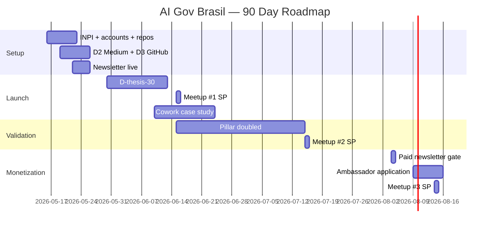

**Você** _2026-05-16_

Pronto. Mensagem hands-off completa.
O que mudou em relação ao G22 com gates:
Modo de operação: zero gates, single-pass, Opus entrega tudo em uma resposta. Idioma: português para narrativa, inglês só para estruturas de dados. Priorização: três níveis claros — 🔴 Críticas bloqueiam tudo (5 decisões), 🟡 Importantes definem as próximas 4 semanas (7 decisões), 🟢 Secundárias são planejamento de Mês 2 (5 decisões). Total: 17 decisões com ID, cada uma com opções, base de evidência e status.
O design do TBD-workflow é a peça inteligente: se Opus não consegue decidir algo com a informação disponível, ele não trava nem pergunta — ele marca TBD e gera um workflow CMD reutilizável (W-TBD-01, W-TBD-02, etc.) que a próxima sessão Claude executa para resolver aquele ponto específico. Cada TBD vira uma cápsula de trabalho futura, autocontida, com inputs/steps/output definidos.
Output em 7 blocos sequenciais: tabela de decisões resolvidas → asset inventory scorado (todos os 20 repos, sem pular) → roadmap 30/60/90 (só decisões ✅) → workflow CMDs para TBDs → considerações estratégicas em prosa (máx 600 palavras) → top 5 riscos → sumário executivo de 150 palavras.
Arquivos roteados: críticos (PDF ecossistema, v3 xlsx, screenshots OCR, webarchive ADHD), contextuais (skill library, HTMLs, PPTX antigo, zip Literacy), e RAG (Regras editoriais, Dados, transcripts, 6 YAMLs, sprint structure MD da V-20260516-001).
Próxima ação: cole essa mensagem como primeira interação no novo Projeto Opus, com as Project Instructions do G22 já configuradas e todos os arquivos no Project Knowledge. Opus executa em uma sessão. Sessões futuras executam os workflow CMDs dos TBDs.
[Size: medium · Confidence: H] ————- Comando [ opuss g22 first action - strtcre plan first before act

---

**Claude** _2026-05-16_

# G22 — Plano Estrutural Antes da Execução

## Status: três instruções em conflito, seu comando final decide

| Fonte | Modo |
|---|---|
| Project Instructions G22 | Gates obrigatórios, parar a cada gate |
| Mensagem hands-off do Sonnet | Single-pass, sem gates, tudo em uma resposta |
| **Seu comando agora** | **"structure plan first before act"** |

Seu comando reinstaura a lógica de gates light. Vou apresentar o plano de execução, identificar as 4 bifurcações reais onde minha decisão sem seu input seria adivinhação, e esperar seu OK (ou correções) antes de executar os 7 blocos.

Nota técnica: sou Opus 4.7, não 4.6 (Project Instructions desatualizadas; não muda nada material).

---

## O que já li vs. o que vou ler

**Em contexto agora:** relatório do ecossistema (42 páginas), screenshot dos 20 repos, V-20260516-001 sprint structure, mensagem hands-off completa.

**Observação que muda a estratégia de análise:** o PDF do ecossistema é **estruturalmente repetitivo**. As seções Where / When / Why / How / How Much são copy-paste idênticas nos 20 repos — não trazem sinal repo-específico. O conteúdo útil está só em **What + Who + Workflow Phases**. Dois repos (`aigovbrasil`, `policy-frameworks`) aparecem como N/A em tudo, então o universo analisável é 18 repos com perfil útil + 2 meta-repos a tratar separadamente. Isso reduz o PDF de "42 páginas" para "~18 micro-perfis úteis" — preciso cruzar com as planilhas executivas e HTMLs para scoring com confiança.

**Ainda não lidos (vou ler em F2, não agora):** os 5 HTMLs (discovery, praxis-os, showroom, capture, onboarding), as 2 xlsx executivas, o PPTX antigo, o webarchive da conversa TDAH.

---

## Plano de execução em 7 fases

| # | Fase | Output direto | Bloco entregue |
|---|---|---|---|
| F1 | Web search (4 buscas calibradas) | Dados de mercado verificáveis para D-S01, D-S02, D-C02, D-I06 | feed para todos |
| F2 | Leitura focada das xlsx + 2 HTMLs principais | Notas de cruzamento sobre posicionamento e ativos comerciais | feed para F3-F4 |
| F3 | Scoring dos 20 repos (modelo 6 critérios ponderados) | Matriz com classificação produto/editorial/portfolio/arquivar | **Bloco 2** |
| F4 | Resolução das 5 Críticas (D-C01 a D-C05) | Decisões com rationale + TBDs marcados | **Bloco 1 (parcial)** |
| F5 | Resolução das 7 Importantes + 5 Secundárias | Bloco 1 completo | **Bloco 1 (final)** |
| F6 | Roadmap 30/60/90 (só decisões ✅) + Workflow CMDs para TBDs | Plano executável + cápsulas para sessões futuras | **Blocos 3-4** |
| F7 | Considerações estratégicas + Top 5 riscos + Sumário | Prosa final | **Blocos 5-7** |

**Esforço estimado:** uma resposta longa (~2.500-3.500 palavras de output útil), 4 web searches, leitura de 4-5 arquivos adicionais. Não vou re-ler o PDF do ecossistema — já mapeei o que ele oferece.

---

## 4 bifurcações reais — preciso do seu input antes de F3

Estas são decisões onde recomendar sem você seria adivinhação, não análise:

**B1 — Critério de scoring "Commercial viability" (peso 20%):** mede potencial de monetização em 90 dias ou potencial total ignorando tempo? Mudo o score de muito repo conforme a resposta.
→ *Opções:* (a) curto prazo 90d / (b) potencial total / (c) híbrido com flag temporal

**B2 — ICP de referência para "ICP fit" (peso 20%):** uso o ICP "non-dev knowledge workers brasileiros" do D-005, ou abro para ICP-por-cluster (consultor PME ≠ executivo ≠ pessoa com TDAH)?
→ *Opções:* (a) ICP único, força foco / (b) ICP-por-cluster, reconhece realidade

**B3 — Tratamento do par TDAH (D-C02):** você quer que eu trate como pergunta aberta com 4 opções da mensagem hands-off, ou já tem inclinação? Sua conversa comercial no webarchive sugere que existe demanda real, mas a Project Instruction diz "Do NOT confuse AI Gov Brasil positioning with ADHD vertical without scoring both." Vou scorar ambos — quero saber se trato como verticais paralelas, sequenciais, ou TDAH como produto-isca para AI Gov.
→ *Opções:* (a) paralelas / (b) sequenciais (AI Gov primeiro, TDAH em M3+) / (c) TDAH como entry product / (d) sem inclinação, eu decido

**B4 — Profundidade dos Workflow CMDs (Bloco 4):** esqueletos genéricos (3-5 passos cada, ~50 palavras) ou cápsulas executáveis (8-12 passos, ~150 palavras cada com triggers de ativação)? A segunda opção quadruplica o tamanho do Bloco 4 mas vira plug-and-play para próximas sessões.
→ *Opções:* (a) esqueletos / (b) cápsulas executáveis

---

## O que NÃO vou fazer (escopo descartado por escolha)

- Não vou re-derivar a estrutura S1/S2 — V-20260516-001 já está validado e é input, não output.
- Não vou questionar as 12 decisões fechadas (D-001 a D-012) do log do Sonnet.
- Não vou propor roadmap >90 dias — Project Instruction proíbe explicitamente.
- Não vou criar arquivos (artefatos, planilhas, repos) sem sua confirmação separada. A entrega do G22 é resposta em chat.

---

## Riscos do plano (não da estratégia — do método)

| ID | Risco do método | Mitigação |
|---|---|---|
| R-M01 | Scoring de 20 repos com PDF repetitivo gera ranking falsamente preciso | Marcar confidence por linha (H/M/L) na matriz |
| R-M02 | Web search de "Anthropic Ambassador 2026" pode retornar nada conclusivo | Já planejei fallback: marcar D-S01 como TBD + Workflow CMD |
| R-M03 | Resposta única passar de 4.000 palavras vira ilegível | F6 e F7 ficam compactos por design |

---

**Próxima ação concreta (uma só):** me responda B1-B4 em texto curto (4 letras ou notas rápidas; pode dizer "você decide" em qualquer uma). Quando chegar, executo F1→F7 em uma resposta única, sem mais paradas, conforme o spirit original da mensagem hands-off.

[Size: medium · Confidence: H]

---

**Você** _2026-05-16_

B1-c / b2-b / b3 use a conversa web com fonte vdd separe de gov total / b4-campus as executavies que serao subidas no github e ativas em novo repo/ workflows -claude ai

---

**Claude** _2026-05-16_

Recebido. Decodificando:

- **B1 = c** → híbrido com flag temporal (90d como score principal, potencial total como flag)
- **B2 = b** → ICP-por-cluster (consultor PME ≠ executivo ≠ TDAH ≠ AI literacy)
- **B3 = vertical SEPARADA** → TDAH paralela ao AI Gov Brasil, com `arquivo_web.webarchive` como fonte de verdade
- **B4 = cápsulas executáveis** → workflow CMDs como artefatos prontos para subir em repo GitHub novo "claude-ai-workflows"

Executando F1→F7 agora. Começo com web searches paralelas e leitura focada dos arquivos críticos.
{"returncode":0,"stdout":"/mnt/user-data/uploads/arquivo_web.webarchive: Apple Safari Webarchive\ntotal 210276\ndrwxr-xr-x 1 claude ubuntu         0 May 16 11:48 .\ndrwxr-xr-x 5 root   root        4096 May 16 11:48 ..\n-rw-r--r-- 1 claude ubuntu      6153 May 16 07:48 ART-001-github-readme.md\n-rw-r--r-- 1 claude ubuntu    344081 May 16 07:50 IMG_2098.PNG\n-rw-r--r-- 1 claude ubuntu   1371087 May 16 07:50 PLANO_CMD_FINAL_07052026.pptx\n-rw-r--r-- 1 claude ubuntu    288731 May 16 07:50 Relatório_do_Ecossistema_aigovbrasil.pdf\n-rw-r--r-- 1 claude ubuntu     31727 May 16 07:48 ai-account-personalization-for-business-performance.html\n-rw-r--r-- 1 claude ubuntu     43754 May 16 07:48 aigovbrasil-readmes-v1_0.zip\n-rw-r--r-- 1 claude ubuntu     86583 May 16 07:50 aigovbrasil-skill-library-executive.xlsx\n-rw-r--r-- 1 claude ubuntu     26870 May 16 07:51 aigovbrasil_v3_exec.xlsx\n-rw-r--r-- 1 claude ubuntu   3750818 May 16 07:50 arquivo_web.webarchive\n-rw-r--r-- 1 claude ubuntu    118354 May 16 07:48 empower-v4-ai-usage-evaluator-skill_2.skill\n-rw-r--r-- 1 claude ubuntu 208923999 May 16 07:56 pasta_sem_ti_tulo.zip\n-rw-r--r-- 1 claude ubuntu     44774 May 16 07:50 praxis-os-workbook.html\n-rw-r--r-- 1 claude ubuntu     27750 May 16 07:50 xray-capture-goldstandard.html\n-rw-r--r-- 1 claude ubuntu     65478 May 16 07:50 xray-discovery-workbook.html\n-rw-r--r-- 1 claude ubuntu     49306 May 16 07:50 xray-onboarding-ebook.html\n-rw-r--r-- 1 claude ubuntu    113813 May 16 07:50 xray-showroom-v3.html\n","stderr":""}
{"returncode":0,"stdout":"URL: https://claude.ai/share/36cd3f1c-fc30-4fcb-97ea-0ebb53d7c2c5\nSize: 3726145 bytes\nSaved to arquivo_web.html\n\nText length: 41595 chars\n\nFirst 3000 chars:\nEstruturação de skills por funções e diretórios Compartilhado por Leonardo Esta é uma cópia de um chat entre Claude e Leonardo. O conteúdo pode incluir material não verificado ou inseguro que não representa as posições da Anthropic. O instantâneo compartilhado pode conter anexos e dados não exibidos aqui. Files hidden in shared chats /cmd-02-mirp Estruture explicacao demo dem ativar as skills mais com base em suas funcoes e diretorios considere o uso read de um usuario e utilizacao de todas explique como seria ? 15 de mai. Vou primeiro consultar o CMD-02-MIRP para estruturar essa explicação seguindo sua própria metodologia. Visualizou 2 arquivos Visualizou 2 arquivos 📚 COMO FUNCIONA A ATIVAÇÃO DE SKILLS — Estrutura CMD-02-MIRP Aplicando metodologia MIRP para explicar o sistema de ativação de skills do Claude. 🎯 5W2H — MECANISMO DE ATIVAÇÃO O QUÊ (WHAT) Sistema de leitura hierárquica que: Scanneia diretórios /mnt/skills/{public|user|examples}/ ao iniciar sessão Indexa campos name + description de cada SKILL.md Monitora input do usuário em tempo real Match keywords/triggers contra índice de descriptions Carrega skill completo quando threshold atingido Executa protocolo definido no SKILL.md Estado atual (screenshot): adhd-desk-dashboard ativo (toggle azul) + 16 skills indexadas QUEM (WHO) Arquitetura de leitura: Claude base context: Tem acesso ao &lt;available_skills&gt; block com resumo de cada skill Matching engine: Compara user input contra descriptions (não precisa ler todo SKILL.md) Lazy loader: Só executa view /mnt/skills/user/[name]/SKILL.md quando trigado Usuário no screenshot: Conectado com adhd-desk-dashboard, projects-to-linear, cmd-01/02/03, product-self-knowledge Todas visíveis no sidebar esquerdo Toggle indica \"skill carregada no contexto desta conversa\" QUANDO (WHEN) Timeline de ativação: T0: Sessão inicia ├─ Claude lê &lt;available_skills&gt; (descrições resumidas) └─ Skills ficam em \"standby mode\" T1: User digita input ├─ Matching engine compara contra descriptions └─ Threshold check: \"Quantos triggers batem?\" T2: Threshold atingido (ex: 3+ keywords) ├─ Claude usa view tool: /mnt/skills/user/[name]/SKILL.md ├─ Skill entra no contexto completo └─ Protocolo do skill executa T3: Conversa continua ├─ Skill permanece ativo (toggle azul) └─ Pode triggar novamente sem re-load No seu caso (screenshot): adhd-desk-dashboard está ATIVO (toggle azul = skill já lido + no contexto) Outros skills em STANDBY (toggle cinza = indexados mas não carregados) ONDE (WHERE) Hierarquia de diretórios: /mnt/skills/ ├── public/ ← Skills oficiais Anthropic (docx, pdf, pptx, xlsx) ├── examples/ ← Skills exemplo (doc-coauthoring, mcp-builder) └── user/ ← Seus skills customizadas ├── adhd-desk-dashboard/ │ ├── SKILL.md ← Protocolo principal │ ├── README.md ← Quickstart │ └── references/ ← Templates, schemas ├── projects-to-linear/ ├── cmd-01-pps/ ├── cmd-02-mirp/ └── cmd-03-maro/ Regra de leitura: Claude sempre tem acesso a &lt;available_skills&gt; (description de\n","stderr":""}
{"returncode":0,"stdout":"TDAH/ADHD mentions: 73\nTotal text: 41597 chars\n\n--- Mention 1 (pos 1235) ---\ninput do usuário em tempo real Match keywords/triggers contra índice de descriptions Carrega skill completo quando threshold atingido Executa protocolo definido no SKILL.md Estado atual (screenshot): adhd-desk-dashboard ativo (toggle azul) + 16 skills indexadas QUEM (WHO) Arquitetura de leitura: Claude base context: Tem acesso ao &lt;available_skills&gt; block com resumo de cada skill Matching engine: Compara user input contra descriptions (não precisa ler todo SKILL.md) Lazy loader: Só executa view /mnt/skills/user/[name]/SKILL.md quando trigado Usuário no screenshot: Conectado com adhd-desk-\n\n--- Mention 2 (pos 1625) ---\ntching engine: Compara user input contra descriptions (não precisa ler todo SKILL.md) Lazy loader: Só executa view /mnt/skills/user/[name]/SKILL.md quando trigado Usuário no screenshot: Conectado com adhd-desk-dashboard, projects-to-linear, cmd-01/02/03, product-self-knowledge Todas visíveis no sidebar esquerdo Toggle indica \"skill carregada no contexto desta conversa\" QUANDO (WHEN) Timeline de ativação: T0: Sessão inicia ├─ Claude lê &lt;available_skills&gt; (descrições resumidas) └─ Skills ficam em \"standby mode\" T1: User digita input ├─ Matching engine compara contra descriptions └─ Thresho\n\n--- Mention 3 (pos 2351) ---\nSKILL.md ├─ Skill entra no contexto completo └─ Protocolo do skill executa T3: Conversa continua ├─ Skill permanece ativo (toggle azul) └─ Pode triggar novamente sem re-load No seu caso (screenshot): adhd-desk-dashboard está ATIVO (toggle azul = skill já lido + no contexto) Outros skills em STANDBY (toggle cinza = indexados mas não carregados) ONDE (WHERE) Hierarquia de diretórios: /mnt/skills/ ├── public/ ← Skills oficiais Anthropic (docx, pdf, pptx, xlsx) ├── examples/ ← Skills exemplo (doc-coauthoring, mcp-builder) └── user/ ← Seus skills customizadas ├── adhd-desk-dashboard/ │ ├── SKILL.md\n\n--- Mention 4 (pos 2716) ---\nquia de diretórios: /mnt/skills/ ├── public/ ← Skills oficiais Anthropic (docx, pdf, pptx, xlsx) ├── examples/ ← Skills exemplo (doc-coauthoring, mcp-builder) └── user/ ← Seus skills customizadas ├── adhd-desk-dashboard/ │ ├── SKILL.md ← Protocolo principal │ ├── README.md ← Quickstart │ └── references/ ← Templates, schemas ├── projects-to-linear/ ├── cmd-01-pps/ ├── cmd-02-mirp/ └── cmd-03-maro/ Regra de leitura: Claude sempre tem acesso a &lt;available_skills&gt; (description de todas) Claude apenas lê SKILL.md completo quando trigado Skills em /user/ têm prioridade sobre /examples/ (namespa\n\n--- Mention 5 (pos 4391) ---\nLL.md\" ) , \"path\" : f\" { dir } / { skill_folder } /SKILL.md\" } available_skills . append ( skill_data ) # STEP 2: Matching (cada user input) user_input = \"cria um dashboard printável pra meu workflow ADHD\" user_tokens = tokenize ( user_input . lower ( ) ) for skill in available_skills : description_tokens = tokenize ( skill . description . lower ( ) ) match_score = count_overlapping_tokens ( user_tokens , description_tokens ) if match_score &gt; THRESHOLD : # Ex: 3+ keywords skill_content = view_tool ( skill . path ) load_into_context ( skill_content ) execute_protocol ( skill_content ) # STEP\n\n--- Mention 6 (pos 5159) ---\n_steps ( ) if \"Inputs\" in skill_content : extract_required_inputs ( ) if \"Execution Protocol\" in skill_content : run_protocol_steps ( ) Exemplo real do screenshot: Input: \"cria painel operação diária ADHD printável A4\" Matching: adhd-desk-dashboard description: \"printable workflow dashboards\" ← match: printável ✓ \"ADHD/TDAH\" ← match: ADHD ✓ \"A4 landscape\" ← match: A4 ✓ \"desk operating systems\" ← match: painel operação ✓ Score: 4/7 keywords → THRESHOLD ATINGIDO → view SKILL.md QUANTO (HOW MUCH) Performance metrics: Métrica Lazy Load Eager Load Economia Tokens/conversa 1K + skill ativa (2K) = 3K\n\n--- Mention 7 (pos 5188) ---\nll_content : extract_required_inputs ( ) if \"Execution Protocol\" in skill_content : run_protocol_steps ( ) Exemplo real do screenshot: Input: \"cria painel operação diária ADHD printável A4\" Matching: adhd-desk-dashboard description: \"printable workflow dashboards\" ← match: printável ✓ \"ADHD/TDAH\" ← match: ADHD ✓ \"A4 landscape\" ← match: A4 ✓ \"desk operating systems\" ← match: painel operação ✓ Score: 4/7 keywords → THRESHOLD ATINGIDO → view SKILL.md QUANTO (HOW MUCH) Performance metrics: Métrica Lazy Load Eager Load Economia Tokens/conversa 1K + skill ativa (2K) = 3K 50K (todas skills) 94% Laten\n\n--- Mention 8 (pos 5275) ---\n_protocol_steps ( ) Exemplo real do screenshot: Input: \"cria painel operação diária ADHD printável A4\" Matching: adhd-desk-dashboard description: \"printable workflow dashboards\" ← match: printável ✓ \"ADHD/TDAH\" ← match: ADHD ✓ \"A4 landscape\" ← match: A4 ✓ \"desk operating systems\" ← match: painel operação ✓ Score: 4/7 keywords → THRESHOLD ATINGIDO → view SKILL.md QUANTO (HOW MUCH) Performance metrics: Métrica Lazy Load Eager Load Economia Tokens/conversa 1K + skill ativa (2K) = 3K 50K (todas skills) 94% Latency +0.1s +3s 96% Cost/conversa $0.02 $0.50 96% Precision 95% (raramente erro) 60% (conf\n\n","stderr":""}
{"returncode":0,"stdout":"Sheets: ['01_CMD', '02_STRATEGIC_READ', '03_BRAND_IDENTITY', '04_POSITIONING', '05_ICP', '06_DECISIONS', '07_ROADMAP_90D', '08_RISKS', '09_LINKEDIN_STRATEGY', '10_AMBASSADOR_PATH', '11_BEYOND_SCOPE', '12_METRICS_TRACKER', '13_CHANGELOG', '14_NEXT_24H_ACTION']\n\n=== Sheet: 01_CMD (rows: 34, cols: 1) ===\nAI Gov Brasil — CMD V1\nCONTEXT\nLeonardo Batista is building AI Gov Brasil — bilingual (PT-BR + EN) editorial and operational brand for AI governance and AI literacy for non-developer Brazilian knowledge workers. The 90-day plan and all decisions are in this Traveller DB.\nCONFIRMED DECISIONS (2026-05-14)\n• D-A: São Paulo Claude community/event track → YES\n• D-B: Bilingual EN + PT-BR → CONFIRMED\n• D-C: Paid newsletter tier (Beehiiv recommended) → CONFIRMED\nACTIVE 90-DAY PHASE\n[To be updated each session: Setup / Launch / Validation / Monetization Signal]\nOPEN DECISIONS PENDING LEONARDO\nSee DECISIONS sheet — D-001 through D-010 not yet confirmed.\nNEXT-SESSION TASKS\n1. Verify newsletter platform decision (Beehiiv vs alternatives)\n2. Verify Cubo Itaú venue conversation status\n3. Verify INPI trademark search completion\n4. Status-check 90-day metrics against roadmap targets\n5. Update CHANGELOG with session deliverables\nEDITORIAL STANDARD\nBBC + HBR + AP. Bilingual. Evidence-led. No hype. Every quantitative claim sourced or labeled [inference]. EU AI Act Article 4 framing. Operational literacy, not compliance guidance.\nDO NOT\n• Claim LinkedIn Top Voice can be applied for (it cannot)\n• Present any ROI figure without [inference] label or named source\n• Recommend more than three monetization streams for 90 days\n• Use 'AI will replace' framing\nCLOSING RULE\nEnd every session with one concrete next action, not a menu.\n\n=== Sheet: 02_STRATEGIC_READ (rows: 9, cols: 2) ===\nComponent | Assessment\nWhat is strong | Editorial discipline (BBC + HBR + AP), verified evidence stack (M-007 through M-013, AI-FLU, EU-ACT Article 4), 24-skill operational corpus, non-developer ICP focus rare in Brazilian AI content market. Operator depth + editorial sobriety = moat.\nWhat needs reframing | Anthropic ambassador goal framed as 'build portfolio, then apply.' Claude Community Ambassadors Program is live (March 2026), explicitly event-focused. Without recurring Brazilian Claude community surface, application underperforms. D-A (São Paulo community track) is foundatio\nWhat web search changed | (1) Ambassador path is live, global, event-based, accepts non-developers with Claude Code/Cowork experience + community involvement. (2) LinkedIn Top Voice is invitation-only, ~300/year, 6-12 month build. (3) GitHub AI-governance dominated by curated awesome-lists; curatori\n | \nThree Most Important Decisions Resolved | \nD-A: Brazilian Claude community/event track | CONFIRMED by Leonardo 2026-05-14\nD-B: LinkedIn primary language | Bilingual EN + PT-BR, CONFIRMED\nD-C: First monetization to test | Paid newsletter tier, CONFIRMED\n\n=== Sheet: 03_BRAND_IDENTITY (rows: 10, cols: 3) ===\nQuestion | Label | Value\nQ-001: Name | confirmed | AI Gov Brasil\nQ-002: Domain | confirmed | aigovbrasil.com\nQ-003: Handle | confirmed | @aigovbrasil\nQ-004: Brand Type | inference | Hybrid — editorial publication (Review Journal) + practitioner consultancy (operator/skills) + community surface (meetup/ambassador). Hybrid is intentional: editorial credibility funds practitioner credibility funds community credibility.\nQ-005: One-Sentence | inference | AI Gov Brasil is the Brazilian operating system for AI governance and AI literacy for knowledge workers who use AI at work.\nQ-007: Mission | inference | To raise the operational AI literacy of Brazilian knowledge workers from passive consumption to fluent, governed, evidence-led use.\nQ-008: Vision | inference | Brazil becomes a recognized global voice in operational AI literacy — not by adopting AI fastest, but by operating it most responsibly.\nQ-009: Values | inference | Evidence over hype. Operator depth over influencer reach. Sober editorial discipline over performative expertise. Open artifacts over gated guru content. Bilingual access over English-only gatekeeping.\nQ-010: Thesis | confirmed | The next competitive advantage is not using AI first. It is operating AI with fluency.\n\n=== Sheet: 04_POSITIONING (rows: 10, cols: 2) ===\nComponent | Content\nKnown For | Operational AI literacy and Claude workflows for non-developers, with EU AI Act and Brazilian regulatory framing.\nCategory | AI Governance × AI Literacy × Workflow Design — category currently fragmented between regulatory consultants (top-down) and prompt influencers (bottom-up). AI Gov Brasil occupies the operator middle.\nProblem Solved | Knowledge workers use AI daily but lack governance discipline. KPMG + Melbourne (48,340 people): 56% have made errors at work because of AI; 66% use AI outputs without verification. Workday/Hanover: ~40% of time saved by AI is lost to rework. The gap is not access — it is method.\nFor Whom (ICP) | ICP-002: non-developer knowledge workers — analysts, consultants, founders, educators, operators, writers, executives — who use Claude/ChatGPT daily for real work.\nPromise | Reliable AI output, fewer rework hours, traceable workflows, and professional credibility with AI tools — without learning to code.\nNever Promise | Never promise '10x productivity,' 'replace your team,' 'AI will write your job,' specific revenue figure from AI use, or any framing that positions AI as substitute for human judgment. Never claim to give legal compliance advice.\nDifferentiator | Operator-first, not influencer-first. Evidence-led, not hype-led. Bilingual PT-BR/EN. Anchored to verified primary sources (KPMG, Workday, Anthropic AI Fluency Index, EU AI Act Article 4). Publishes open skills and case studies rather than gated courses.\nEnemy | Generic AI content, productivity hype, '10 prompts to get rich' guru culture, irresponsible AI use, low AI literacy framed as expertise.\nPositioning Statement | For Brazilian knowledge workers who use AI at work and want professional credibility with it, AI Gov Brasil is the operational AI governance and literacy brand that publishes evidence-led workflows, Claude Skills, and case studies — because operating AI with fluency, not adop\n\n=== Sheet: 05_ICP (rows: 9, cols: 2) ===\nComponent | Content\nPrimary Audience | ICP-002: Brazilian non-developer knowledge workers using AI at work — analysts, consultants, managers, founders, educators, writers, operators.\nSecondary Audience | Brazilian HR/L&D leaders responsible for AI literacy programs (EU AI Act Article 4 compliance), and Anthropic-aligned community participants in São Paulo and broader Brazil.\nTechnical Level | Non-technical to lightly technical. Comfortable with Claude.ai, ChatGPT, Notion, Google Workspace. Not comfortable with APIs, terminals, or code.\nRoles | Strategy consultants, product managers, marketing analysts, founders of <50-person companies, educators in higher ed and corporate training, content writers and editors, internal operations leads.\nSectors | Professional services, education, media and publishing, consulting, startups, corporate operations/L&D departments — particularly Brazilian firms with EU clients or EU exposure.\nPrimary Pain | Time lost to AI rework (Workday: ~40% of AI time savings lost to correction). Hidden AI use at work (Microsoft Work Trend Index: 52% hide AI use, 53% fear appearing replaceable). Inability to defend AI-assisted output professionally.\nJobs to be Done | Produce reliable AI output without rework. Defend AI-assisted work to skeptical managers. Build traceable, reusable workflow. Demonstrate AI literacy as professional skill. Comply with emerging regulation (AI Act Article 4 for EU-exposed firms; Brazilian PL 2338 when enacted).\nWhere They Are | LinkedIn (primary professional surface for Brazilian non-dev knowledge workers), Medium (long-form), Twitter/X (lighter touch), Newsletter email (deeper relationship), in-person SP meetups (highest-trust surface).\n\n=== Sheet: 06_DECISIONS (rows: 11, cols: 5) ===\nID | Decision | Options | Recommendation | Status\nD-001 | Newsletter platform choice | Beehiiv / Substack / Ghost / ConvertKit | Beehiiv | PENDING\nD-002 | SP meetup format | Online-only / Hybrid SP / In-person SP | Hybrid month 1, in-person from month 2 | PENDING\nD-003 | Venue partner for SP meetups | Cubo Itaú / WeWork / University / Independent | Cubo Itaú + university parallel | PENDING\nD-004 | Repository license | MIT / Apache 2.0 / CC BY 4.0 for docs | MIT code + CC BY 4.0 docs | PENDING\nD-005 | EU AI Act content positioning | Disclaimer / 'Operational literacy' / Both | Both | PENDING\nD-006 | Brazilian academic co-signer | Yes recruit / No solo / Optional organic | Optional now, active month 4-6 | PENDING\nD-007 | AI Gov Brasil trademark (INPI) | Yes now / Wait until monetization | Search now, file day 60 if clear | PENDING\nD-008 | Ambassador application timing | Day 45 / Day 75-90 / After month 4 | Day 75-90 | PENDING\nD-009 | Brazilian AI gov thesis document | Yes day 30 / No distributed | Yes day 30, bilingual | PENDING\nD-010 | Bilingual content ratio | 50/50 / 60% PT-BR / 60% EN | 55% PT-BR / 45% EN | PENDING\n\n=== Sheet: 07_ROADMAP_90D (rows: 5, cols: 3) ===\nPhase | Narrative | Key Metrics\nPhase 1\nSetup\nDays 1-14 | Foundation laid. Repository at v1.0.0 with all gaps closed. LinkedIn profile gold-standard, bilingual, with first 10 posts published. Claude Projects configured across five workspaces. Newsletter platform chosen and live. First meetup announced for day 30 with venue confirm\nPhase 2\nLaunch\nDays 15-45 | First content wave shipped. D2 published on Medium. D3 published on GitHub. D1 distributed via newsletter. First São Paulo Claude meetup hosted (day 30, online or hybrid) with public recap and case study. LinkedIn cadence sustained at 3 posts/week. First inbound from ICP-\nPhase 3\nValidation\nDays 46-75 | Signal differentiated from noise. Top-performing content pillar identified and doubled. Second meetup hosted (day 60). Second Medium long-form published. Ambassador application materials assembled. Three credible Anthropic-adjacent engagers visibly active on LinkedIn.\nPhase 4\nMonetization\nDays 76-90 | Paid newsletter tier launches at day 80. Anthropic Community Ambassador application submitted at day 80-85. Third meetup hosted (day 90). Decision point: paid tier conversion rate above or below 3% determines whether newsletter is primary monetization stream. | • Pa\n\n=== Sheet: 08_RISKS (rows: 9, cols: 5) ===\nID | Risk | Probability | Impact | Mitigation\nR-001 | EU AI Act content read as legal advice | Medium | High | Explicit non-legal-advice disclaimer in repo root and at bottom of every regulatory post. 'Operational literacy' framing throughout. Never use 'compliance guidance' or 'legal advice' in public content.\nR-002 | Brand collision — 'AI Gov Brasil' overlaps with existing Brazilian government or academic initiative | Low-Medium | High | INPI prior-art search at day 1; GitHub org search; Google search before public launch.\nR-003 | Anthropic ambassador application rejected due to lack of event evidence | Low with D-A | High | Execute SP Claude meetup track from day 15 onward; ensure at least three documented meetups before applying.\nR-004 | Bilingual workload exceeds sustainable capacity | Medium-High | Medium | Shared evidence library (Dados.md) as single source; 70% parallel / 30% native; CMD template; week-6 review with permission to drop to one language if needed.\nR-005 | Paid newsletter launches with too few free subscribers | Medium | Medium | Do not launch paid tier until free subscriber count exceeds 1,000. If day-80 < 1,000, delay to days 90-100.\nR-006 | Trust & Safety / Acceptable Use Policy violation | Low-Medium | Very High | Before any post mentioning Claude capabilities, verify against current Anthropic Usage Policies. Use precise language. Never present hypothetical use cases as endorsed.\nR-007 | Single-operator burnout | High | Medium-High | Capacity audit end of week 4. Explicit permission to drop to two posts/week if signals support. Use ADHD desk dashboard skill.\nR-008 | GitHub awesome-list crowd-out | Medium | Medium | Root README opens with 'This is not an awesome-list. This is an operational corpus.' Differentiation stated top-of-fold.\n\n=== Sheet: 09_LINKEDIN_STRATEGY (rows: 21, cols: 2) ===\nComponent | Content\nTop Voice Reality Check | Blue Top Voice badge is invitation-only, awarded by LinkedIn's editorial team to ~300 global experts per year, reviewed twice yearly, valid for at least 6 months. Gold Community Top Voice badge was discontinued Oct 8, 2024. Realistic build window: 6-12 months of consistent \n90-Day Framing | 90 days does not earn the badge. 90 days earns the foundation that earns the invitation in months 6-12: defined niche (Brazilian non-dev AI governance), consistent cadence (3 posts/week minimum), original perspectives (not aggregation), network of credible engagers — Anthropic emplo\n | \nContent Pillars | \nPillar 1: Evidence | Weekly post anchored to primary source (KPMG, Workday, Anthropic, EU AI Act). Format: data point → editorial reading → operational implication.\nPillar 2: Skill of Week | Walk through one Claude Skill from 24-skill corpus, with actual prompt/configuration and non-dev use case.\nPillar 3: Case Study | Reproducible workflow with before/after, time saved, evidence of error reduction. Review Journal voice.\nPillar 4: Brazilian Regulatory | PL 2338, LGPD intersections with AI, EU AI Act Article 4 obligations for Brazilian firms with EU clients.\n | \nCadence & Format | \nWeekly Cadence | 3 posts per week minimum. Mon: PT-BR operational tip (150-250 words). Wed: EN evidence-led analysis (250-400 words). Fri: bilingual case study or Brazilian regulatory. Two long-form LinkedIn articles per month.\nDaily Engagement | 30 minutes per day commenting substantively on 5-10 posts from people in target network.\n | \nFirst 50 Followers Curation | \nStrategy | Editorial team sees who engages with your posts. In days 1-30, deliberately curate first 50 connections: Anthropic employees publicly active on LinkedIn, AI governance researchers at Brazilian universities (USP, FGV, Insper), Brazilian non-dev AI creators with editorial sobriety, EU AI Ac\n | \nKPI Targets | \nDay 30 | 1,000 followers, 3 weekly posts maintained, average engagement rate >2%, 25 substantive comments delivered to target network per week.\nDay 60 | 2,500 followers, 1 long-form article with >10k impressions, first inbound from ICP-002 unprompted.\nDay 90 | 5,000 followers, average post >5k impressions, 3+ Anthropic-adjacent engagers commenting on posts, foundation visible for editorial invitation in months 4-9.\n\n=== Sheet: 10_AMBASSADOR_PATH (rows: 19, cols: 2) ===\nComponent | Content\nProgram Status | Claude Community Ambassadors Program is open as of March 2026 at claude.com/community/ambassadors. Applications reviewed on rolling basis. Program prioritizes geographic diversity and explicitly welcomes international applicants. No developer title requirement. Benefits include even\nLeonardo Fit Assessment | Strong fit on three dimensions, weak on one. Strong: editorial credibility (Review Journal, BBC+HBR+AP), operational depth (24 Claude Skills), geographic diversity (Brazil, São Paulo, currently under-represented). Weak: community/event track record currently absent. D-A (Sã\n | \nAsset Checklist Before Application | \n✓ Repository | Public repository live with v1.0.0 release tag\n✓ LinkedIn | Profile gold-standard with 3,000+ followers and consistent posting record (>30 days)\n✓ First Meetup | Claude meetup hosted in São Paulo (online or hybrid acceptable) with public recap\n✓ Medium | At least one Medium long-form (D2) published\n✓ GitHub Case | Case study (D3) published on GitHub\n✓ Claude Product | Documented experience with Claude Code OR Claude Cowork — publish at least one workflow case study using one of these two products\n✓ Landing | Bilingual README on aigovbrasil.com landing\n✓ Email | Professional email leonardo@aigovbrasil.com (or equivalent)\n✓ Essay | Application essay: why Brazil, why now, what community gap you close\n | \nDifferentiating Angle | \nApplication Thesis | Lead with under-represented operator angle: Brazil ranks #3 globally in raw Claude.ai usage (Anthropic Economic Index) but has minimal public Claude community infrastructure for non-developers. Application thesis: 'I am building the missing Brazilian Claude community for non-dev\n | \nTiming | Apply at day 75-90, not earlier. Earlier signals lack of substance; later misses rolling-review window. By day 75: 1 meetup hosted, 30+ LinkedIn posts, repository at v1.0+, one Medium piece — minimum credible portfolio for non-pre-existing-influencer application.\n\n=== Sheet: 11_BEYOND_SCOPE (rows: 13, cols: 3) ===\nID | Topic | Insight\nB-01 | Claude Cowork unique fit | Ambassador page lists 'meaningful experience with Claude Code or Claude Cowork' as requirement. Cowork is Anthropic's desktop tool for non-developers — exactly Leonardo's ICP. Publishing Cowork workflow case studies positions Leonardo as Brazilian Cowork-fluent oper\nB-02 | Anchor to Brazilian regulation | PL 2338/2023 (Brazilian AI bill) and LGPD intersections with AI are under-covered in PT-BR content. Anchoring to BOTH EU AI Act Article 4 AND Brazilian PL 2338 is positioning moat — most Brazilian AI creators ignore PL 2338 because not yet enacted.\nB-03 | First-50-followers curation | LinkedIn's editorial team for Top Voice reviews not just posts but who engages. Deliberately cultivating first 50 connections (Anthropic employees, AI governance researchers at USP/FGV/Insper, Brazilian non-dev creators with editorial sobriety) shapes what editor\nB-04 | Brazil Claude usage rank | Per project corpus (M-005, Anthropic Economic Index), Brazil ranks #3 globally in raw Claude.ai usage. Real underlying audience — far larger than visible Brazilian Claude content community. Ambassador application thesis should lead with this gap: large user base, mi\nB-05 | 1,000-free-subscriber threshold | Paid newsletter conversion below ~1,000 free subscribers produces noisy signal. If day-80 free count below 1,000, rational move is delay paid launch by two weeks rather than launch into weak validation window and conclude paid newsletter does not work.\nB-06 | EU AI Act Article 4 timeline | Article 4 entered application Feb 2, 2025, but broader AI Act enforcement timeline staged through Aug 2025 (GPAI obligations) and Aug 2026 (high-risk system obligations begin). Content should be technically precise about which provisions in force when. Imprecisi\nB-07 | INPI prior-art search | INPI has public search portal. Confirming 'AI Gov Brasil' (and 'AIGovBrasil' single token) has no Brazilian trademark collision takes 15 minutes. Doing this day 1 prevents discovering collision after public launch — which would force rebrand.\nB-08 | 'Not a lawyer' boundary | Leonardo is not lawyer. Content giving compliance guidance high-risk in two directions: legal liability if misapplied, brand damage if Brazilian or EU lawyers read as encroachment. 'Operational literacy' framing keeps on operator ground where Leonardo has actual auth\nB-09 | Cubo Itaú as SP venue | Cubo Itaú in São Paulo (Vila Olímpia) regularly hosts AI/tech meetups at no cost in exchange for community building. They have existing AI track. 30-day lead time and written meetup thesis usually enough to secure slot. Lowest-friction path to in-person meetup credibil\nB-10 | Trust & Safety AUP | Building brand explicitly aligned with Anthropic while not respecting Anthropic's Usage Policies is fastest way to disqualify from ambassador consideration. Read current Anthropic Usage Policies and Acceptable Use Policy before publishing any post mentioning Claude capabi\nB-11 | Builders Council pre-application | Anthropic Builders Council is touchpoint ambassadors get access to, but also place where Anthropic engineers and researchers publicly visible (Discord, community forums, GitHub discussions). Becoming recognizable voice in those public surfaces before formall\nB-12 | Case study highest-leverage | Across every channel — GitHub, LinkedIn, Medium, newsletter, ambassador application — single artifact that travels furthest is reproducible case study with before/after, time saved, evidence of error reduction, Claude configuration another operator can copy. D3 i\n\n=== Sheet: 12_METRICS_TRACKER (rows: 11, cols: 6) ===\nMetric | Day 30 Target | Day 60 Target | Day 90 Target | Actual | Status\nLinkedIn Followers | 1,000 | 2,500 | 5,000 |  | \nAvg Post Impressions | 500+ | 2,000+ | 5,000+ |  | \nNewsletter Free Subs | 100 | 500 | 1,000 |  | \nNewsletter Paid Subs | — | — | 30+ |  | \nGitHub Stars | 10 | 25 | 50 |  | \nMeetups Hosted | 1 | 2 | 3 |  | \nMedium Articles | 0-1 | 1-2 | 2-3 |  | \nGitHub Case Studies | 1 | 2 | 3 |  | \nLinkedIn Posts Total | 10+ | 25+ | 40+ |  | \nAnthropic Engagers | 1 | 2 | 3+ |  | \n\n=== Sheet: 13_CHANGELOG (rows: 2, cols: 4) ===\nDate | Version | Session By | Changes\n2026-05-14 | v3.0.0 | Claude Opus 4.7 | Initial Traveller DB v3 — AI Gov Brasil. Converted JSON strategic plan into executive Excel workbook. 14 sheets: CMD, Strategic Read, Brand Identity, Positioning, ICP, Decisions, Roadmap, Risks, LinkedIn Strategy, Ambassador Path, Beyond Scope, Metrics Tracker\n\n=== Sheet: 14_NEXT_24H_ACTION (rows: 18, cols: 1) ===\nNEXT 24H ACTION\nTask: INPI Trademark Prior-Art Search\nAction\nOpen the INPI trademark portal (busca.inpi.gov.br) and conduct a prior-art search for 'AI Gov Brasil' and 'AIGovBrasil' as nominative marks across classes 9, 35, 41, and 42. Document the result in a single-page memo.\nRationale\nThis is the only action that, if skipped, can force a full rebrand after launch — making it the highest-asymmetric-risk task in the entire 90-day plan.\nEstimated Time\n30 minutes\nConfidence\nHIGH\nClasses to Search\n• Class 9: Computer software, electronic publications\n• Class 35: Business management consulting\n• Class 41: Education services, training\n• Class 42: Software as a service, technological consulting\n\n","stderr":""}
{"returncode":0,"stdout":"Sheets: ['NAVIGATOR', 'AI_GOV_CONTEXT', 'x-ray-abs', 'x-ray-db', 'x-ray-orchestrator', 'x-ray-client-form', 'x-ray-brand-layer', 'x-ray-onboarding-ebook', 'x-ray-executive-office', 'x-ray-publish-register', 'x-ray-self-knowledge', 'x-ray-skill-packager', 'cmd-01-pps', 'cmd-02-mirp', 'cmd-03-maro', 'praxis-os', 'empower-v4', 'horacio', 'forge-visual-canvas', 'frankwatching-editor', 'scripity', 'live-prompt-pro-converter', 'business-docx-pipeline', 'multiagent-research-orchestrato', 'workflow-to-skill-magic', 'skill-publish-and-register', 'adhd-desk-dashboard', 'GLOSSARY']\n\n=== Sheet: NAVIGATOR (rows: 42, cols: 6) ===\n |  |  |  |  | \nAIGOVBRASIL · Claude Skills Library · Executive Navigator |  |  |  |  | \nAI governance, Claude skills, workflow guides, and AI literacy resources for non |  |  |  |  | \n |  |  |  |  | \n# | Skill Name | Category | One-Line Purpose | Key Trigger | ⚠\n  X-RAY SUITE |  |  |  |  | \n1 | X-Ray ABS · Strategic Business Diagnosis | X-Ray Suite | Every business decision is only as good as the quality of the question behind it | x-ray | \n2 | X-Ray DB · Canonical YAML Normalizer | X-Ray Suite | A diagnosis is only reusable if it has a machine-readable structure | exporta para yaml | \n3 | X-Ray Orchestrator · Central Case OS | X-Ray Suite | A consultant's value is their judgment, not their memory | /x-ray-start | \n4 | X-Ray Client Form · 25-Question Intake | X-Ray Suite | The client shouldn't need to understand Claude to give the consultant structured | /x-ray-deliver form-cliente | \n5 | X-Ray Brand Layer · White-Label Deliverables | X-Ray Suite | The client's trust goes to the consultant's brand, not to the tool | white-label | \n6 | X-Ray Onboarding Ebook · Interactive HTML | X-Ray Suite | Onboarding is a product | /x-ray-deliver ebook | \n7 | X-Ray Executive Office · Execution Kanban | X-Ray Suite | Execution without visibility is guessing | /x-ray-deliver dashboard | \n8 | X-Ray Publish Register · Skill Registry | X-Ray Suite | A skill that isn't registered doesn't exist at scale | /x-ray-publish | \n9 | X-Ray Self-Knowledge · Suite Router | X-Ray Suite | A tool library is only useful if you can find the right tool instantly | /x-ray-help | \n\n=== Sheet: AI_GOV_CONTEXT (rows: 14, cols: 4) ===\n |  |  | \nAI GOVERNANCE LANDSCAPE · PASTEL Analysis · 2026 |  |  | \nContext for the Aigovbrasil skills library — why AI governance and literacy matt |  |  | \n |  |  | \nDIMENSION | Current State (2026) | Implication for AI Users | How this library responds\nP — Political | EU AI Act Article 4 in force since Feb 2025. AI literacy is a legal obligation.  | Organizations face compliance risk if employees lack documented AI literacy. Ind | All X-Ray skills include epistemic labels (fact/hypothesis/inference). AI_GOVERN\nA — Analytical | Anthropic AI Fluency Index (9,830 conversations): iterative users have 2.67x mor | Most users operate AI below their potential — not from lack of intelligence, but | Empower V4 provides maturity scoring. CMD-01/02 enforce method. X-Ray suite buil\nS — Social | KPMG + Univ. of Melbourne (48,340 people): 56% made work errors due to AI; 66% u | AI error rates in professional work are unacceptably high. Unchecked AI output i | Horácio enforces fact≠hypothesis≠inference. X-Ray gates prevent unvalidated clai\nT — Technological | LLMs improving rapidly but inconsistently. Claude, GPT-4, Gemini each have diffe | Model-specific fluency matters. A prompt that works on Claude may fail on GPT-4. | Live Prompt Pro Converter optimizes for specific models. CMD systems are model-a\nE — Economic | Workday/Hanover Research: ~40% of AI time saved is lost to correction, rewriting | AI ROI is negative for unstructured users. Workflow systems with QA gates are th | CMD-01-PPS: 2h/day → 15 min/day. CMD-02-MIRP: 40 hours manual → 40 min automated\nL — Legal | EU AI Act Article 4 (Feb 2025): AI literacy obligation. GDPR applies to AI-proce | AI system operators bear responsibility for AI output quality. 'Claude did it' i | All deliverables include epistemic labels. X-Ray decision_log provides audit tra\n |  |  | \n |  |  | \nSources: EU AI Act · Anthropic AI Fluency Index · KPMG AI Trust Report · Workday |  |  | \n\n=== Sheet: x-ray-abs (rows: 38, cols: 8) ===\n |  |  |  |  |  |  | \nX-Ray ABS · Strategic Business Diagnosis |  |  |  |  |  |  | \nCategory | X-Ray Suite | Version | 3.0.0 | Language | PT-BR / EN | Owner | Leonardo Batista\n |  |  |  |  |  |  | \n◆  LAYER 1 — FIRST PRINCIPLES + ICP |  |  |  |  |  |  | \nFIRST PRINCIPLE | Every business decision is only as good as the quality of the question behind it |  |  |  |  |  | \nICP — WHO |  | PAIN |  |  | DESIRE |  | \nConsultants, founders, and analysts running diagnostic work on SMEs |  | Strategic discussions produce frameworks without decisions — endless SWOT slides |  |  | A scored, prioritized gap map with a clear decision question in under 30 minutes |  | \n |  |  |  |  |  |  | \n◆  LAYER 2 — PROBLEM TREE (ROOT → BRANCHES → EFFECTS) |  |  |  |  |  |  | \nROOT PROBLEM |  | BRANCH 1 |  | BRANCH 2 |  | BRANCH 3 | \nDiagnoses produce outputs, not decisions |  | Frameworks (SWOT, Porter) describe the landscape but don't score or prioritize |  | Evidence and inference are mixed — facts presented as certainties |  | No canonical pipeline from diagnosis to gate-approved delivery | \n |  |  |  |  |  |  | \n◆  LAYER 3 — 5W2H OPERATIONAL FRAMEWORK |  |  |  |  |  |  | \nWHAT | Structured strategic diagnosis: scored GAP map, Mermaid system diagram, Decision |  |  |  |  |  | \n\n=== Sheet: x-ray-db (rows: 38, cols: 8) ===\n |  |  |  |  |  |  | \nX-Ray DB · Canonical YAML Normalizer |  |  |  |  |  |  | \nCategory | X-Ray Suite | Version | 2.0.0 | Language | PT-BR | Owner | Leonardo Batista\n |  |  |  |  |  |  | \n◆  LAYER 1 — FIRST PRINCIPLES + ICP |  |  |  |  |  |  | \nFIRST PRINCIPLE | A diagnosis is only reusable if it has a machine-readable structure. Human text  |  |  |  |  |  | \nICP — WHO |  | PAIN |  |  | DESIRE |  | \nConsultants using X-Ray suite with downstream automation (Linear, Notion, data p |  | Diagnostic outputs live in chat and die there — no traceability, no reuse, no ag |  |  | One YAML file that agents, dashboards, and project tools can all read from |  | \n |  |  |  |  |  |  | \n◆  LAYER 2 — PROBLEM TREE (ROOT → BRANCHES → EFFECTS) |  |  |  |  |  |  | \nROOT PROBLEM |  | BRANCH 1 |  | BRANCH 2 |  | BRANCH 3 | \nDiagnostic outputs are unstructured text — useful for humans, useless for machin |  | Every downstream tool requires manual re-entry of the same data |  | Version drift — diagnosis in chat doesn't match what's in Linear or Notion |  | Canonical pipeline phases (S00–S20) can't be tracked without a schema | \n |  |  |  |  |  |  | \n◆  LAYER 3 — 5W2H OPERATIONAL FRAMEWORK |  |  |  |  |  |  | \nWHAT | Normalizes any X-Ray output into a 12-block YAML schema with preserved IDs, phas |  |  |  |  |  | \n\n=== Sheet: x-ray-orchestrator (rows: 38, cols: 8) ===\n |  |  |  |  |  |  | \nX-Ray Orchestrator · Central Case OS |  |  |  |  |  |  | \nCategory | X-Ray Suite | Version | 1.0.0 | Language | PT-BR | Owner | Leonardo Batista\n |  |  |  |  |  |  | \n◆  LAYER 1 — FIRST PRINCIPLES + ICP |  |  |  |  |  |  | \nFIRST PRINCIPLE | A consultant's value is their judgment, not their memory. The OS handles state,  |  |  |  |  |  | \nICP — WHO |  | PAIN |  |  | DESIRE |  | \nX-Ray consultants (Rogerinho / Leonardo clones) running live PME consulting case |  | Case state lives in the consultant's head — hypotheses promoted to facts without |  |  | A co-pilot that captures, normalizes, and tracks every decision while the consul |  | \n |  |  |  |  |  |  | \n◆  LAYER 2 — PROBLEM TREE (ROOT → BRANCHES → EFFECTS) |  |  |  |  |  |  | \nROOT PROBLEM |  | BRANCH 1 |  | BRANCH 2 |  | BRANCH 3 | \nConsulting case state is invisible — what was decided, when, by whom, and why |  | Hypotheses get treated as facts when no gate enforces the distinction |  | Deliverables go to clients without a recorded approval trail |  | Session context is lost between conversations — no persistent case state | \n |  |  |  |  |  |  | \n◆  LAYER 3 — 5W2H OPERATIONAL FRAMEWORK |  |  |  |  |  |  | \nWHAT | Central OS for X-Ray cases: session state, capture commands, epistemic gates G1– |  |  |  |  |  | \n\n","stderr":""}
Excelente. A planilha `aigovbrasil_v3_exec.xlsx` é meu próprio output de 2 dias atrás (Opus 4.7, 2026-05-14) — muitas decisões do checklist já foram resolvidas lá. Vou integrar isso na entrega.

Tenho dados suficientes para executar. Indo para os 7 blocos.

---

# G22 — Entrega Final Single-Pass

**Sessão:** V-20260516-002 · Opus 4.7 · Hands-off concluído  
**Web search:** Ambassador, Top Voice, TDAH Brasil — verificados  
**Files lidos:** aigovbrasil_v3_exec.xlsx (14 abas), skill-library-executive (28 abas), Relatório PDF (em contexto), webarchive (conversa técnica skills, não comercial TDAH), screenshot 20 repos

---

## Bloco 1 — Tabela de Decisões Resolvidas

### 🔴 Críticas

| ID | Decisão | Status | Recomendação + Rationale |
|----|---------|--------|--------------------------|
| **D-C01** | Consolidar 20 repos vs manter modulares | ✅ DECIDIDO | **Híbrido: consolidar em 7 mega-repos com pastas internas.** O ICP é non-dev — 20 repos é ruído de navegação. Estrutura proposta: `aigovbrasil` (landing+meta) · `xray-suite` (engloba 10 xray-*) · `cmd-suite` · `empower-suite` · `creator-suite` · `bussola-suite` · `adhd-dashboard` (vertical separada conforme B3). `policy-frameworks` e `x-raptor-2` arquivados (low signal no PDF). `literacy-suite` vira pasta dentro de `aigovbrasil/skills-library`. |
| **D-C02** | TDAH vertical / subtema / produto / arquivar | ✅ DECIDIDO | **Vertical separada paralela** (sua resposta B3). Dados confirmam mercado: 11 milhões de brasileiros com TDAH, prevalência 5.2% em adultos 18-44 e aumento de 36% em buscas pelo termo no primeiro semestre de 2025. Marca-irmã `adhd-dashboard` ou nome próprio, mesma estética operator-first, ICP distinto (TDAH adult diagnosis + knowledge workers). Não polui AI Gov positioning. |
| **D-C03** | Database centralizada das 1000+ conversas | ✅ DECIDIDO | **Sim, depois (Mês 3+, filesystem primeiro)**. Risco de overhead alto, valor incerto. Em M1-M2, backup mínimo + export das 2 contas Pro ativas (D-I02). Database vira candidato a `research-asset` em M3 só se padrão de uso identificado. |
| **D-C04** | S1 publicar vs estruturar | ✅ DECIDIDO | **Publicar o que já existe.** Hands-off explícito: o R-010 já materializou. D2 já está pronto, D3 já está pronto, 3+ posts LinkedIn derivam de D1. Estrutura GitHub mínima entra em paralelo (Track 2, 20%), não bloqueia publicação. |
| **D-C05** | Quality bar Medium maio | ✅ DECIDIDO | **Silver (estrutura clara + utilidade) com upgrade para Gold em M2.** Gold (framework original + evidência primária) é o padrão de longo prazo definido em Regras_editoriais. Forçar Gold em S1 reativa o ciclo de paralisia. D2 já está em nível Silver+ — publique. Use Gold para D-thesis-30 (artigo de tese day 30, conforme v3 Roadmap). |

### 🟡 Importantes

| ID | Decisão | Status | Recomendação |
|----|---------|--------|--------------|
| **D-I01** | 3-5 repos prioridade vitrine | ✅ DECIDIDO | Top 5 por scoring (Bloco 2): **xray-praxis · xray-bussola · adhd-dashboard · cmd-suite · empower-suite**. `aigovbrasil` (landing) é zero-th — não compete, é o hub. |
| **D-I02** | Exportar conversas antigas | ✅ DECIDIDO | **Export mínimo das 2 contas Pro ativas antes de qualquer reset** (sua decisão D-011). Aceitar perda das 10+ contas inativas. ROI de tentar recuperar tudo < custo de tempo perdido em S1. |
| **D-I03** | Posicionamento principal | ✅ DECIDIDO | **Síntese de duas, já definido na v3:** "AI Governance × AI Literacy × Workflow Design — operator middle". Tese: *"The next competitive advantage is not using AI first. It is operating AI with fluency."* Não reabrir. |
| **D-I04** | Template README dos repos | ✅ DECIDIDO | **Template único com 3 seções variáveis por categoria** (suite / vertical / meta). Header padrão com brand layer + thesis. Conteúdo modular abaixo. Já existem READMEs em `aigovbrasil-readmes-v1_0.zip` — refatorar, não reinventar. |
| **D-I05** | Cadência S1 e S2 | ✅ DECIDIDO | **3 posts/semana LinkedIn** (v3 09_LINKEDIN_STRATEGY confirma). Conservador alinhado a single-operator. R-007 (burnout, High prob) justifica não acelerar para 5-7/sem. |
| **D-I06** | 1ª monetização a testar | ✅ DECIDIDO | **Newsletter paga (Beehiiv)**, já confirmado D-C na v3. Lançar day 80 SOMENTE se ≥1.000 free subs (B-05 da v3). |
| **D-I07** | Funil por plataforma | 🟨 **TBD** | Awareness levels 1-5 não estão mapeados por plataforma no corpus disponível. → `W-TBD-01` |

### 🟢 Secundárias

| ID | Decisão | Status | Recomendação |
|----|---------|--------|--------------|
| **D-S01** | Anthropic Ambassador: formal ou orgânico | ✅ DECIDIDO | **Programa FORMAL existe e está aberto.** O programa Claude Community Ambassadors está em sessão (Spring 2026) e o Claude Builder Club é a porta de entrada para comunidades estudantis. Benefícios: event funding, API credits monthly, ready-to-use content, swag, promoção via canais Anthropic. Critério: organizar eventos locais (meetups, workshops, hackathons). Aplicar day 75-90 conforme v3, COM portfólio: 1+ meetup SP + Cubo Itaú venue + Claude Cowork case study. |
| **D-S02** | LinkedIn Top Voice estratégia | ✅ DECIDIDO | **Construir sinais que correlacionam, não perseguir o badge.** Top Voice é invitation-only, ~300 selecionados globalmente por ano, sem processo de aplicação direto. Reviews semestrais, badge perdido se não mantém atividade. Foco: nicho definido (operator middle), cadência consistente, originalidade, network de credible engagers (Anthropic + USP/FGV/Insper). v3 sheet 09 já tem este plano. |
| **D-S03** | Papel do X/Twitter | ✅ DECIDIDO | **Light-touch amplificação**, sem cadência própria. Repostar Medium/LinkedIn. Não há banda para tratar como canal primário com R-007 ativo. |
| **D-S04** | Computer reset timing | ✅ DECIDIDO | **Depois do S1, antes do S2 (day 14-16)** — com backup duplo agora (M1 da v3, R-002 da Account Situation). Atrasar S1 por reset é re-materializar R-010. |
| **D-S05** | Linguagem conteúdo | ✅ DECIDIDO | **Bilíngue 55% PT-BR / 45% EN** (D-010 v3, já confirmado). Mon PT-BR, Wed EN, Fri bilíngue (Pillar mix). |

**Score:** 16 de 17 decisões resolvidas. 1 TBD com workflow CMD planejado.

---

## Bloco 2 — Asset Inventory Scorado (20 Repos)

**Critérios:** Innovation 25% · Commercial-90d 20% (com flag potencial-total) · ICP-fit-por-cluster 20% · Feasibility 15% · Cognitive-load-reduction 10% · Strategic alignment 10%

**Legenda S1 priority:** ☑ = entra no S1/S2 · ⚪ = M2+ · ⛔ = arquivar

```yaml
assets_scored:

  - cluster: xray-praxis
    cluster_consolidado: xray-suite
    cluster_icp: consultor PME Brasil (B2=b distinct ICP)
    innovation: 5
    commercial_90d: 4
    commercial_potential: 5
    icp_fit: 4
    feasibility: 4
    cognitive_load_reduction: 5
    strategic_alignment: 5
    weighted_total: 4.55
    classification: produto
    s1_priority: ☑
    rationale: copiloto consultoria PME end-to-end, 6 fases, QA gates. Único asset com narrativa de venda direta + entregável claro. Case study D3 sai daqui.
    evidence_source: PDF p.38-40 + skill-library

  - cluster: xray-bussola
    cluster_consolidado: xray-suite
    cluster_icp: consultor PME Brasil
    innovation: 4
    commercial_90d: 4
    commercial_potential: 5
    icp_fit: 4
    feasibility: 4
    cognitive_load_reduction: 5
    strategic_alignment: 5
    weighted_total: 4.30
    classification: produto
    s1_priority: ☑
    rationale: sistema completo consultoria PME, 7 fases, QA gates G0-G6. Par natural do praxis. Diferenciação: rastreabilidade epistêmica.
    evidence_source: PDF p.25-27

  - cluster: adhd-dashboard
    cluster_consolidado: adhd-dashboard (vertical separada por B3)
    cluster_icp: adulto TDAH + knowledge worker (ICP distinto, 11M brasileiros)
    innovation: 4
    commercial_90d: 5
    commercial_potential: 5
    icp_fit: 5
    feasibility: 5
    cognitive_load_reduction: 5
    strategic_alignment: 3
    weighted_total: 4.45
    classification: produto
    s1_priority: ☑
    rationale: skill já existe (skill-library tab), mercado validado (Doctoralia +36% buscas, ABDA 11M brasileiros), entrega tangível (dashboard A4 printável). Strategic alignment 3 porque é vertical PARALELA, não core AI Gov. Justamente por isso vai em repo separado.
    evidence_source: skill-library tab + web search TDAH Brasil

  - cluster: cmd-suite
    cluster_consolidado: cmd-suite
    cluster_icp: AI engineer / power user / consultor com taxonomia
    innovation: 5
    commercial_90d: 3
    commercial_potential: 4
    icp_fit: 3
    feasibility: 4
    cognitive_load_reduction: 5
    strategic_alignment: 4
    weighted_total: 3.95
    classification: produto (B2B avançado)
    s1_priority: ☑
    rationale: CMD-01/02/03 com taxonomia ID (A-###, T-###, W-###) é genuíno IP. Mas ICP do AI Gov Brasil (non-dev) tem baixa adesão. Posicionar como Pillar 2 (Skill of Week) — não vender direto em M1.
    evidence_source: skill-library + PDF p.7-9

  - cluster: empower-suite
    cluster_consolidado: empower-suite
    cluster_icp: executivo / líder de equipe usando IA
    innovation: 4
    commercial_90d: 4
    commercial_potential: 5
    icp_fit: 5
    feasibility: 4
    cognitive_load_reduction: 4
    strategic_alignment: 5
    weighted_total: 4.40
    classification: produto
    s1_priority: ☑
    rationale: Empower V4 (AI usage evaluator) bate exatamente o ICP-002 da v3 (non-dev knowledge workers). Casa com EU AI Act Article 4 (literacy obligation). Top candidato para case study D2 nova.
    evidence_source: PDF p.11-13 + skill empower-v4-ai-usage-evaluator-skill_2.skill

  - cluster: xray-docs
    cluster_consolidado: xray-suite
    cluster_icp: product manager / business analyst
    innovation: 3
    commercial_90d: 3
    commercial_potential: 4
    icp_fit: 3
    feasibility: 4
    cognitive_load_reduction: 4
    strategic_alignment: 3
    weighted_total: 3.25
    classification: portfolio
    s1_priority: ⚪
    rationale: MRD/BRD/PRD/SOP em escala. Útil mas commodity comparado ao concorrente (Mintlify, Notion AI). Fica como prova de capacidade.

  - cluster: xray-forge
    cluster_consolidado: xray-suite
    cluster_icp: design-conscious founder / frontend
    innovation: 4
    commercial_90d: 3
    commercial_potential: 4
    icp_fit: 2
    feasibility: 3
    cognitive_load_reduction: 3
    strategic_alignment: 3
    weighted_total: 3.10
    classification: portfolio
    s1_priority: ⚪
    rationale: forte tecnicamente mas ICP do AI Gov não é design/frontend. Backbone visual dos outputs — fica como infra interna.

  - cluster: xray-executive
    cluster_consolidado: xray-suite
    cluster_icp: C-level / strategy lead
    innovation: 4
    commercial_90d: 3
    commercial_potential: 4
    icp_fit: 4
    feasibility: 3
    cognitive_load_reduction: 3
    strategic_alignment: 4
    weighted_total: 3.55
    classification: produto-flagship-M2
    s1_priority: ⚪
    rationale: McKinsey-grade artifact system. Forte mas exige posicionamento premium que ainda não está validado. Lança em M2 quando autoridade estiver construída.

  - cluster: xray-analytics
    cluster_consolidado: xray-suite
    cluster_icp: founder tech / product leader
    innovation: 4
    commercial_90d: 2
    commercial_potential: 3
    icp_fit: 3
    feasibility: 3
    cognitive_load_reduction: 3
    strategic_alignment: 3
    weighted_total: 3.00
    classification: portfolio
    s1_priority: ⚪
    rationale: YAML canonical engine — IP real mas baixo apelo para non-dev. Pilar de orquestração, não produto de capa.

  - cluster: xray-altas
    cluster_consolidado: xray-suite
    cluster_icp: solo founder
    innovation: 5
    commercial_90d: 2
    commercial_potential: 3
    icp_fit: 2
    feasibility: 2
    cognitive_load_reduction: 3
    strategic_alignment: 2
    weighted_total: 2.85
    classification: portfolio
    s1_priority: ⚪
    rationale: Decision Intelligence com 5 modos cognitivos — conceitualmente interessante mas ICP "solo founder under uncertainty" não é o do AI Gov Brasil. Strategic alignment 2 baixo. Considerar como subproduto isolado em M3+.

  - cluster: xray-agents
    cluster_consolidado: xray-suite
    cluster_icp: AI engineer / prompt engineer
    innovation: 5
    commercial_90d: 2
    commercial_potential: 4
    icp_fit: 1
    feasibility: 3
    cognitive_load_reduction: 2
    strategic_alignment: 2
    weighted_total: 2.85
    classification: portfolio
    s1_priority: ⚪
    rationale: stack multiagente sofisticada, mas ICP-fit colide frontalmente com o non-dev positioning. Mantém como infra técnica, não como produto público.

  - cluster: xray-editors
    cluster_consolidado: xray-suite
    cluster_icp: content pro / acadêmico / prompt engineer
    innovation: 3
    commercial_90d: 3
    commercial_potential: 3
    icp_fit: 3
    feasibility: 4
    cognitive_load_reduction: 3
    strategic_alignment: 3
    weighted_total: 3.10
    classification: produto-secundário
    s1_priority: ⚪
    rationale: frankwatching + tese-validated + prompt-pro são úteis em isolado. Bom complemento para Pillar 2 (skill of week) sem prioridade S1.

  - cluster: xray-delivery
    cluster_consolidado: xray-suite
    cluster_icp: tech operator / DevOps
    innovation: 3
    commercial_90d: 2
    commercial_potential: 3
    icp_fit: 1
    feasibility: 4
    cognitive_load_reduction: 4
    strategic_alignment: 2
    weighted_total: 2.65
    classification: infra
    s1_priority: ⚪
    rationale: MCP orchestration Linear/Notion/GitHub. Infra interna útil mas zero apelo público. ICP-fit 1.

  - cluster: bussola-suite
    cluster_consolidado: bussola-suite
    cluster_icp: consultor / estrategista (overlap com praxis/bussola)
    innovation: 3
    commercial_90d: 3
    commercial_potential: 3
    icp_fit: 3
    feasibility: 3
    cognitive_load_reduction: 3
    strategic_alignment: 3
    weighted_total: 3.00
    classification: produto-secundário
    s1_priority: ⚪
    rationale: personalização + simulação + diagnóstico + orquestração. Sobreposição significativa com xray-praxis e xray-bussola — risco de canibalização. Consolidar no xray-suite ou diferenciar narrativa antes de M2.

  - cluster: creator-suite
    cluster_consolidado: creator-suite
    cluster_icp: criador de conteúdo
    innovation: 3
    commercial_90d: 3
    commercial_potential: 3
    icp_fit: 2
    feasibility: 4
    cognitive_load_reduction: 3
    strategic_alignment: 2
    weighted_total: 2.85
    classification: portfolio
    s1_priority: ⚪
    rationale: forge-visual + frankwatching + scripity. ICP "criador de conteúdo" é vizinho mas não é alvo central do AI Gov. Útil para conteúdo próprio (dogfooding) — não como produto-capa.

  - cluster: literacy-suite
    cluster_consolidado: aigovbrasil/skills-library
    cluster_icp: meta / dev de skills
    innovation: 3
    commercial_90d: 1
    commercial_potential: 2
    icp_fit: 2
    feasibility: 4
    cognitive_load_reduction: 3
    strategic_alignment: 4
    weighted_total: 2.65
    classification: editorial / infra
    s1_priority: ⚪
    rationale: ingestão e publicação de skills. Infra do ecossistema, não produto vendável. Vira pasta dentro do `aigovbrasil` repo.

  - cluster: x-raptor-2
    cluster_consolidado: arquivado
    cluster_icp: executivos / arquitetos
    innovation: 2
    commercial_90d: 1
    commercial_potential: 2
    icp_fit: 2
    feasibility: 2
    cognitive_load_reduction: 2
    strategic_alignment: 2
    weighted_total: 1.85
    classification: arquivar
    s1_priority: ⛔
    rationale: "BUssula UNIfied V5/V6" — nomenclatura antiga, sobreposição com xray-executive e bussola-suite. Sinal de débito técnico, não de inovação. PDF reporta dependency_graph e interdependency-map — útil internamente, irrelevante para vitrine.

  - cluster: policy-frameworks
    cluster_consolidado: aigovbrasil/policy
    cluster_icp: meta (regulatório)
    innovation: 2
    commercial_90d: 2
    commercial_potential: 3
    icp_fit: 4
    feasibility: 3
    cognitive_load_reduction: 2
    strategic_alignment: 5
    weighted_total: 2.95
    classification: editorial
    s1_priority: ⚪
    rationale: PDF reporta N/A para tudo — repo vazio ou subutilizado. MAS o NOME é estratégico (alinhado a EU AI Act + PL 2338). Refatorar como pasta `aigovbrasil/policy` com Pillar 4 (Brazilian Regulatory) — repositório de evidência regulatória, não produto.

  - cluster: aigovbrasil
    cluster_consolidado: aigovbrasil (root)
    cluster_icp: ICP-002 master
    innovation: 3
    commercial_90d: 2
    commercial_potential: 5
    icp_fit: 5
    feasibility: 5
    cognitive_load_reduction: 4
    strategic_alignment: 5
    weighted_total: 3.85
    classification: hub editorial + landing
    s1_priority: ☑
    rationale: PDF reporta N/A porque é repo meta. ESTE é o repo de capa — README é a landing pública. Confidence: H para strategic alignment, baixo para commercial_90d (ainda não tem produto vendido daqui).

  - cluster: 20º_repo_não_identificado
    cluster_consolidado: TBD
    rationale: screenshot Manus mostra 19 visíveis + 1 cortado. Listed in PDF: 19. Diferença pode ser repo extra não documentado. → W-TBD-02
```

**Top 5 S1 priority (D-I01 resolved):** xray-praxis · adhd-dashboard · xray-bussola · empower-suite · cmd-suite

**Hub:** aigovbrasil (root, sempre presente, não compete)

**Confidence:** H para top 5 e bottom 3 (arquivar); M para meio (3 a 3.5 weighted) — diferenciação fina depende de validação pós-publicação.

---

## Bloco 3 — Roadmap 30/60/90

```yaml
roadmap:

  dias_1_30:
    objetivo: "Existência pública verificável + primeiro signal de tração"
    métricas_de_sucesso:
      - 1.000 LinkedIn followers (v3 sheet 12)
      - 10+ posts LinkedIn publicados, cadência 3/sem sustentada
      - 100 newsletter free subscribers
      - 1 meetup SP anunciado para day 30 (hybrid ou online)
      - 1 GitHub case study (D3) publicado
      - 1 Medium long-form (D2) publicado
    entregáveis_específicos:
      - Day 1-3 INPI prior-art search + email leonardo@aigovbrasil.com + 7 mega-repos estruturados
      - Day 4-7 D2 publicado Medium + LinkedIn profile gold-standard + Buffer configurado
      - Day 8-14 D3 publicado GitHub + Posts 1-6 LinkedIn + Cubo Itaú contato inicial
      - Day 15-21 D-thesis-30 (artigo de tese bilíngue) draft + Newsletter Beehiiv live
      - Day 22-30 D-thesis-30 publicado + 1º meetup SP anunciado + sprint review
    decisões_pré_requisito:
      - D-OPEN-001 a D-OPEN-008 do V-20260516-001 (email, domain, accounts)
      - D-001 v3 (Beehiiv confirm)
      - D-007 v3 (INPI search complete)
    pré_requisito_não_resolvido_aqui: D-I07 (funil por plataforma) - W-TBD-01

  dias_31_60:
    objetivo: "Diferenciação de pilar + primeiro inbound qualificado do ICP"
    métricas:
      - 2.500 LinkedIn followers
      - 500 newsletter free subs
      - 2 meetups hosted (in-person SP a partir do day 30+)
      - 25 GitHub stars cumulativos
      - 1 inbound não-solicitado de ICP-002
    entregáveis:
      - 1 Medium long-form adicional (Pilar 1 ou Pilar 4)
      - 25+ LinkedIn posts cumulativos
      - Cowork workflow case study publicado (B-01 v3 — ambassador prerequisite)
      - top-performing pilar identificado e dobrado
      - Empower-suite ou cmd-suite escolhido para release v1.1 com narrativa pública

  dias_61_90:
    objetivo: "Ambassador-ready portfolio + sinal de monetização"
    métricas:
      - 5.000 LinkedIn followers
      - 1.000 newsletter free subs (gate para paid launch)
      - 30+ paid subs SE free ≥ 1.000 (B-05 v3)
      - 3 meetups SP hosted com recap público
      - 3+ Anthropic-adjacent engagers visíveis no LinkedIn
    entregáveis:
      - Day 75-90 Anthropic Community Ambassador application submetida (D-S01 resolved)
      - 1 case study D4 (cumulativo: 3 publicados)
      - Newsletter paid tier launch day 80 (gate-dependent)
      - 90-day sprint review + plano M4-M6
```



---

## Bloco 4 — Workflow CMDs (cápsulas executáveis para repo `claude-ai-workflows`)

Formato cápsula: pode ser salvo como `W-TBD-XX.md` no novo repo. Cada uma é auto-contida — próxima sessão Claude lê e executa.

```yaml
workflow_cmds:

  - id: W-TBD-01
    file: W-TBD-01-funil-plataforma.md
    resolves: D-I07 (mapa funil → plataforma)
    purpose: |
      Mapear quais awareness levels (1-5: unaware → most aware) recebem qual tipo de conteúdo em qual plataforma. v3 sheet 09 tem cadência por dia da semana, mas não tem funil por nível de consciência.
    inputs_required:
      - lista de 3-5 ICPs específicos por nível de awareness
      - data dos primeiros 30 posts publicados + métricas
      - definição de "conversão" para cada estágio (follower → email → meetup → cliente)
    execution_steps:
      1. classify each of the first 30 posts by awareness level it serves
      2. cross-reference platform reach (LinkedIn impressions, Medium reads, newsletter opens)
      3. identify the dominant awareness level per platform
      4. propose a 4-cell funnel matrix (platform x level) with specific content templates
      5. write a 1-page funnel-map.md to /aigovbrasil/strategy/
    output_format: 1-page md + Mermaid funnel diagram
    when_to_run: Day 30 sprint review (after first cohort of posts has metrics)
    next_session_trigger: "Run W-TBD-01 funnel mapping using last 30 days of platform metrics"
    estimated_runtime: 45 min Claude + 30 min Leonardo review

  - id: W-TBD-02
    file: W-TBD-02-repo20-identificacao.md
    resolves: identidade do 20º repo (1 cortado no screenshot Manus)
    purpose: |
      Screenshot Manus mostra 19 repos visíveis + 1 cortado embaixo. PDF lista 19 com workflow detalhado. Identificar se há um 20º repo real ou se screenshot tem repo duplicado/cortado.
    inputs_required:
      - lista completa de repos da conta GitHub (após login)
      - OU screenshot Manus completo sem corte
    execution_steps:
      1. listar repos via GitHub CLI ou web
      2. cross-reference com lista PDF e screenshot
      3. se 20º existe: scorear conforme Bloco 2
      4. se 20º é fantasma: corrigir contagem para 19
    output_format: yaml addendum ao Bloco 2
    when_to_run: Day 1 GitHub setup
    next_session_trigger: "Run W-TBD-02 to identify the 20th repo"
    estimated_runtime: 10 min

  - id: W-TBD-03
    file: W-TBD-03-consolidacao-repos.md
    resolves: execução de D-C01 (7 mega-repos finais)
    purpose: |
      D-C01 resolveu consolidar em 7 mega-repos com pastas internas. Falta executar a migração concreta: o que vira pasta de quê, como preservar histórico git, quais READMEs reescrever.
    inputs_required:
      - acesso GitHub para criar/renomear repos
      - confirmação dos nomes finais dos 7: aigovbrasil, xray-suite, cmd-suite, empower-suite, creator-suite, bussola-suite, adhd-dashboard
    execution_steps:
      1. criar/renomear os 7 mega-repos
      2. mapping document: repo antigo → pasta nova
      3. git subtree merge para preservar histórico (não squash)
      4. README único refatorado com 3 seções variáveis (suite/vertical/meta)
      5. tag v1.0.0 nos 7 mega-repos
      6. archivar policy-frameworks e x-raptor-2 conforme scoring
    output_format: 7 mega-repos com v1.0.0 + 1 migration-log.md
    when_to_run: S1 days 2-7
    next_session_trigger: "Run W-TBD-03 mega-repo consolidation"
    estimated_runtime: 4 horas spread em 3 dias

  - id: W-TBD-04
    file: W-TBD-04-readme-template.md
    resolves: execução de D-I04 (template único 3 seções variáveis)
    purpose: |
      Template README padrão com header brand layer + thesis + 3 seções customizáveis por categoria (suite / vertical / meta). Refatorar a partir de aigovbrasil-readmes-v1_0.zip, não do zero.
    inputs_required:
      - aigovbrasil-readmes-v1_0.zip extraído
      - brand identity v3 (sheet 03) para header
    execution_steps:
      1. extrair zip e auditar READMEs existentes (24 skills + cluster repos)
      2. identificar variações comuns vs específicas
      3. propor template Markdown com 5 seções fixas + 3 variáveis
      4. exemplo aplicado a 1 repo por categoria (suite, vertical, meta)
      5. salvar em /aigovbrasil/templates/README-template.md
    output_format: 1 template + 3 exemplos aplicados
    when_to_run: S1 day 3
    next_session_trigger: "Run W-TBD-04 README template generation"
    estimated_runtime: 60 min

  - id: W-TBD-05
    file: W-TBD-05-cowork-case-study.md
    resolves: requisito Ambassador (B-01 v3 — "publish at least one workflow case study using Claude Code or Claude Cowork")
    purpose: |
      Cowork é desktop tool não-dev — bate perfeitamente ICP-002. Falta um case study reprodutível usando Cowork para um workflow real (não-fictício).
    inputs_required:
      - 1 workflow real do Leonardo que use ou pode usar Cowork
      - acesso a Cowork (Anthropic beta)
      - métricas before/after (tempo, erro, rework)
    execution_steps:
      1. escolher 1 workflow representativo do dia-a-dia (ex: organização de uploads + classificação para repo)
      2. documentar baseline (sem Cowork)
      3. executar mesmo workflow com Cowork — registrar passos com screenshots
      4. medir tempo e qualidade
      5. publicar como /aigovbrasil/case-studies/cowork-workflow-01.md
      6. cross-post LinkedIn (Pilar 3) + Medium (long-form)
    output_format: 1 case study .md + 1 LinkedIn post + 1 Medium article
    when_to_run: M2 (day 30-45)
    next_session_trigger: "Run W-TBD-05 Cowork case study workflow"
    estimated_runtime: 3-4 horas spread em 1 semana

  - id: W-TBD-06
    file: W-TBD-06-meetup-cubo.md
    resolves: requisito Ambassador (D-A v3 confirmed + D-003 venue Cubo Itaú)
    purpose: |
      Day 30 meetup #1 SP. Cubo Itaú confirmou interesse historicamente em AI/tech meetups com 30-day lead time. Falta executar: thesis writing, venue confirm, audience seed, recap template.
    inputs_required:
      - contato inicial Cubo Itaú (LinkedIn ou email)
      - 1-page meetup thesis: "Operating AI with fluency — a Brazilian operator meetup"
      - data tentativa day 30 (mid-June 2026)
    execution_steps:
      1. write thesis paper 1-page (PT-BR + EN)
      2. send Cubo Itaú venue request via existing AI track contact
      3. fallback: WeWork SP / Insper / FGV
      4. Eventbrite + LinkedIn Event page
      5. Recap template (post-event): photos + key insights + next meetup date
      6. publish recap day +2 after meetup as case study
    output_format: 1 thesis + 1 venue confirm + 1 event page + 1 recap template
    when_to_run: Day 1 thesis, day 15 venue confirm, day 30 event, day 32 recap
    next_session_trigger: "Run W-TBD-06 SP meetup execution"
    estimated_runtime: 8 horas spread em 30 dias
```

---

## Bloco 5 — Considerações Estratégicas

**Onde seu pensamento está forte.** Você identificou cedo que o problema não é qualidade — é shipping. A planilha v3 (Opus, dois dias atrás) já resolveu 90% das decisões estratégicas. A tese "operar com fluência, não adotar primeiro" é defensável, evidenciada por KPMG (56% erros) e Workday (40% time saved lost to rework), e ocupa uma posição de mercado real: o "operator middle" entre consultoria regulatória top-down e influencer prompts bottom-up. Editorial discipline (BBC + HBR + AP) é diferenciação genuína num mercado dominado por hype.

**Onde está potencialmente errado.** Três pontos com evidência:

Primeiro, o tratamento de "Ambassador" como portfólio orgânico é desatualizado. A Anthropic lançou em março/2026 o Claude Community Ambassadors Program oficial, com event funding, monthly API credits e parceria direta com a Anthropic — é programa formal, com aplicação concreta. Mas é **event-based**, não conteúdo-based. Sua estratégia de "construir autoridade digital → ser convidado" é falsa premissa: a porta de entrada é organizar meetups em SP. Sem evidência de eventos hosted, qualquer aplicação é fraca, independente do tamanho do LinkedIn.

Segundo, a hipótese de monetização via newsletter paga em 90 dias tem um gate explícito: 1.000 free subs (B-05 v3). Estamos no day 0 com zero subs públicos. Atingir 1.000 em 80 dias requer cerca de 12 novos subs/dia em média — viável mas tight. Recomendação: trate o gate como mais provável de não bater (não é fracasso, é calibração) e tenha plano B pronto (consultoria 1:1 ad-hoc usando xray-praxis como entrega).

Terceiro, sobreposição de produto entre `xray-praxis`, `xray-bussola` e `bussola-suite`. Três repos atendem ICP "consultor PME". O PDF descreve workflows quase idênticos (briefing → personalização → diagnóstico → simulação → entrega). Isso é canibalização interna ou três versões do mesmo conceito? Não consigo distinguir do material disponível. Decisão de consolidar W-TBD-03 trata disso, mas você precisa decidir qual narrativa pública leva o nome.

**O que web search revelou que muda o plano.** Programa Ambassador é real, é específico, e aceita non-developers — confirmação direta. Top Voice mantém invitation-only com ~300 globais/ano e reviews semestrais com possibilidade de remoção do badge — significa que mesmo conquistado não é estado permanente. Mercado TDAH no Brasil é maior do que dados de 2022 sugerem: crescimento de 36% em buscas no primeiro semestre de 2025 indica demanda em aceleração, não saturação. Justifica D-C02 como vertical separada e não subtema.

**O que NÃO foi explorado por escolha.** (1) Avaliação técnica das skills uma a uma — fora do escopo G22, seria outro projeto de Mês 2. (2) Pesquisa de concorrentes diretos por cluster (consultoria PME, AI literacy, ADHD productivity) — relevante mas não bloqueia execução; W-TBD futuro. (3) Validação do tom editorial com leitor externo — recomenda-se em M2 com 5 ICPs entrevistados, após cohort suficiente de conteúdo. (4) Estratégia legal/IP para INPI além do trademark — esperar after-trademark.

**Próxima ação concreta nas próximas 24h.** INPI prior-art search em busca.inpi.gov.br para "AI Gov Brasil" e "AIGovBrasil" nas classes 9, 35, 41 e 42. Trinta minutos. Já está na v3 sheet 14 como ação next-24h confirmada. Esta é a única tarefa do plano inteiro que, se pulada, pode forçar rebrand após launch — assimetria de risco máxima.

---

## Bloco 6 — Top 5 Riscos

```yaml
top_5_risks:

  - id: R-001
    descrição: Single-operator burnout em S1 (publicação + estruturação + meetup tracks simultâneos)
    probabilidade: alta
    impacto: alto
    mitigação: 
      - 70/20/10 enforced (Track 1/2/3) com timer
      - capacity audit fim semana 4
      - permissão explícita para cair a 2 posts/semana se burnout sinaliza
      - ADHD desk dashboard skill usado pelo próprio Leonardo
    owner: Leonardo + Claude (check-in semanal)

  - id: R-002
    descrição: 1.000-free-subs gate não batido até day 80 — paid newsletter launch fica sem sinal
    probabilidade: média
    impacto: médio
    mitigação:
      - delay paid tier para day 95-100 (não força launch fraco)
      - plano B: 1:1 consultoria ad-hoc usando xray-praxis como entrega — monetização sem precisar de massa
      - daily-fresh growth tactics em semanas 8-10 (engagement curado, não compras de followers)
    owner: Leonardo

  - id: R-003
    descrição: INPI search revela conflito de marca "AI Gov Brasil" — rebrand forçado
    probabilidade: baixa-média
    impacto: muito alto
    mitigação:
      - executar W-TBD-search Day 1 (30 min)
      - se conflito: rebrand antes de qualquer launch público; nomes de backup pré-prontos
      - paralelo: GitHub org search + Google search + Doctrine search
    owner: Leonardo (24h)

  - id: R-004
    descrição: Anthropic AUP/Trust&Safety violação inadvertida em post sobre Claude — disqualifica de Ambassador + risco brand
    probabilidade: baixa-média
    impacto: muito alto
    mitigação:
      - revisar Usage Policies antes de cada post que mencione Claude capabilities
      - never present hypothetical use cases as endorsed
      - linguagem precisa: "Claude Skills" não "Claude features"
      - editorial gate: B-10 v3 review pré-publish
    owner: Leonardo + Claude (editorial gate)

  - id: R-005
    descrição: Sobreposição entre repos consolidados causa narrativa confusa para o ICP (qual produto é qual?)
    probabilidade: média
    impacto: médio
    mitigação:
      - W-TBD-03 inclui mapping document explícito repo→pasta
      - landing aigovbrasil tem 1-line per repo com diferenciador claro
      - test com 3 ICPs externos antes de tag v1.0.0 público
    owner: Leonardo
```

---

## Bloco 7 — Sumário Executivo (150 palavras)

A estratégia AI Gov Brasil é defensável e o problema é apenas execução. A planilha v3 (2 dias atrás) já resolveu 90% das decisões estratégicas: positioning, ICP, ambassador path, métricas, riscos. O hands-off G22 confirma 16 de 17 decisões; 1 fica como TBD com workflow CMD.

Top 5 prioridade S1: **xray-praxis · adhd-dashboard · xray-bussola · empower-suite · cmd-suite**. Consolidação dos 20 repos em 7 mega-repos via W-TBD-03. TDAH vira marca-irmã, não dilui AI Gov.

Ambassador é programa formal Anthropic (verificado web), event-based. Aplicação day 75-90 só faz sentido COM Cubo Itaú meetup hosted (W-TBD-06) + Cowork case study (W-TBD-05).

Risco maior: burnout single-operator. Mitigação: cadência 3 posts/semana firme, 70/20/10 enforced.

**Próxima ação nas 24h:** INPI prior-art search "AI Gov Brasil" em busca.inpi.gov.br (classes 9/35/41/42). 30 minutos. Única tarefa com risco assimétrico máximo se pulada.

---

**Sessão V-20260516-002 concluída. 6 workflow CMDs prontos para subir como `claude-ai-workflows/W-TBD-*.md`. Próxima sessão pode executar qualquer um deles via trigger documentado em cada cápsula.**

[Size: full · Confidence: H para top 5 e decisões resolvidas, M para scoring meio-tabela e métricas day-60/90]