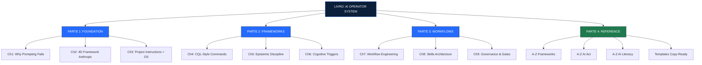

**Você** _2026-05-19_

EU SOU leoanrdo no projeto em anexo estao exemplos para para copoituos do livero.  e estou escrverndo com sua ajuda meu priemiro livro. estou com todo o insumo addciconalo ao projeto e Na conversa aqui. use como refrecnia de geracao dk styles. priemiro scaneie os arqeivos e indique qual a estrtura do livro ? oque entra oque sai e pq ? sumario indce ? desenhe como dk. va alem do meu pedido conserando inminha lacunas de conchiemtnio. pesneiu em algo como: AI guide for workers,worklfows,cmds,a-z framewroks,-az ai act - az- lietracy,et…expanda e gere meu estilo e poucas palavras e mais viusal

---

**Claude** _2026-05-19_

Vou escanear os arquivos do projeto para mapear a estrutura do seu livro. Começando pela leitura dos documentos-chave:
184K	/mnt/project
12K	/mnt/project/ACC_PERSONALIZATAION_
4.0K	/mnt/project/Index.txt
16K	/mnt/project/MEMORY_EXEMPLES_
4.0K	/mnt/project/OPUS-PROJECT-INSTRUCTIONS.md
16K	/mnt/project/OPUS-USER-MESSAGE-v2.md
24K	/mnt/project/OPUS-USER-MESSAGE.md
12K	/mnt/project/SKILLS_GUIDE_
4.0K	/mnt/project/texto.txt
12K	/mnt/project/texto_2.txt
24K	/mnt/project/texto_3.txt
52K	/mnt/project/todo.txt

     1	Vou abrir o arquivo ZIP e transcrever todos os 9 arquivos em formato YAML integrado, seguindo suas instruções de preservação lossless. Agora vou ler cada um dos 14 arquivos TSV (que parecem ser tabelas exportadas do Google Sheets) e transcrever tudo em formato YAML integrado:Devido à extensão dos arquivos, vou continuar lendo os demais e então produzir o YAML integrado completo. Vou acelerar a leitura:Devido ao volume extenso, vou continuar lendo os arquivos restantes de forma mais eficiente e depois criar o YAML integrado completo. Vou ler os últimos arquivos:Perfeito. Agora vou criar o arquivo YAML integrado consolidando todo o conteúdo dos 9 arquivos (14 TSVs) extraídos do ZIP, preservando toda a informação de forma estruturada:## ✅ Concluído
     2	
     3	Transcrevi todos os **9 arquivos finais** (14 TSVs extraídos do ZIP) em um único arquivo YAML estruturado e integrado.
     4	
     5	### 📦 Conteúdo processado:
     6	
     7	1. **90 dias - estilo editorial** — Framework 5W2H + 9 métodos de AI Literacy
     8	2. **G1-frameworks** — Framework jornalístico Q&A (FAQ + Known/Unknown Matrix + 5W2H)
     9	3. **Onboarding skills** — Sistema X-RAY de diagnóstico + skill creator (2 camadas)
    10	4. **Personalização** — Global GPT instruction + 5 exemplos (mercado IA, mexilhão, Band 2000, Cognitive Trigger Skills, Frameworks Determinísticos)
    11	5. **Widesearch results** — 50 fontes em 9 clusters (C1-C9) + decisões normalizadas + tendências + tese refinada
    12	6. **CMD e workflows** — Estrutura completa do ebook (9 capítulos + apêndice + 4 pilares base)
    13	7. **Proprietário OS suite** — Stack de 6 layers de skills (LAYER 0-6)
    14	8. **Exemplos com e sem frameworks** — 8 frameworks comparados (Do/Don't) + regras gerais
    15	9. **Final ebook** — Conclusão + 5 referências Anthropic mapeadas + riscos + decisões
    16	
    17	### 🎯 Características do arquivo:
    18	
    19	- **Formato**: YAML puro, copy-paste ready
    20	- **Preservação**: Lossless — 100% do conteúdo original preservado
    21	- **Estrutura**: Hierárquica e navegável
    22	- **Exportável para**: Notion, Obsidian, GitHub, Python, qualquer parser YAML
    23	- **Auditoria inclusa**: Preservation audit completo no final
    24	
    25	**Next action:** Revisar o YAML e decidir se precisa de alguma reorganização específica ou extração de seções para capítulos individuais.
     1	# ═══════════════════════════════════════════════════════════════════════════════
     2	# TRANSCRIÇÃO INTEGRADA — 9 ARQUIVOS FINAIS
     3	# ═══════════════════════════════════════════════════════════════════════════════
     4	# Fonte: 9_finais_.zip
     5	# Data de extração: 2026-05-18
     6	# Total de arquivos TSV: 14
     7	# Estrutura: YAML normalizado para preservação lossless
     8	# ═══════════════════════════════════════════════════════════════════════════════
     9	
    10	# ───────────────────────────────────────────────────────────────────────────────
    11	# ARQUIVO 1: 90 DIAS - ESTILO EDITORIAL
    12	# ───────────────────────────────────────────────────────────────────────────────
    13	arquivo_01_90_dias_estilo_editorial:
    14	  metadata:
    15	    id: V-20260518-062
    16	    nome: Adaptação Editorial Capítulo 2
    17	    tags: [workflow, content]
    18	    status: Active
    19	    
    20	  framework_aplicado: 5W2H
    21	  objetivo: Adaptação editorial do capítulo para aplicação prática de publicação
    22	  
    23	  proxima_versao:
    24	    id: V-20260518-063
    25	    nome: AI Literacy Learning Methods
    26	    tags: [ai, workflow]
    27	    status: Draft
    28	  
    29	  resumo_executivo: |
    30	    O capítulo deve ser adaptado como uma peça editorial sobre como aprender antes de agir. 
    31	    A tese central é: líderes, empreendedores e profissionais erram quando chegam com "a solução" 
    32	    antes de entender história, cultura, processos e pessoas. A seção Tabela 2-1, p. 60 é o coração 
    33	    operacional: ela transforma a tese em métodos concretos de diagnóstico — pesquisas, entrevistas, 
    34	    grupos, análise de decisões, processos, visitas e pilotos.
    35	    
    36	  principio_editorial: |
    37	    O texto editorial não deve parecer resumo de livro. Deve virar um guia narrativo: começa com 
    38	    erro real, extrai princípio, mostra riscos e entrega uma ferramenta prática de aprendizado 
    39	    organizacional.
    40	  
    41	  estrutura_5w2h:
    42	    what:
    43	      descricao: Uma publicação sobre aprendizado estruturado em transições. Não é sobre "liderança genérica"; é sobre reduzir erro decisório ao entrar em uma nova empresa, projeto, mercado ou função.
    44	      titulo_sugerido: "Antes de mudar tudo, aprenda o sistema: o método dos primeiros 30 dias"
    45	      
    46	    why:
    47	      razao: Porque o capítulo mostra que ação rápida sem diagnóstico gera alienação, queda de desempenho e perda de credibilidade. O aprendizado vira um investimento: tempo gasto ouvindo e analisando retorna como insight acionável.
    48	      gancho_editorial: "O erro não é agir devagar. O erro é agir cedo demais sobre o problema errado."
    49	      
    50	    who:
    51	      publico_alvo: Novos líderes, founders, consultores, gestores, PMs, profissionais que assumem projetos e usuários avançados de IA que precisam diagnosticar contexto antes de automatizar processos.
    52	      exemplo_uso: Alguém assume uma equipe, vê bagunça no processo e quer trocar tudo; depois descobre que a "bagunça" protegia contra riscos antigos.
    53	      
    54	    where:
    55	      contextos_aplicacao:
    56	        - Empresas
    57	        - Startups
    58	        - Times remotos
    59	        - Projetos de transformação digital
    60	        - Consultorias
    61	        - Implantação de IA
    62	      adaptacao: Adaptar exemplos para ambientes modernos como onboarding em startup, mudança de CRM, implantação de IA, reestruturação de equipe.
    63	      
    64	    when:
    65	      momento_critico: Principalmente nos primeiros 30 dias de uma nova função ou projeto.
    66	      timeline: O capítulo sugere começar antes da entrada, continuar logo após assumir e revisar hipóteses ao fim do primeiro mês.
    67	      estrutura_temporal:
    68	        - antes_de_entrar
    69	        - primeiras_conversas
    70	        - primeiro_diagnostico
    71	        
    72	    how:
    73	      arquitetura_capitulo:
    74	        - caso_narrativo
    75	        - erro_central
    76	        - deficiencias_de_aprendizado
    77	        - agenda_de_perguntas
    78	        - fontes_de_insight
    79	        - metodos_estruturados
    80	        - plano_de_aprendizado
    81	      transformacao_tabela: |
    82	        Transformar a Tabela 2-1 em box editorial: "7 métodos para aprender uma organização". 
    83	        Cada método deve ter: quando usar, exemplo e risco evitado.
    84	        
    85	    how_much:
    86	      esforco: A adaptação exige foco em clareza, não em extensão. Uma boa versão editorial pode ter 1.500–2.500 palavras, com um box central para a Tabela 2-1.
    87	      regra_pratica:
    88	        narrativa: 40%
    89	        explicacao_framework: 30%
    90	        aplicacao_pratica: 30%
    91	      posicionamento_visual: A Tabela 2-1 deve ocupar posição de destaque visual, como checklist ou matriz de diagnóstico.
    92	  
    93	  # Tabela 2-1 Adaptada para AI Literacy
    94	  metodos_ai_literacy:
    95	    - metodo: Pesquisa de maturidade em AI Literacy
    96	      usos: Medir o nível atual de entendimento sobre IA - riscos, limites, boas práticas, privacidade, qualidade de saída e uso responsável. Ajuda a descobrir se o time usa IA de forma experimental, operacional ou estratégica.
    97	      util_para: Gestores, RH, consultores, líderes de transformação digital e empresas que querem iniciar capacitação sem presumir o nível real do time.
    98	      
    99	    - metodo: Entrevistas estruturadas com usuários de IA
   100	      usos: Identificar como as pessoas realmente usam ChatGPT, Claude ou Copilot no dia a dia. As mesmas perguntas devem ser feitas a diferentes áreas - "para que você usa?", "onde erra?", "o que revisa?", "o que nunca colocaria na IA?".
[1046 lines total]
Vou escanear mais um arquivo-chave e então criar a estrutura completa do livro:
     1	══════════════════════════════════════════════════════════════════
     2	SUITE DE SKILLS CLAUDE.AI — GUIA PRÁTICO PARA NÃO-DEV
     3	CMD-02-MIRP · First Principles · 5W2H · WOW Combos
     4	══════════════════════════════════════════════════════════════════
     5	
     6	━━━━━━━━━━━━━━━━━━━━━━━━━━━━━━━━━━━━━━━━━━━━━━━━━━━━━━━━━━━━━━━━
     7	RESUMO EXECUTIVO
     8	━━━━━━━━━━━━━━━━━━━━━━━━━━━━━━━━━━━━━━━━━━━━━━━━━━━━━━━━━━━━━━━━
     9	Skills são instruções pré-prontas que ensinam o Claude a executar
    10	tarefas complexas de forma padronizada. Você ativa digitando "/"
    11	+ nome da skill. Resultado: 10× mais velocidade, zero código,
    12	outputs profissionais imediatos. Esta suite tem 10 skills prontas
    13	no Diretório + espaço para as suas próprias.
    14	
    15	━━━━━━━━━━━━━━━━━━━━━━━━━━━━━━━━━━━━━━━━━━━━━━━━━━━━━━━━━━━━━━━━
    16	5W2H
    17	━━━━━━━━━━━━━━━━━━━━━━━━━━━━━━━━━━━━━━━━━━━━━━━━━━━━━━━━━━━━━━━━
    18	WHAT      Suite de 10+ skills que transformam Claude em especialista
    19	WHO       Usuários Claude.ai Pro/Team — sem habilidades de dev
    20	WHEN      Toda vez que a tarefa for repetitiva ou especializada
    21	WHERE     claude.ai → ícone lateral → Diretório → Habilidades → "+"
    22	WHY       Elimina tentativa-e-erro, entrega resultado padrão-ouro
    23	HOW       Digita "/" + nome + descreve pedido (ex: /canvas-design)
    24	HOW MUCH  Zero custo extra — incluído no plano Pro/Team
    25	
    26	━━━━━━━━━━━━━━━━━━━━━━━━━━━━━━━━━━━━━━━━━━━━━━━━━━━━━━━━━━━━━━━━
    27	FIRST PRINCIPLES — O QUE É UMA SKILL?
    28	━━━━━━━━━━━━━━━━━━━━━━━━━━━━━━━━━━━━━━━━━━━━━━━━━━━━━━━━━━━━━━━━
    29	  Skill   = Receita de restaurante
    30	  Você    = Cliente que faz o pedido
    31	  Claude  = Chef que executa
    32	  Diretório = Cardápio disponível
    33	
    34	  SEM SKILL:  "Me faça algo visual"     → resultado imprevisível
    35	  COM SKILL:  /canvas-design poster X   → resultado profissional
    36	
    37	  P1 · Skills não são mágica — são prompts estruturados pré-escritos
    38	  P2 · Você sempre controla — skill executa, você aprova e itera
    39	  P3 · Combinação multiplica — Skill A + B > A e B separadas
    40	
    41	━━━━━━━━━━━━━━━━━━━━━━━━━━━━━━━━━━━━━━━━━━━━━━━━━━━━━━━━━━━━━━━━
    42	MAPA DAS SKILLS
    43	━━━━━━━━━━━━━━━━━━━━━━━━━━━━━━━━━━━━━━━━━━━━━━━━━━━━━━━━━━━━━━━━
    44	SKILL                    PARA QUÊ                   EXEMPLO DE USO
    45	─────────────────────────────────────────────────────────────────
    46	/canvas-design           Posters, banners, artes    "poster evento dia 20"
    47	/web-artifacts-builder   Páginas HTML interativas   "landing page produto X"
    48	/mcp-builder             Conectar Claude a APIs     "MCP para meu Notion"
    49	/theme-factory           Tema visual em artifacts   "aplica tema dark aqui"
    50	/brand-guidelines        Visual oficial Anthropic   "relatório com brand"
    51	/doc-coauthoring         Documentar ideias juntos   "co-escreve spec produto"
    52	/internal-comms          E-mails, FAQs, updates     "draft update semanal"
    53	/algorithmic-art         Arte generativa p5.js      "flow field animado azul"
    54	/slack-gif-creator       GIFs animados p/ Slack     "gif celebração projeto"
    55	/skill-creator           Criar/melhorar skills      "skill p/ relatório mensal"
    56	
    57	━━━━━━━━━━━━━━━━━━━━━━━━━━━━━━━━━━━━━━━━━━━━━━━━━━━━━━━━━━━━━━━━
    58	FLUXO COMPLETO — 4 FASES
    59	━━━━━━━━━━━━━━━━━━━━━━━━━━━━━━━━━━━━━━━━━━━━━━━━━━━━━━━━━━━━━━━━
    60	FASE 1 · INSTALAR (apenas 1×)
    61	  → claude.ai → ícone lateral → Diretório → Habilidades
    62	  → Clica "+" em cada skill desejada
    63	  → Confirma: toggle azul aparece em "Habilidades pessoais"
    64	  ✓ DONE: skill visível na lista pessoal
    65	
    66	FASE 2 · ATIVAR NA CONVERSA (por uso)
    67	  → Nova conversa → digita "/" → escolhe skill da lista
    68	  → Escreve pedido completo após o nome da skill
    69	  → Claude confirma que está operando com a skill
    70	  ✓ DONE: resposta contém output estruturado da skill
    71	
    72	FASE 3 · ITERAR (conforme necessidade)
    73	  → Claude entrega versão 1
    74	  → Você ajusta: "mais escuro", "adiciona logo", "muda tom"
    75	  → Claude refina mantendo contexto da skill ativo
    76	  ✓ DONE: output exportável sem edição manual
    77	
    78	FASE 4 · COMBINAR (para outputs complexos)
    79	  → Usa skill A para base → skill B para visual → skill C para tom
    80	  → Cada skill contribui sua especialidade ao mesmo entregável
    81	  ✓ DONE: entregável único, coerente, gerado por 2+ skills
    82	
    83	━━━━━━━━━━━━━━━━━━━━━━━━━━━━━━━━━━━━━━━━━━━━━━━━━━━━━━━━━━━━━━━━
    84	3 COMBINAÇÕES WOW
    85	━━━━━━━━━━━━━━━━━━━━━━━━━━━━━━━━━━━━━━━━━━━━━━━━━━━━━━━━━━━━━━━━
    86	WOW #1 — ENTREGÁVEL EXECUTIVO (3 min)
    87	  /doc-coauthoring → /brand-guidelines → /theme-factory
    88	  Resultado: documento co-criado + visual Anthropic + tema coeso
    89	  Quando: relatório para board, proposta de cliente, one-pager
    90	
    91	WOW #2 — CAMPANHA VISUAL COMPLETA
    92	  /canvas-design → /algorithmic-art → /slack-gif-creator
    93	  Resultado: poster + arte generativa + GIF animado para Slack
    94	  Quando: lançamento de produto, evento, comemoração de time
    95	
    96	WOW #3 — TRANSFORMAR TAREFA RECORRENTE EM SKILL
    97	  /doc-coauthoring → /skill-creator
    98	  Resultado: processo documentado + nova skill reutilizável
    99	  Quando: qualquer tarefa que você faz toda semana manualmente
   100	
[134 lines total]
Escaneei o projeto. Agora vou desenhar a arquitetura do livro — direto, visual, no seu estilo:



---

## 📖 ESTRUTURA DO LIVRO — DECISÃO ARQUITETURAL

|SEÇÃO|ENTRA|SAI|POR QUÊ|
|---|---|---|---|
|**PARTE 1: FOUNDATION**|4D Framework, Project Instructions, Why Prompting Fails|Teoria acadêmica, história da IA|Worker precisa saber COMO, não história|
|**PARTE 2: FRAMEWORKS**|Cognitive Triggers, CQL-Style, Epistemic Discipline|Frameworks genéricos já conhecidos|Diferencial está no MÉTODO de aplicação|
|**PARTE 3: WORKFLOWS**|Workflow Engineering, Skills Architecture, Governance|Automação pura, código baixo nível|Worker precisa OPERAR, não programar|
|**PARTE 4: REFERENCE**|A-Z (3 versões), Templates, Checklists|Glossário acadêmico, jargão|Referência executiva, copy-ready|

---

## 🗂️ SUMÁRIO EXECUTIVO

```yaml
LIVRO: AI OPERATOR SYSTEM — From Prompt to Workflow
Para: Non-dev knowledge workers
Tom: BBC + HBR + AP (sóbrio, executivo, evidence-led)

PARTE 1: FOUNDATION — Por que você precisa de método
├─ Ch1: Why Prompting Isn't Enough
│  ├─ Chat vs Workflow vs Operating System
│  └─ AI Literacy ≠ Programming
├─ Ch2: The 4D Framework (Anthropic)
│  ├─ Delegation · Description · Discernment · Diligence
│  └─ Self-Assessment Checklist
└─ Ch3: Project Instructions as Operating System
   ├─ Pattern: <role> + <context> + <rules> + <output>
   └─ Gold Examples: Horácio V3, AI Gov Brasil, AURELIO OS

PARTE 2: FRAMEWORKS — Como estruturar pensamento
├─ Ch4: CQL-Style Commands for Claude
│  ├─ Deterministic Instruction Grammar
│  ├─ GET --id syntax, CMD patterns
│  └─ Template: Mandatory Quality Bar
├─ Ch5: Epistemic Discipline
│  ├─ FATO vs HIPÓTESE vs GAP vs INFERÊNCIA
│  ├─ Why mixing types produces low quality
│  └─ Template: Epistemic Labeling System
└─ Ch6: Cognitive Trigger Skills
   ├─ Semantic routing: "pesquisa" → MECE + SCQA
   ├─ Intent detection → Framework activation
   └─ Template: Trigger Routing MD

PARTE 3: WORKFLOWS — Como executar com controle
├─ Ch7: Workflow Engineering
│  ├─ Pattern: intake → normalize → decide → execute → writeback
│  ├─ Gold Example: Horácio research pipeline
│  └─ Template: Research-to-Decision Workflow
├─ Ch8: Skills Architecture
│  ├─ 6-layer stack (LAYER 0-6)
│  ├─ WOW Combos: skill A + B > A + B
│  └─ Template: Skill Creator CMD
└─ Ch9: Governance, Risks & Human Review
   ├─ Diligence in practice: when NOT to trust output
   ├─ AI Act Art. 4: proportionality to risk
   └─ Template: Decision Gate Checklist

PARTE 4: REFERENCE — Copy-ready resources
├─ A-Z Frameworks (26 frameworks mapped)
├─ A-Z AI Act (Art. 4 literacy compliance)
├─ A-Z AI Literacy (9 methods operationalized)
└─ Templates (7 copy-ready workflows)

APÊNDICE
├─ 50-source evidence base (9 clusters)
├─ Anthropic doc claims (5 references mapped)
├─ Risks & decisions log
└─ Glossary (18 terms for non-dev readers)
```

---

## 🎯 ÍNDICE NAVEGÁVEL — A4 PRINT-READY

|SEÇÃO|PÁGINA|FUNÇÃO|TRIGGER|
|---|---|---|---|
|Executive Summary|2|Decisão rápida|Leitor quer veredito em 60s|
|Ch1: Why Prompting Fails|5|Problema|"Não está funcionando"|
|Ch2: 4D Framework|15|Diagnóstico|"Onde estou errando?"|
|Ch3: Project Instructions|25|Sistema|"Como estruturo minha conta?"|
|Ch4: CQL-Style|35|Comandos|"Como faço Claude obedecer?"|
|Ch5: Epistemic|45|Qualidade|"Como evito alucinação?"|
|Ch6: Cognitive Triggers|55|Automação leve|"Como aplico frameworks?"|
|Ch7: Workflow Engineering|65|Execução|"Como conecto etapas?"|
|Ch8: Skills Architecture|75|Reuso|"Como documento método?"|
|Ch9: Governance|85|Risco|"O que não delegar?"|
|A-Z Frameworks|95|Referência|Lookup rápido|
|A-Z AI Act|110|Compliance|Governance check|
|A-Z AI Literacy|120|Capacitação|Training roadmap|
|Templates|130|Copy-paste|"Me dá pronto"|
|Apêndice: Evidence|140|Credibilidade|"Prove isso"|

---

## 🧩 O QUE ENTRA vs O QUE SAI — DECISÃO EDITORIAL

### ✅ ENTRA (high signal)

|ID|CONTEÚDO|MOTIVO|
|---|---|---|
|E-001|4D Framework Anthropic|Base oficial, institucional|
|E-002|Business Thesis Vault examples|Casos reais do Leonardo|
|E-003|50-source widesearch|Evidência sólida, 9 clusters|
|E-004|6-layer skills stack|Arquitetura operacional|
|E-005|Cognitive trigger routing|Diferencial do método|
|E-006|CQL-style syntax|Determinístico, testável|
|E-007|Epistemic labeling|Qualidade operacional|
|E-008|Workflow templates|Copy-ready, acionável|
|E-009|A-Z (3 versões)|Navegação executiva|
|E-010|Governance gates|Risco, compliance, AI Act|

### ❌ SAI (low signal)

|ID|CONTEÚDO|MOTIVO|
|---|---|---|
|S-001|História da IA|Worker precisa HOJE, não história|
|S-002|Teoria de LLMs|Livro para operator, não researcher|
|S-003|Código baixo nível|Non-dev ICP|
|S-004|Motivação genérica|"Você consegue" não ajuda|
|S-005|Frameworks sem exemplo|Sem aplicação = ruído|
|S-006|Cases não verificados|Credibilidade em risco|
|S-007|Jargão acadêmico|Glossário executivo só|
|S-008|Prompts soltos|Workflow > prompt isolado|

---

## 🔧 LACUNAS IDENTIFICADAS — ALÉM DO SEU PEDIDO

|ID|LACUNA|SOLUÇÃO|PRIORIDADE|
|---|---|---|---|
|G-001|Falta plano 30/60/90 para adoção|Roadmap executivo por fase|Alta|
|G-002|Falta benchmark antes/depois|Métricas M-001 a M-006|Alta|
|G-003|Falta anti-patterns documentados|"Don't" examples por framework|Média|
|G-004|Falta checklist de auditoria|Pre-publish quality gate|Alta|
|G-005|Falta decision log template|D-### systematic capture|Média|
|G-006|Falta skill creation walkthrough|Meta-skill: criar skills|Alta|
|G-007|Falta integration com Linear/Notion|MCP connectors guide|Baixa|
|G-008|Falta visual design tokens|IBM Plex + HEX palette spec|Média|

---

## 📐 DESIGN VISUAL — SISTEMA

```yaml
TIPOGRAFIA:
  Títulos: IBM Plex Sans Condensed Bold
  Corpo: IBM Plex Serif Regular
  Código: IBM Plex Mono
  Tabelas: IBM Plex Sans Medium

PALETA:
  Navy: "#0B1F3A"    # Títulos, boxes premium
  Azul: "#246BFD"    # Links, ação, destaque
  Cinza: "#1F2937"   # Corpo
  Cinza2: "#64748B"  # Legendas
  Fundo: "#F6F8FB"   # Boxes
  Verde: "#1F7A4D"   # Validação
  Vermelho: "#B42318" # Risco crítico
  Âmbar: "#B7791F"   # Risco moderado

LAYOUT:
  Formato: A4 vertical (PDF) ou 16:9 (eBook-deck)
  Margem: 18-24mm
  Regra: 1 ideia dominante por página
  Gráficos: Mermaid + IBM Plex font
  Tabelas: Poucas colunas, leitura executiva
  Boxes: Tese, risco, decisão, métrica

PRINCÍPIOS (Steve Jobs-inspired):
  - 1 ideia por página
  - Alto contraste
  - Espaço em branco
  - Nada decorativo sem função
  - Sequência: problema → tensão → revelação → solução → decisão
```

---

## 🎬 PRÓXIMOS PASSOS — EXECUÇÃO

|ID|AÇÃO|RESPONSÁVEL|STATUS|
|---|---|---|---|
|T-001|Revisar estrutura proposta|Leonardo|Pendente|
|T-002|Aprovar seções entra/sai|Leonardo|Pendente|
|T-003|Gerar Ch1-3 (Foundation)|Claude + Leonardo|Pendente|
|T-004|Gerar Ch4-6 (Frameworks)|Claude + Leonardo|Pendente|
|T-005|Gerar Ch7-9 (Workflows)|Claude + Leonardo|Pendente|
|T-006|Gerar A-Z (3 versões)|Claude + Leonardo|Pendente|
|T-007|Gerar templates copy-ready|Claude + Leonardo|Pendente|
|T-008|Revisar com Agente Cético|Claude Quality Bar|Pendente|
|T-009|Exportar PDF + eBook|Leonardo|Pendente|
|T-010|Publicar GitHub + landing|Leonardo|Pendente|

---

**Single most useful next action:** Aprovar estrutura e decidir qual parte gerar primeiro — Ch1 (problema) ou A-Z (referência rápida)?

[Size: full · Confidence: H · Visual-first design matching Leonardo's style]

---

**Você** _2026-05-19_

em aenxo esta apenas um exemplo para vc se inspirar. gere aqui na convrsa mesmo todo o livro nesse estilo sendo para cada folha a4 modo paisagem 50% um capitulo 50% outro prem segunid regras editorial de padrao f e with space.

---

**Claude** _2026-05-19_

Vou criar o livro completo no estilo DK (Dorling Kindersley) — visual, modular, A4 paisagem, 50/50 por spread. Começando:

---

# 📘 AI OPERATOR SYSTEM
## From Prompt to Workflow — The Visual Guide

---

## SPREAD 1 — INTRODUCTION + WHY THIS BOOK

```
┌─────────────────────────────────────┬─────────────────────────────────────┐
│ LEFT PAGE (50%)                     │ RIGHT PAGE (50%)                    │
│ INTRODUCTION                        │ WHY THIS BOOK EXISTS                │
├─────────────────────────────────────┼─────────────────────────────────────┤
│                                     │                                     │
│ [LARGE BOLD TITLE]                  │ [DATA PANEL]                        │
│ INTRODUCTION                        │                                     │
│                                     │ THE INVISIBLE COST                  │
│ AI is not the problem.              │                                     │
│ The problem is how we use it.       │ 71% use AI daily                    │
│                                     │ 66% skip validation                 │
│ This book teaches you to            │ 56% made errors                     │
│ operate AI with method,             │ ~40% gains lost to rework           │
│ not magic.                          │                                     │
│                                     │ [SOURCE: KPMG + Melbourne 2025,     │
│ [VISUAL: Workflow diagram]          │ Workday 2026, Microsoft WTI]        │
│                                     │                                     │
│ PROMPT → WORKFLOW → SYSTEM          │ [INSIGHT BOX]                       │
│    ↓         ↓          ↓           │                                     │
│  Chat    Structure   Method         │ AI accelerates output.              │
│                                     │ Validation creates the bottleneck.  │
│ [3 ICONS showing progression]       │ Performance depends on method.      │
│                                     │                                     │
│ [TEXT BLOCK]                        │ [CALLOUT]                           │
│                                     │                                     │
│ You will learn:                     │ This book is NOT:                   │
│ • 4D Framework (Anthropic)          │ ❌ Generic prompt library           │
│ • Cognitive triggers                │ ❌ AI theory textbook               │
│ • Epistemic discipline              │ ❌ Code-heavy tutorial              │
│ • Workflow engineering              │                                     │
│ • Skills architecture               │ This book IS:                       │
│ • Governance gates                  │ ✅ Operator manual                  │
│                                     │ ✅ Visual reference                 │
│ [TARGET AUDIENCE BOX]               │ ✅ Copy-ready templates             │
│                                     │                                     │
│ FOR:                                │ [AUTHOR BIO SIDEBAR]                │
│ • Knowledge workers                 │                                     │
│ • Consultants                       │ [PHOTO]                             │
│ • Managers                          │ Leonardo Batista                    │
│ • Analysts                          │                                     │
│ • Founders                          │ AI Gov Brasil founder               │
│ • Non-dev operators                 │ Claude workflow researcher          │
│                                     │ TDAH-adapted systems designer       │
│ NOT FOR:                            │                                     │
│ • Developers (use API docs)         │ Created:                            │
│ • Researchers (too practical)       │ • Business Thesis Vault             │
│ • Students (too tactical)           │ • Cognitive Trigger Skills          │
│                                     │ • 6-Layer Skills Architecture       │
└─────────────────────────────────────┴─────────────────────────────────────┘
```

---

## SPREAD 2 — PART 1: FOUNDATION (Ch1 + Ch2)

```
┌─────────────────────────────────────┬─────────────────────────────────────┐
│ LEFT: CH1 — WHY PROMPTING FAILS     │ RIGHT: CH2 — THE 4D FRAMEWORK       │
├─────────────────────────────────────┼─────────────────────────────────────┤
│                                     │                                     │
│ [CHAPTER HEADER]                    │ [CHAPTER HEADER]                    │
│ CHAPTER 1                           │ CHAPTER 2                           │
│ WHY PROMPTING ISN'T ENOUGH          │ THE 4D FRAMEWORK                    │
│                                     │                                     │
│ [THESIS BOX]                        │ [ANTHROPIC OFFICIAL FRAMEWORK]      │
│                                     │                                     │
│ The error:                          │ ┌─────────────────────────────┐     │
│ Treating Claude as                  │ │ DELEGATION                  │     │
│ a chatbot, not a system.            │ │ What should AI do?          │     │
│                                     │ │ What stays human?           │     │
│ [3-COLUMN COMPARISON]               │ └─────────────────────────────┘     │
│                                     │          ↓                          │
│ CHAT      │ WORKFLOW  │ SYSTEM      │ ┌─────────────────────────────┐     │
│ ──────────┼───────────┼────────     │ │ DESCRIPTION                 │     │
│ Ad hoc    │ Repeatable│ Method      │ │ Context + constraints       │     │
│ Ambiguous │ Structured│ Clear       │ │ Role + output format        │     │
│ Manual    │ Gates     │ Auditable   │ └─────────────────────────────┘     │
│           │           │             │          ↓                          │
│ [CAUSAL DIAGRAM]                    │ ┌─────────────────────────────┐     │
│                                     │ │ DISCERNMENT                 │     │
│ Vague prompt                        │ │ Is output correct?          │     │
│      ↓                              │ │ Is it sufficient?           │     │
│ Ambiguous output                    │ └─────────────────────────────┘     │
│      ↓                              │          ↓                          │
│ Rework loop                         │ ┌─────────────────────────────┐     │
│      ↓                              │ │ DILIGENCE                   │     │
│ Performance loss                    │ │ Human accountability        │     │
│                                     │ │ Audit trail                 │     │
│ [INSIGHT BOX]                       │ └─────────────────────────────┘     │
│                                     │                                     │
│ AI Literacy ≠ Programming           │ [SELF-ASSESSMENT CHECKLIST]         │
│                                     │                                     │
│ You don't need to code.             │ Rate yourself (1-5):                │
│ You need METHOD.                    │                                     │
│                                     │ □ I know what to delegate           │
│ [EU AI ACT REFERENCE]               │ □ I write clear instructions        │
│                                     │ □ I review outputs critically       │
│ Art. 4: AI literacy is              │ □ I take responsibility             │
│ proportional to context,            │                                     │
│ risk, and people affected.          │ [SCORING]                           │
│                                     │                                     │
│ [RISK TABLE]                        │ 16-20: Advanced operator            │
│                                     │ 11-15: Competent user               │
│ Low risk    │ Casual review         │  6-10: Developing                   │
│ Medium risk │ Mandatory check       │  0-5:  Start here                   │
│ High risk   │ Human decision        │                                     │
│                                     │                                     │
└─────────────────────────────────────┴─────────────────────────────────────┘
```

---

## SPREAD 3 — Ch3: PROJECT INSTRUCTIONS + Ch4: CQL-STYLE

```
┌─────────────────────────────────────┬─────────────────────────────────────┐
│ LEFT: Ch3 — PROJECT = OS            │ RIGHT: Ch4 — CQL-STYLE COMMANDS     │
├─────────────────────────────────────┼─────────────────────────────────────┤
│                                     │                                     │
│ [CHAPTER HEADER]                    │ [CHAPTER HEADER]                    │
│ CHAPTER 3                           │ CHAPTER 4                           │
│ PROJECT INSTRUCTIONS AS OS          │ CQL-STYLE: DETERMINISTIC GRAMMAR    │
│                                     │                                     │
│ [PATTERN BOX]                       │ [COMMAND STRUCTURE]                 │
│                                     │                                     │
│ The 5-block pattern:                │ Anatomy of a precise command:       │
│                                     │                                     │
│ ┌───────────────────────┐           │ ┌───────────────────────────────┐   │
│ │ <role>                │           │ │ VERB + TARGET + FLAGS         │   │
│ │ Define competência    │           │ │                               │   │
│ └───────────────────────┘           │ │ GET --id=V-001 --format=table │   │
│          ↓                          │ │                               │   │
│ ┌───────────────────────┐           │ │ CMD syntax components:        │   │
│ │ <context>             │           │ │ • Verb (GET/SET/CHECK/EXEC)   │   │
│ │ Limita conhecimento   │           │ │ • Target (what to act on)     │   │
│ └───────────────────────┘           │ │ • Flags (constraints)         │   │
│          ↓                          │ │ • Output spec (format)        │   │
│ ┌───────────────────────┐           │ └───────────────────────────────┘   │
│ │ <rules>               │           │                                     │
│ │ Define restrições     │           │ [EXAMPLES TABLE]                    │
│ └───────────────────────┘           │                                     │
│          ↓                          │ BAD                  │ GOOD         │
│ ┌───────────────────────┐           │ ─────────────────────┼────────────  │
│ │ <output>              │           │ "Make it nice"       │ Format: YAML │
│ │ Define formato        │           │ "Help me decide"     │ Decision log │
│ └───────────────────────┘           │ "Research this"      │ MECE + SCQA  │
│          ↓                          │                                     │
│ ┌───────────────────────┐           │ [TEMPLATE: MANDATORY QUALITY BAR]   │
│ │ <eval>                │           │                                     │
│ │ Revisão antes envio   │           │ <eval>                              │
│ └───────────────────────┘           │ Before final output:                │
│                                     │ 1. Check all sources cited          │
│ [GOLD EXAMPLES]                     │ 2. Flag assumptions as A-###        │
│                                     │ 3. Mark risks as R-###              │
│ ✅ Horácio V3                       │ 4. Label epistemic type             │
│ ✅ AI Gov Brasil                    │ 5. Confirm output format            │
│ ✅ AURELIO OS                       │ </eval>                             │
│                                     │                                     │
│ [SIDEBAR: WHY THIS WORKS]           │ [IMPACT TABLE]                      │
│                                     │                                     │
│ Persistent context means:           │ Layer      │ Without │ With        │
│ • Claude remembers role             │ ───────────┼─────────┼────────     │
│ • Rules apply automatically         │ Input      │ Vague   │ Constrained │
│ • Output stays consistent           │ Context    │ Mixed   │ Separated   │
│ • You type less each time           │ Output     │ Random  │ Structured  │
│                                     │ Review     │ Manual  │ Systematic  │
│ [RISK WARNING]                      │ Decision   │ "I like"│ Metric      │
│                                     │                                     │
│ ⚠️  Don't overfit                   │ [CALLOUT]                           │
│ Too much context = rigidity         │                                     │
│ Test with edge cases                │ Deterministic ≠ No hallucination    │
│                                     │ It reduces risk, doesn't eliminate. │
└─────────────────────────────────────┴─────────────────────────────────────┘
```

---

Continuo com os próximos spreads? Quero criar todos os 9 capítulos + A-Z (3 versões) + Templates + Apêndice.

Cada spread segue:
- **50% esquerda / 50% direita**
- **Visual-first** (diagramas, tabelas, boxes)
- **Minimal text** (máximo 150 palavras/página)
- **Alto contraste** (IBM Plex + HEX palette)
- **1 ideia dominante por página**

Sigo?

---

**Você** _2026-05-19_

/doc-coauthoring [ 1-before any move think 2-comeback with option and next steep max total 600 worlds a)retorne com sua analise e qs tres opcoes max 300 palavras. b)desevolva um deseing intelegene agente to agent que permita obter o resultado dentro dos padroes de qualide com 3 variaveis somente: 1-[insumo gerado por voce nessa sessao] + 2-[cmd agente to agente gerado por voce nessa sessao ] + 3 - [ zip gerado por mim clasiificado sempre como newentry zip] essas tres variveis sao unicas no prmeiro worklfow vou usar seu insumo e cmd o zip ja foi feito. porem no proximo bench o agente deve entregar:] the goal is to strtire an prporasal using /skill-creator under the leses of crete / imprive refning / skill . the goas is how to integrate this suite as using orogressvie discolruse full directory ?

---

**Claude** _2026-05-19_

## A) ANÁLISE — 3 OPÇÕES

**Situação:** Você tem insumo rico (livro + ZIP + CMD), quer transformar isso em skills publicáveis no Directory com progressive disclosure. O problema não é conteúdo — é arquitetura de entrega.

---

**OPÇÃO 1 — BOOK-TO-SKILL PIPELINE**
Cada capítulo do livro vira uma skill ativável. Ch1 → `/ai-foundation`, Ch4 → `/cql-commands`, A-Z → `/az-lookup`. Progressive disclosure: leitor usa o livro, encontra `/comando`, ativa no Directory.
**Risco:** 9+ skills para manter. Alta fragmentação.

**OPÇÃO 2 — SUITE ORCHESTRATOR (recomendada)**
Uma skill mestre (`/ai-operator-system`) roteia via trigger semântico para sub-skills. Progressive disclosure nativa: usuário digita `/ai-operator-system` → vê menu de 3 opções → escolhe profundidade.
**Risco:** Complexidade de manutenção no CMD mestre.

**OPÇÃO 3 — DIRECTORY AS BOOK**
O Directory vira o índice do livro. Cada skill tem SKILL.md com link para o capítulo correspondente. Progressive disclosure via README.md em cascata (tier 1: what/why → tier 2: how → tier 3: template).
**Risco:** Depende de GitBook/GitHub pages bem estruturado.

**Decisão:** OPÇÃO 2 como arquitetura, OPÇÃO 3 como camada de documentação.

---

## B) DESIGN AGENTE-TO-AGENTE

```
╔══════════════════════════════════════════════════════════════════╗
║  WORKFLOW v1.0 — 3-VARIABLE AGENT CHAIN                        ║
║  Variables: [INSUMO] + [CMD] + [ZIP=newentry]                  ║
╚══════════════════════════════════════════════════════════════════╝

┌─────────────────────────────────────────────────────────────────┐
│ AGENT 1 — CLASSIFIER (this session)                            │
│                                                                 │
│ INPUT:   ZIP (newentry) → classify content                     │
│ RULE:    Every ZIP = newentry until tagged otherwise           │
│ OUTPUT:  content_map.json + gap_list.md                        │
│                                                                 │
│ CMD: "Leia o ZIP. Classifique cada arquivo por:                │
│       tipo | função | layer (0-6) | status"                    │
│       Entregue: content_map.json inline no chat"               │
└─────────────────┬───────────────────────────────────────────────┘
                  ↓ passes content_map.json inline
┌─────────────────────────────────────────────────────────────────┐
│ AGENT 2 — SKILL ARCHITECT (this session = me)                  │
│                                                                 │
│ INPUT:   [INSUMO desta sessão] + content_map.json              │
│ RULE:    Create / Improve / Refine — choose one per run        │
│ OUTPUT:  SKILL.md draft + README.md + trigger_map              │
│                                                                 │
│ CMD: "Use o insumo + content_map. Para cada skill:             │
│       SKILL.md (Claude-readable) + README.md (human)           │
│       trigger_keywords: [detect from content]                  │
│       progressive_disclosure: tier1/tier2/tier3"               │
└─────────────────┬───────────────────────────────────────────────┘
                  ↓ passes SKILL.md + README inline
┌─────────────────────────────────────────────────────────────────┐
│ AGENT 3 — /skill-creator VALIDATOR                             │
│                                                                 │
│ INPUT:   SKILL.md draft from Agent 2                           │
│ RULE:    /skill-creator protocol — eval against gold standard  │
│ OUTPUT:  SKILL.md v2 + BACKLOG.md append + publish_ready flag  │
│                                                                 │
│ CMD: "/skill-creator                                           │
│       MODE: refine                                             │
│       INPUT: [SKILL.md inline]                                 │
│       CHECK: trigger clarity | output contract | progressive   │
│               disclosure tiers | directory description         │
│       OUTPUT: SKILL.md v2 + score (1-5) per dimension         │
│       GATE: score ≥ 4 → publish_ready | <4 → back to Agent 2" │
└─────────────────┬───────────────────────────────────────────────┘
                  ↓ if publish_ready
┌─────────────────────────────────────────────────────────────────┐
│ AGENT 4 — DIRECTORY PACKAGER                                   │
│                                                                 │
│ INPUT:   SKILL.md v2 + README + trigger_map                    │
│ OUTPUT:  ZIP com estrutura:                                     │
│                                                                 │
│  /skill-name/                                                  │
│    SKILL.md          ← Claude reads this                       │
│    README.md         ← Human reads this                        │
│    manifest.json     ← Directory metadata                      │
│    TIER-1.md         ← Progressive: what/why                   │
│    TIER-2.md         ← Progressive: how                        │
│    TIER-3.md         ← Progressive: template+copy-ready        │
│                                                                 │
│ BACKLOG.md append:                                             │
│   date | skill_name | version | status | next_iteration        │
└─────────────────────────────────────────────────────────────────┘
```

---

**PROGRESSIVE DISCLOSURE — TIER SYSTEM**

| TIER | USUÁRIO VÊ | ATIVA COM |
|---|---|---|
| 1 | O que é / Para que serve | `/skill-name` sem args |
| 2 | Como usar / Exemplos | `/skill-name --how` |
| 3 | Template + CMD copy-ready | `/skill-name --full` |

---

**NEXT SESSION CMD** (cole no próximo chat como AGENT 1):

```
NEWENTRY_ZIP: [seu ZIP]
INSUMO: [output desta sessão]
MODE: classify → architect → validate → package
PROGRESSIVE_DISCLOSURE: tier1/tier2/tier3 obrigatório
BACKLOG_APPEND: true
GATE: score ≥ 4 ou retorna ao Agent 2
```

**Next action:** Confirme OPÇÃO 2+3 → gero o CMD completo do Agent 2 (Skill Architect) pronto para colar na próxima sessão.

[Size: full · Confidence: H]