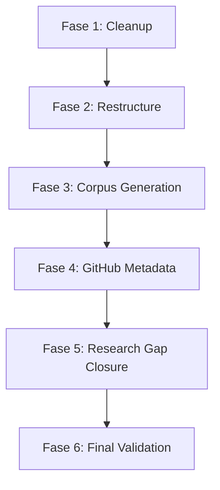

**Você** _2026-05-20_

/cognitive-framework-router  gerar analise de workflow em duas etapas para com claude code realizar reestrutturacai completa de diretorio pre-submissao em github e pre geracao de corpus docuemntal mrd,brd,specs etc.. sendo a organizacao de pastas fundamnetal. veja o briffing

---

**Claude** _2026-05-20_

48K	/mnt/skills/user/cognitive-framework-router
8.0K	/mnt/skills/user/cognitive-framework-router/SKILL.md
20K	/mnt/skills/user/cognitive-framework-router/references
4.0K	/mnt/skills/user/cognitive-framework-router/references/4d-5d-quality-bar.md
4.0K	/mnt/skills/user/cognitive-framework-router/references/az-framework-catalog.md
4.0K	/mnt/skills/user/cognitive-framework-router/references/output-contracts.md
4.0K	/mnt/skills/user/cognitive-framework-router/references/routing-rules.md
16K	/mnt/skills/user/cognitive-framework-router/templates
4.0K	/mnt/skills/user/cognitive-framework-router/templates/pre-balance-questionnaire.md
4.0K	/mnt/skills/user/cognitive-framework-router/templates/response-blueprints.md
4.0K	/mnt/skills/user/cognitive-framework-router/templates/working-backwards-brief.md

     1	---
     2	name: cognitive-framework-router
     3	description: >
     4	  Use this skill whenever the user wants to structure, research, decide, communicate,
     5	  plan, diagnose, prioritize, summarize, transform, or execute any knowledge work using
     6	  business, product, strategy, operations, or communication frameworks. Trigger on
     7	  natural-language phrases such as: "faça uma pesquisa", "preciso decidir", "monte um
     8	  plano", "resumo executivo", "transforme isso em", "comunicação para o time",
     9	  "diagnóstico", "priorização", "retrabalho", "plano de ação", as well as English
    10	  equivalents like "research this", "help me decide", "make a plan", "executive
    11	  summary", "prioritize", "structured output", or any mention of MECE, SCQA, JTBD,
    12	  Cynefin, OKR, 5W2H, RACI, AIDA, Eisenhower, Working Backwards, or A-Z framework.
    13	  Apply it also when the request is vague but clearly needs structured thinking — do
    14	  not wait for the user to name a framework.
    15	---
    16	
    17	# Cognitive Framework Router
    18	
    19	## Mission
    20	
    21	Transform natural-language user requests into clear, auditable, and executable outputs
    22	by silently applying the minimum viable combination of:
    23	
    24	1. **Anthropic 4D AI Fluency** — Delegation, Description, Discernment, Diligence
    25	2. **Leonardo 5D Operational Matrix** — Define, Dor, Design, Data-driven, Delivery
    26	3. **A-Z Framework Combination Router** — see `references/az-framework-catalog.md`
    27	4. **Pre-balance questionnaire** — only when missing context would cause rework
    28	5. **Working Backwards** — for execution-heavy or decision-heavy outputs
    29	6. **Minimum viable quality bar** — format, length, evidence, risk, next action
    30	
    31	## Reference Files
    32	
    33	Read these as needed — do not load all at once:
    34	
    35	| File | When to read |
    36	|---|---|
    37	| `references/4d-5d-quality-bar.md` | Always — defines the routing sequence and failure modes |
    38	| `references/az-framework-catalog.md` | When selecting frameworks from the A-Z catalog |
    39	| `references/routing-rules.md` | When choosing a framework combination for a given intent |
    40	| `references/output-contracts.md` | When finalizing the output format for any response type |
    41	| `templates/pre-balance-questionnaire.md` | When context is too thin to avoid rework |
    42	| `templates/working-backwards-brief.md` | When the request is execution- or decision-heavy |
    43	| `templates/response-blueprints.md` | When the user needs a specific artifact blueprint |
    44	
    45	## Operating Principle
    46	
    47	Act as a **cognitive routing layer**, not a prompt library.
    48	
    49	The user should never need to know which framework to request. Infer intent. Select the
    50	smallest useful combination. Do not overproduce frameworks — only add one if it changes
    51	the output.
    52	
    53	## Routing Sequence (apply silently)
    54	
    55	```
    56	Delegation → Define → Dor → Design → Data-driven
    57	→ Framework A-Z Router → Discernment → Delivery → Diligence
    58	```
    59	
    60	Full definitions and failure modes → `references/4d-5d-quality-bar.md`
    61	
    62	## Framework Selection
    63	
    64	Quick defaults (full table → `references/routing-rules.md`):
    65	
    66	| User intent | Combination |
    67	|---|---|
    68	| research / pesquisa | MECE + SCQA + evidence hierarchy |
    69	| decision / decidir | Cynefin + trade-off matrix + risk register |
    70	| communication / comunicação | SCQA + AIDA + audience framing |
    71	| planning / planejamento | Working Backwards + 5W2H + RACI |
    72	| diagnosis / diagnóstico | 3P + Ishikawa + Theory of Constraints |
    73	| prioritization / priorizar | Eisenhower + impact/effort + Theory of Constraints |
    74	| social post | SCQA + AIDA + one sharp thesis |
    75	| repository / system design | Working Backwards + modular architecture + evals |
    76	
    77	**Limits:** 2–3 frameworks default; up to 5 for complex execution. Never use all A-Z in
    78	one output unless the user asks for an educational A-Z artifact.
    79	
    80	Full A-Z catalog → `references/az-framework-catalog.md`
    81	
    82	## Pre-balance Questionnaire
    83	
    84	Ask **only** when missing context would produce rework. Max 5 questions.
    85	If the user asks to proceed, infer and label assumptions.
    86	
    87	```
    88	1. Objective — What decision, output, or action should this support?
    89	2. Audience — Who will read or use it?
    90	3. Depth — Short, standard, or deep?
    91	4. Evidence — Provided data, web sources, internal docs, or assumptions?
    92	5. Delivery — Table, memo, plan, checklist, JSON, or social post?
    93	```
    94	
    95	Full template → `templates/pre-balance-questionnaire.md`
    96	
    97	## Working Backwards Trigger
    98	
    99	Apply when the request involves: execution, product launch, project planning, public
   100	deliverable, workflow implementation, roadmap, repository generation, or sprint planning.
   101	
   102	Structure: desired end state → user/audience → success criteria → required artifacts →
   103	constraints and risks → reverse path → first next action.
   104	
   105	Full template → `templates/working-backwards-brief.md`
   106	
   107	## Output Quality Bar
   108	
   109	| Situation | Minimum format | Length |
   110	|---|---|---|
   111	| quick clarification | 3–6 bullets | short |
   112	| social post | hook + compact structure | 150–400 words |
   113	| executive decision | table + recommendation + risks | 300–700 words |
   114	| research / analysis | evidence + synthesis + gaps | medium/deep |
   115	| implementation | phases + tasks + dependencies | deep |
   116	| repository / system design | architecture + files + tests + evals | deep |
   117	
   118	## Output Discipline
   119	
   120	Every response must include, when relevant:
   121	
   122	- **Framework combination selected** and why
   123	- **Output** in the requested format
   124	- **Assumptions** if context was inferred
   125	- **Risks or limits** when output supports a decision
   126	- **Next action** if the user is building a system
   127	
   128	Output contracts per type → `references/output-contracts.md`
   129	
   130	## High-Stakes Caution
   131	
   132	For legal, medical, financial, HR, safety, compliance, or public regulatory outputs,
   133	mark clearly that the artifact is **decision support** and requires qualified human
   134	review before acting.
   135	
   136	## Non-Goals
   137	
   138	- Do not claim frameworks improve the model's internal reasoning
   139	- Do not present proprietary frameworks (e.g. 3P) as universal standards
   140	- Do not add jargon for non-developer users
   141	- Do not use a framework because its letter matches a word in the prompt
   142	- Do not ask a long questionnaire when assumptions are acceptable
   143	
     1	# Framework Routing Rules
     2	
     3	## Intent-first routing
     4	
     5	Do not choose frameworks alphabetically. Choose by intent, complexity, risk, and delivery format.
     6	
     7	## Default combinations
     8	
     9	| User intent | Framework combination | Output |
    10	|---|---|---|
    11	| research / pesquisa | MECE + SCQA + evidence hierarchy | Executive research synthesis |
    12	| decision / decidir | Cynefin + trade-off matrix + risk register | Decision brief |
    13	| communication / comunicação | SCQA + AIDA + audience framing | Clear message or post |
    14	| planning / planejamento | Working Backwards + 5W2H + RACI | Action plan |
    15	| diagnosis / diagnóstico | 3P + Ishikawa + Theory of Constraints | Root-cause diagnostic |
    16	| prioritization / priorizar | Eisenhower + impact/effort + Theory of Constraints | Priority matrix |
    17	| product/customer | JTBD + Kano + User Story Mapping | Customer/product insight |
    18	| strategy | First Principles + SWOT/PESTEL if requested + OKR/X-Matrix | Strategy map |
    19	| rework/process | Value Stream Mapping + 3P + Theory of Constraints | Rework reduction map |
    20	| execution handoff | 5W2H + RACI + Linear issue schema | Project/ticket plan |
    21	| social post | SCQA + AIDA + one sharp thesis | Publishable narrative |
    22	| repository/system design | Working Backwards + modular architecture + evals | Implementation-ready repo |
    23	
    24	## Complexity routing
    25	
    26	| Context | Prefer |
    27	|---|---|
    28	| clear / obvious task | 1–2 frameworks |
    29	| complicated expert task | 2–3 frameworks |
    30	| complex social/system task | Cynefin + hypothesis log + iterative plan |
    31	| chaotic urgent task | triage first, then decide framework |
    32	| high-stakes task | quality bar + human review + risk register |
    33	
    34	## Combination limits
    35	
    36	- Default: 2–3 frameworks.
    37	- Complex execution: up to 5.
    38	- Educational A-Z artifact: all frameworks allowed.
    39	- Never add frameworks that do not change the output.
    40	
    41	## Pre-balance trigger
    42	
    43	Ask questions only if missing context will likely cause rework.
    44	
    45	Ask no more than 5 questions. If the user asks to proceed, infer and label assumptions.
    46	
    47	## Output size routing
    48	
    49	| User signal | Output |
    50	|---|---|
    51	| "rápido", "curto", "só me diz" | 80–180 words |
    52	| "post", "LinkedIn", "redes" | 150–400 words |
    53	| "executivo", "decisão" | table + synthesis, 300–700 words |
    54	| "profundo", "completo", "repo" | structured deep output |
    55	| "JSON", "YAML", "CSV" | strict machine-readable output |
    56	
     1	# Working Backwards Brief
     2	
     3	## Use when
     4	
     5	- final artifact matters
     6	- execution is expected
     7	- the user asks for repository, project, sprint, plan, launch, deliverable, roadmap, or implementation
     8	
     9	## Structure
    10	
    11	| Field | Answer |
    12	|---|---|
    13	| End state | What should exist at the end? |
    14	| User / audience | Who uses it? |
    15	| Success criteria | How will quality be judged? |
    16	| Required artifacts | What files, documents, outputs, or tickets are needed? |
    17	| Constraints | Time, format, source, style, risk |
    18	| Dependencies | What must come before what? |
    19	| First action | What starts now? |
    20	
     1	# Output Contracts
     2	
     3	## Executive summary contract
     4	
     5	Must include:
     6	- core thesis
     7	- framework combination
     8	- decision logic
     9	- risks / assumptions
    10	- next action
    11	
    12	## Research synthesis contract
    13	
    14	Must include:
    15	- question
    16	- framework combination
    17	- evidence / inference / hypothesis separation
    18	- source quality notes when sources are used
    19	- gaps
    20	- conclusion
    21	
    22	## Decision brief contract
    23	
    24	Must include:
    25	- decision to be made
    26	- options
    27	- criteria
    28	- trade-offs
    29	- risks
    30	- recommended next validation step
    31	
    32	## Action plan contract
    33	
    34	Must include:
    35	- objective
    36	- 5W2H table
    37	- RACI if owners matter
    38	- dependencies
    39	- success metric
    40	- next action
    41	
    42	## Social post contract
    43	
    44	Must include:
    45	- hook
    46	- clear thesis
    47	- compact structure
    48	- examples or framework list
    49	- closing statement
    50	- no unsupported claims
    51	
    52	## Repository generation contract
    53	
    54	Must include:
    55	- file tree
    56	- SKILL.md
    57	- references
    58	- templates
    59	- examples
    60	- eval cases
    61	- tests
    62	- README
    63	- install/run instructions
    64	
| ID | Chat Name | Type | Frame | Question | Output | Data/Metric | Owner | Priority | Status | Tags |
|---|---|---|---|---|---|---|---|---|---|---|
| V-20260520-001 | tdha.zip → GitHub Corpus | Plan+Task | Working Backwards+5W2H+modular architecture | Como reestruturar workspace TDAH para submissão GitHub com corpus documental completo? | 2-stage workflow: (1) mapping + (2) Claude Code execution | M-001: 21 arquivos reais, 3 duplicatas, 5 gaps | User | P0 | Draft | #workflow #github #repo #structure #execution |

---

## ETAPA 1: WORKING BACKWARDS BRIEF + MAPEAMENTO

### End State (Desired)
```
tdah-workspace/
├── docs/
│   ├── MRD.md (Market Requirements Document)
│   ├── BRD.md (Business Requirements Document)
│   ├── TECH-SPEC.md (Technical Specifications)
│   ├── ARCHITECTURE.md (System Architecture)
│   └── API-REFERENCE.md (API Documentation)
├── research/
│   ├── adhd-principles.md ← T1-04
│   ├── source-analysis.md ← T1-02 (canonical)
│   └── webarchives/ ← T0-01, T0-02, T0-03 + extracts
├── skills/
│   ├── adhd-desk-dashboard/ ← T2-02 (v2 active)
│   ├── cognitive-framework-router/ ← T2-03
│   └── workflow-to-skill-magic/ ← T2-04
├── product/
│   ├── tdah-linear-os/ ← T3-01 (commercial)
│   │   ├── README.md
│   │   ├── SKILL.md
│   │   └── pricing/
│   └── neuroplanner-mobile/ ← T4-01 + fixes G-01/G-02/G-03
│       ├── app/
│       ├── api/ (novo — server-side router)
│       └── README.md
├── specs/
│   ├── 5w2h-neuroplanner.md ← T4-02 (canonical)
│   └── saas-roadmap.md ← T4-04
├── build-logs/
│   └── phase-logs/ ← T3-03, T3-04
├── .github/
│   ├── workflows/ (CI/CD)
│   └── ISSUE_TEMPLATE/
├── README.md ← raiz do projeto
├── CHANGELOG.md
├── LICENSE
└── .gitignore
```

### Success Criteria
| ID | Criteria | Metric | Validation |
|---|---|---|---|
| M-001 | Zero duplicatas | 0 arquivos duplicados | `find . -type f -exec md5sum {} + | sort | uniq -d -w32` |
| M-002 | Corpus documental completo | 5 docs (MRD+BRD+TECH+ARCH+API) | Todos presentes em `docs/` |
| M-003 | GitHub-ready structure | .github/ + README + LICENSE + .gitignore | Validar com checklist GitHub |
| M-004 | Gaps críticos resolvidos | G-01, G-02, G-03 documentados com plano | Issue tracker atualizado |
| M-005 | Build reproducível | Build logs organizados + instruções | `README.md` com setup completo |

### Required Artifacts (5W2H)

| What | Why | Who | When | Where | How | How Much |
|---|---|---|---|---|---|---|
| **D-001**: Deletar duplicatas | Clareza e tamanho do repo | User | Fase 1 (5min) | T1-03, T3-02, T4-03 (TBD) | `rm` após diff validation | 3 arquivos |
| **D-002**: Reorganizar Tiers em pastas semânticas | GitHub best practices | User | Fase 2 (30min) | Raiz → research/, skills/, product/, specs/ | `mkdir` + `mv` estruturado | 21 arquivos |
| **D-003**: Gerar MRD | Corpus documental | Claude | Fase 3 (45min) | docs/MRD.md | Consolidar T1-02, T1-04, T4-02 | 1 doc |
| **D-004**: Gerar BRD | Corpus documental | Claude | Fase 3 (45min) | docs/BRD.md | Consolidar T4-04 + pricing T3-01 | 1 doc |
| **D-005**: Gerar TECH-SPEC | Corpus documental | Claude | Fase 3 (60min) | docs/TECH-SPEC.md | Consolidar T4-01 gaps + arquitetura | 1 doc |
| **D-006**: Gerar ARCHITECTURE | Corpus documental | Claude | Fase 3 (45min) | docs/ARCHITECTURE.md | Tier map + dependencies | 1 doc |
| **D-007**: Gerar API-REFERENCE | Corpus documental | Claude | Fase 3 (30min) | docs/API-REFERENCE.md | Anthropic API usage + MCP | 1 doc |
| **D-008**: README raiz | Entry point do repo | Claude | Fase 4 (20min) | README.md | Sumário executivo + quickstart | 1 doc |
| **D-009**: GitHub metadata | CI/CD + templates | Claude | Fase 4 (15min) | .github/ | Workflows + issue templates | Pasta |
| **D-010**: Inspecionar webarchives | Fechar gap G-04 | Claude | Fase 5 (45min) | research/webarchives/ | Extract + process T0-02, T0-03 | 2 arquivos |

### Constraints & Risks

| ID | Risk | Impact | Mitigation | Owner |
|---|---|---|---|---|
| R-001 | Diff T4-03 vs T4-02 pode revelar conteúdo único | Perda de dados se deletar sem validar | `diff` antes de `rm` | User |
| R-002 | Webarchives T0-02/03 podem ter research crítico | Gap permanente se não inspecionados | Priorizar Fase 5 antes de commit | User |
| R-003 | Gaps G-01/G-02/G-03 requerem código novo | MRD/BRD incompletos sem resolver | Documentar como "Known Issues" + roadmap | Claude |
| R-004 | Token budget pode esgotar antes de corpus completo | Docs incompletos | Gerar 1 doc por vez, validar, continuar | Claude |
| R-005 | Skills podem ter dependências externas não mapeadas | Build quebrado | Validar imports em cada skill antes de mover | User |

### Dependencies (ordem de execução)



| Fase | Depende de | Output | Blocker? |
|---|---|---|---|
| 1. Cleanup | — | Duplicatas deletadas | Não |
| 2. Restructure | Fase 1 | Pastas semânticas criadas | Sim |
| 3. Corpus Generation | Fase 2 | docs/ completo (5 arquivos) | Sim |
| 4. GitHub Metadata | Fase 3 | .github/, README, LICENSE | Não |
| 5. Research Gap Closure | Fase 2 | webarchives processados | Não |
| 6. Final Validation | Fases 1-5 | M-001 a M-005 verificados | Sim |

### Assumptions

| ID | Assumption | Impact se falso | Validation |
|---|---|---|---|
| A-001 | T4-03 é duplicata exata de T4-02 | Perda de conteúdo único | `diff` command |
| A-002 | Skills em T2 são independentes (não têm cross-deps) | Build quebrado | Verificar imports em SKILL.md |
| A-003 | Webarchives T0-02/03 não têm conteúdo crítico urgente | Research gap aceitável | Inspecionar na Fase 5 |
| A-004 | User tem Claude Code instalado | Workflow não executável | Verificar pré-requisitos |
| A-005 | Token budget suficiente para 5 docs + validações | Corpus incompleto | Monitorar uso progressivo |

---

## ETAPA 2: COMANDOS CLAUDE CODE — EXECUTION WORKFLOW

### Pre-flight Checklist
```bash
# Validar Claude Code + working directory
claude --version
pwd  # deve estar em workspace com tdha.zip extraído
ls -lh tdha.zip  # confirmar arquivo presente
```

### FASE 1: CLEANUP (5min)

**T-001**: Validar duplicatas antes de deletar
```bash
# Verificar T4-03 vs T4-02
diff "Relatório 5W2H: NeuroPlanner TDAH Mobile.md" "Relatório 5W2H: NeuroPlanner TDAH Mobile 2.md"

# Se saída vazia (arquivos idênticos), seguro deletar T4-03
# Se diff mostra diferenças, PARAR e revisar manualmente
```

**T-002**: Deletar duplicatas confirmadas
```bash
# T1-03: duplicata de T1-02
rm "ADHD_source_summary 2.md"

# T3-02: duplicata binária de T3-01
rm "tdah-linear-workflow-os-v2.0.0-commercial"  # arquivo sem .zip

# T4-03: SOMENTE se diff T-001 confirmar identidade
# rm "Relatório 5W2H: NeuroPlanner TDAH Mobile 2.md"
```

### FASE 2: RESTRUCTURE (30min)

**T-003**: Criar estrutura de pastas
```bash
mkdir -p research/webarchives
mkdir -p skills/{adhd-desk-dashboard,cognitive-framework-router,workflow-to-skill-magic}
mkdir -p product/{tdah-linear-os,neuroplanner-mobile}
mkdir -p specs
mkdir -p docs
mkdir -p build-logs/phase-logs
mkdir -p .github/{workflows,ISSUE_TEMPLATE}
```

**T-004**: Mover arquivos para estrutura semântica
```bash
# T0 → research/webarchives/
mv ADHD.webarchive research/webarchives/
mv "arquivo web.webarchive" research/webarchives/adhd-research-secondary.webarchive
mv "arquivo web 2.webarchive" research/webarchives/adhd-research-tertiary.webarchive
mv texto.txt research/webarchives/google-ads-reference.txt

# T1 → research/
mv ADHD_excerpt_first_220_lines.txt research/
mv ADHD_source_summary.md research/source-analysis.md
mv adhd-design-principles.md research/

# T2 → skills/ (extrair .skill/.zip primeiro)
unzip -q adhd-desk-dashboard.skill -d skills/adhd-desk-dashboard/
unzip -q cognitive-framework-router.skill -d skills/cognitive-framework-router/
unzip -q "workflow-to-skill-magic.skill 2.zip" -d skills/workflow-to-skill-magic/

# T3 → product/tdah-linear-os/
unzip -q tdah-linear-workflow-os-v2.0.0-commercial.zip -d product/tdah-linear-os/
mv "texto 2.txt" build-logs/phase-logs/build-phases-1-3.log
mv "texto 3.txt" build-logs/phase-logs/build-phases-4-8-keynote-checklist.log

# T4 → product/neuroplanner-mobile/ + specs/
unzip -q neuroplanner-mobile.zip -d product/neuroplanner-mobile/
mv "Relatório 5W2H: NeuroPlanner TDAH Mobile.md" specs/5w2h-neuroplanner.md
mv "Propostas de Funcionalidades Complementares para o NeuroPlanner SaaS.md" specs/saas-roadmap.md

# T5 → manter na raiz ou mover para skills/adhd-desk-dashboard/
mv README.md skills/adhd-desk-dashboard/ORIGINAL-README.md
```

**T-005**: Limpar arquivos originais após extração
```bash
# Remover .skill/.zip após extração (manter backups se necessário)
rm adhd-desk-dashboard.skill
rm cognitive-framework-router.skill
rm "workflow-to-skill-magic.skill 2.zip"
rm tdah-linear-workflow-os-v2.0.0-commercial.zip
rm neuroplanner-mobile.zip
```

### FASE 3: CORPUS GENERATION (3h — executar 1 doc por vez)

**T-006**: Gerar MRD (Market Requirements Document)
```bash
claude code --prompt "
Baseando-se nos arquivos:
- research/source-analysis.md (T1-02)
- research/adhd-design-principles.md (T1-04)
- specs/5w2h-neuroplanner.md (T4-02)

Gere um MRD (Market Requirements Document) completo com:
1. Executive Summary
2. Market Opportunity (TDAH market size, pain points)
3. Target Personas (TDAH/dislexia users)
4. Product Vision (NeuroPlanner + TDAH-OS ecosystem)
5. Key Features (dashboard A4, workflows, Linear integration)
6. Success Metrics (M-### format)
7. Competitive Landscape
8. Go-to-Market Strategy

Output: docs/MRD.md
"
```

**T-007**: Gerar BRD (Business Requirements Document)
```bash
claude code --prompt "
Baseando-se nos arquivos:
- specs/saas-roadmap.md (T4-04)
- product/tdah-linear-os/pricing/ (T3-01)
- specs/5w2h-neuroplanner.md (T4-02)

Gere um BRD (Business Requirements Document) completo com:
1. Business Objectives
2. Stakeholders & Owners (RACI)
3. Functional Requirements (features prioritized)
4. Non-Functional Requirements (performance, accessibility)
5. Pricing Strategy (tiers from T3-01)
6. Revenue Model & Projections
7. Assumptions & Constraints
8. Risks & Mitigation (R-### format)

Output: docs/BRD.md
"
```

**T-008**: Gerar TECH-SPEC (Technical Specifications)
```bash
claude code --prompt "
Baseando-se nos arquivos:
- product/neuroplanner-mobile/app/(tabs)/index.tsx (T4-01)
- specs/5w2h-neuroplanner.md (T4-02)
- MASTER INDEX gaps G-01, G-02, G-03

Gere um TECH-SPEC (Technical Specifications) completo com:
1. System Overview
2. Technology Stack (Expo, React Native, Anthropic API)
3. Architecture Diagrams (current + proposed)
4. API Integration (Anthropic Messages endpoint)
5. Data Models (task schema, user preferences)
6. Known Issues & Gaps (G-01: LLM real, G-02: server-side router, G-03: task generation)
7. Proposed Solutions (roadmap técnico)
8. Testing Strategy

Output: docs/TECH-SPEC.md
"
```

**T-009**: Gerar ARCHITECTURE (System Architecture)
```bash
claude code --prompt "
Baseando-se no MASTER INDEX tier map (T0-T5) e arquivos:
- skills/ (T2)
- product/ (T3, T4)
- research/ (T0, T1)

Gere um ARCHITECTURE.md completo com:
1. System Overview (Tier Map visual)
2. Component Dependencies (T0→T1→T2→T3→T4)
3. Skills Architecture (adhd-desk-dashboard, cognitive-framework-router, workflow-to-skill-magic)
4. Product Stack (TDAH-OS + NeuroPlanner)
5. Data Flow (research → skills → product)
6. Integration Points (Linear, Anthropic API, MCP)
7. Deployment Strategy

Output: docs/ARCHITECTURE.md
"
```

**T-010**: Gerar API-REFERENCE (API Documentation)
```bash
claude code --prompt "
Baseando-se em:
- product/neuroplanner-mobile/app/(tabs)/index.tsx (Anthropic API usage)
- skills/cognitive-framework-router/ (MCP references)

Gere um API-REFERENCE.md completo com:
1. Anthropic Messages API
   - Endpoint: /v1/messages
   - Authentication
   - Request/Response schemas
   - Error handling
2. MCP Integration (se aplicável)
3. Internal APIs (se houver)
4. Rate Limits & Best Practices
5. Code Examples (JavaScript/TypeScript)

Output: docs/API-REFERENCE.md
"
```

### FASE 4: GITHUB METADATA (35min)

**T-011**: Gerar README raiz
```bash
claude code --prompt "
Gere um README.md raiz para o repositório TDAH Workspace com:
1. Título & Badges
2. Sumário Executivo (1 parágrafo)
3. Features Principais
4. Estrutura do Repositório (tree)
5. Quickstart (setup + run)
6. Documentação (links para docs/)
7. Contribuindo
8. Licença
9. Contato

Estilo: profissional, GitHub-ready, markdown bem formatado.

Output: README.md
"
```

**T-012**: Gerar .gitignore
```bash
cat > .gitignore << 'EOF'
# Dependencies
node_modules/
.npm
.pnp
.pnp.js

# Testing
coverage/

# Production
build/
dist/

# Misc
.DS_Store
.env.local
.env.development.local
.env.test.local
.env.production.local
__MACOSX/

# Logs
npm-debug.log*
yarn-debug.log*
yarn-error.log*
*.log

# IDE
.vscode/
.idea/

# OS
Thumbs.db
EOF
```

**T-013**: Gerar LICENSE (MIT)
```bash
cat > LICENSE << 'EOF'
MIT License

Copyright (c) 2026 TDAH Workspace Contributors

Permission is hereby granted, free of charge, to any person obtaining a copy
of this software and associated documentation files (the "Software"), to deal
in the Software without restriction, including without limitation the rights
to use, copy, modify, merge, publish, distribute, sublicense, and/or sell
copies of the Software, and to permit persons to whom the Software is
furnished to do so, subject to the following conditions:

The above copyright notice and this permission notice shall be included in all
copies or substantial portions of the Software.

THE SOFTWARE IS PROVIDED "AS IS", WITHOUT WARRANTY OF ANY KIND, EXPRESS OR
IMPLIED, INCLUDING BUT NOT LIMITED TO THE WARRANTIES OF MERCHANTABILITY,
FITNESS FOR A PARTICULAR PURPOSE AND NONINFRINGEMENT. IN NO EVENT SHALL THE
AUTHORS OR COPYRIGHT HOLDERS BE LIABLE FOR ANY CLAIM, DAMAGES OR OTHER
LIABILITY, WHETHER IN AN ACTION OF CONTRACT, TORT OR OTHERWISE, ARISING FROM,
OUT OF OR IN CONNECTION WITH THE SOFTWARE OR THE USE OR OTHER DEALINGS IN THE
SOFTWARE.
EOF
```

**T-014**: Gerar GitHub workflows (CI)
```bash
mkdir -p .github/workflows
cat > .github/workflows/ci.yml << 'EOF'
name: CI

on:
  push:
    branches: [ main, develop ]
  pull_request:
    branches: [ main ]

jobs:
  build:
    runs-on: ubuntu-latest
    steps:
    - uses: actions/checkout@v3
    - name: Setup Node.js
      uses: actions/setup-node@v3
      with:
        node-version: '18'
    - name: Install dependencies
      run: cd product/neuroplanner-mobile && npm install
    - name: Run tests
      run: cd product/neuroplanner-mobile && npm test
EOF
```

**T-015**: Gerar issue templates
```bash
cat > .github/ISSUE_TEMPLATE/bug_report.md << 'EOF'
---
name: Bug Report
about: Create a report to help us improve
---

**Describe the bug**
A clear description of what the bug is.

**To Reproduce**
Steps to reproduce the behavior.

**Expected behavior**
What you expected to happen.

**Screenshots**
If applicable, add screenshots.

**Environment:**
 - Device: [e.g. iPhone 12]
 - OS: [e.g. iOS 15.0]
 - App Version: [e.g. 1.0.0]
EOF

cat > .github/ISSUE_TEMPLATE/feature_request.md << 'EOF'
---
name: Feature Request
about: Suggest an idea for this project
---

**Feature Description**
Clear description of the feature.

**Problem it solves**
What pain point does this address?

**Proposed Solution**
How should it work?

**Alternatives Considered**
Other approaches you've thought about.
EOF
```

### FASE 5: RESEARCH GAP CLOSURE (45min)

**T-016**: Inspecionar webarchives T0-02 e T0-03
```bash
claude code --prompt "
Extraia e processe os webarchives:
- research/webarchives/adhd-research-secondary.webarchive (T0-02)
- research/webarchives/adhd-research-tertiary.webarchive (T0-03)

Tarefas:
1. Extrair texto completo de cada arquivo
2. Identificar temas principais (pesquisa de produto, funcionalidades SaaS, referências externas)
3. Consolidar achados em research/webarchive-findings.md
4. Atualizar docs/MRD.md se houver insights de mercado relevantes

Output:
- research/webarchive-findings.md
- docs/MRD.md (atualizado se necessário)
"
```

### FASE 6: FINAL VALIDATION (15min)

**T-017**: Validar estrutura completa
```bash
# Verificar M-001: Zero duplicatas
find . -type f -exec md5sum {} + | sort | uniq -d -w32
# Esperado: nenhuma saída

# Verificar M-002: Corpus documental completo
ls -lh docs/
# Esperado: MRD.md, BRD.md, TECH-SPEC.md, ARCHITECTURE.md, API-REFERENCE.md

# Verificar M-003: GitHub-ready
ls -lh .github/ README.md LICENSE .gitignore
# Esperado: todos presentes

# Verificar M-004: Gaps documentados
grep -r "G-01\|G-02\|G-03" docs/
# Esperado: mencionados em TECH-SPEC.md

# Verificar M-005: Build logs organizados
ls -lh build-logs/phase-logs/
# Esperado: build-phases-1-3.log, build-phases-4-8-keynote-checklist.log
```

**T-018**: Gerar CHANGELOG.md
```bash
cat > CHANGELOG.md << 'EOF'
# Changelog

All notable changes to this project will be documented in this file.

## [Unreleased]

### Added
- Initial repository structure (research/, skills/, product/, specs/, docs/)
- Complete documentation corpus (MRD, BRD, TECH-SPEC, ARCHITECTURE, API-REFERENCE)
- GitHub metadata (.github/, README, LICENSE, .gitignore)
- TDAH Linear OS v2.0.0 commercial
- NeuroPlanner mobile app (Expo/React Native)
- 3 active skills (adhd-desk-dashboard, cognitive-framework-router, workflow-to-skill-magic)

### Fixed
- Removed duplicates (ADHD_source_summary 2.md, tdah-linear-workflow-os-v2.0.0-commercial)
- Organized build logs into structured phase-logs/

### Known Issues
- G-01: NeuroPlanner mobile missing real LLM integration (uses placeholder)
- G-02: NeuroPlanner mobile missing server-side feature router
- G-03: Task generation uses hardcoded templates instead of dynamic LLM generation

## [0.1.0] - 2026-05-20

### Added
- Initial workspace extraction from tdha.zip
- MASTER INDEX documentation
EOF
```

**T-019**: Commit inicial (se Git já inicializado)
```bash
git add .
git commit -m "feat: Initial TDAH Workspace structure with complete documentation corpus

- Organized tiers T0-T5 into semantic folders
- Generated MRD, BRD, TECH-SPEC, ARCHITECTURE, API-REFERENCE
- Removed duplicates (3 files)
- GitHub-ready with CI/CD workflows and issue templates
- Documented gaps G-01, G-02, G-03 for roadmap

Refs: MASTER INDEX v1.0"
```

---

## RESUMO EXECUTIVO

**Framework Combination**: Working Backwards + 5W2H + Modular Architecture

**Output**: Workflow de 2 etapas para reestruturação completa do workspace TDAH:
1. **Etapa 1**: Working Backwards Brief com mapeamento estado atual → estado desejado
2. **Etapa 2**: 19 comandos Claude Code executáveis em 6 fases sequenciais

**Risks**:
- R-001: Duplicata T4-03 pode ter conteúdo único (mitigado com `diff`)
- R-004: Token budget pode esgotar antes de corpus completo (mitigado com execução 1 doc por vez)

**Next Action**: Executar **T-001** (validar duplicatas) e começar Fase 1 (Cleanup).

**Estimated Total Time**: 5h30min (Cleanup 5min + Restructure 30min + Corpus 3h + GitHub 35min + Research 45min + Validation 15min)

**Tags**: #workflow #github #repository #restructure #documentation #tdah #execution #claude-code